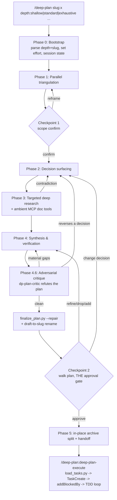
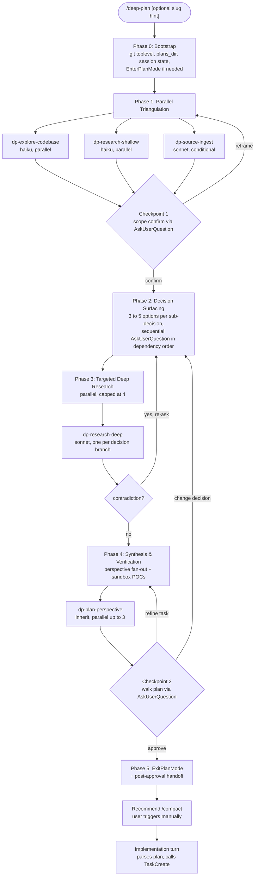
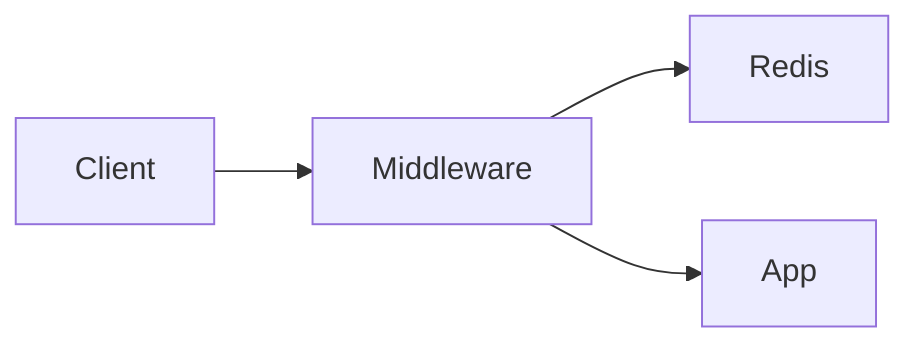

<!-- deep-plan-version: 1 -->

# Deep Plan Mode for Claude Code

`/deep-plan` is a slash-invoked deep-planning workflow for Claude Code, shipped as the `deep-plan` plugin. It co-designs a non-trivial plan with the user across seven phases, never silently picking between meaningful options, then hands the finished plan to a companion `/deep-plan:deep-plan-execute` command that builds it test-first. It runs in the session's normal permission mode and deliberately does not use Claude Code's native plan mode (see the v0.4 changelog and the History sections for why).

This document describes the **current design** (v0.6 of the plugin: the v0.2 refactor, the v0.3 power features, the v0.4 plan-mode removal, the v0.5 design-review critic fleet, and the v0.6 folder-per-plan artifact set). The superseded flat-file plan layout (v0.4/v0.5) is preserved under `## History (flat-file plan layout)`, the superseded v0.2/v0.3 plan-mode integration under `## History (v0.2/v0.3 plan-mode integration)`, and the original v0.1 design verbatim under `## History (v0.1)` at the end, all for rationale only. Where they conflict, the text above the History headings wins.

## What it does

- Fans research three ways in parallel in Phase 1 (codebase, light web, user-provided sources).
- Surfaces every meaningful sub-decision as a 3-to-5-option `AskUserQuestion`. Never silently picks.
- Does targeted deep web research per chosen option in Phase 3, opportunistically using ambient MCP documentation tools when the session exposes them.
- Runs an adversarial critique (Phase 4.6) that tries to refute the plan before the user approves it.
- Produces an AI-consumable plan folder that lives in the project: born as `plans_dir/<topic>-draft/` (canonical `plan.md` inside) at the first resolved decision, renamed to `plans_dir/<slug>/` before review. Descriptive slug, structured headings, `TaskCreate`-loadable, code-only TDD embedded, plus a `design.md` member carrying the expanded per-decision rationale and, during execution, per-task implementation notes.
- Saves the plan to a user-chosen project-local location (default `<repo>/docs/plans/`), never `~/.claude/plans/`.
- A `depth:` argument scales fan-out and effort, from a fast single pass to an exhaustive multi-wave run.

The user is a co-author of the plan, not a reviewer.

## Phase workflow



### Phase 0: Bootstrap

Parse `$ARGUMENTS` for the optional `slug:` and `depth:` tokens (there is no native key:value parser); the remainder is the topic. If native plan mode is active, ask the user in one sentence to toggle it off (Shift+Tab) and stop the turn. Run `setup_session.py` to resolve the project root and `plans_dir` (prompting once per project: `docs/plans/` recommended, `.claude/plans/` warned against as a protected path, with a warn-and-offer-to-move sentinel for remembered protected dirs), detect stale `*-draft/` folders (and legacy flat drafts) left by abandoned runs (resume / overwrite / start fresh), and create the per-session sandbox.

### Phase 1: Parallel triangulation

Launch `dp-explore-codebase` (haiku) and `dp-research-shallow` (haiku) always, plus `dp-source-ingest` (sonnet) when the user supplied source material. Synthesize the findings and confirm scope with the user at Checkpoint 1.

### Phase 2: Decision surfacing

Enumerate 2 to 5 sub-decisions worth surfacing, generate option sets inline, and resolve them sequentially in dependency order via `AskUserQuestion`. The draft plan file `plans_dir/<topic>-draft/plan.md` is created when the first decision is asked, and each answer is appended to its `## Decisions made` table as it resolves, so an abandoned run never loses its decisions.

### Phase 3: Targeted deep research

Launch one `dp-research-deep` (sonnet) per decision branch, capped at 4 in parallel (waves of 4). A `## Contradiction` in any dossier loops back to Phase 2 for that one decision with the evidence quoted. Skipped entirely when no novelty needs research (or at `depth: shallow`).

### Phase 4: Synthesis and verification

Generate the slug, rename the draft folder to `plans_dir/<slug>/` at Phase 4.2 behind a fail-closed guard (`test ! -e` on both the folder and the legacy flat form), launch 1 to 3 `dp-plan-perspective` drafts (simplicity, performance, maintainability, minimal-diff, security), merge them into the plan body, seed `<slug>/design.md` from `references/design-md-template.md` with the expanded per-decision rationale and evidence links, and run inline verification probes (writing any fixtures into the sandbox).

### Phase 4.6: Adversarial critique

Launch `dp-plan-critic` to refute the synthesized plan: missing tasks, wrong or missing dependencies, code tasks lacking tests, decisions contradicted by research, and untested assumptions, each tagged `material` or `minor`. Material findings are fixed inline (or, if they reverse a user decision, loop back to Phase 2 with the contradiction quoted); minor findings go to `## Open questions`. Then Checkpoint 2 walks the plan with the user (approve / refine / drop / add / change a decision).

### Phase 5: Archive and handoff

`finalize_plan.py --repair` auto-normalizes the plan in place BEFORE the Checkpoint 2 question (including regenerating the `## Task overview` table between its markers), so finalization cannot be skipped; Checkpoint 2's `AskUserQuestion` ("Approve and finalize") is the single approval gate. On approval, `finalize_plan.py --archive` rewrites the lean `plans_dir/<slug>/plan.md` in place (source and destination are the same file), stamps `**Status**: approved` and `**Date**` under the title, splits the appendices into the `probes.md` and `research.md` folder members, and regenerates the `plans_dir/README.md` index; the orchestrator then recommends the user run `/compact` before handing the plan to `/deep-plan:deep-plan-execute`.

## Depth control

`depth: shallow | standard | exhaustive` (default `standard`) is parsed in Phase 0 and read by every later phase. It also maps to the native `effort` field.

| Aspect | shallow | standard (default) | exhaustive |
|--------|---------|--------------------|------------|
| Phase 1 fan-out | explore + shallow (source-ingest if sources) | explore + shallow (+ source-ingest) | same, may re-run on weak evidence |
| Phase 3 deep research | skip entirely | one per decision, cap 4, waves of 4 | multiple waves, never skip when novelty exists |
| Phase 4 perspectives | 1 | 1 to 3 | 3 |
| Phase 4.6 critique | 1 quick pass, no loop | 1 pass, loop once on material findings | loop until no material findings (cap 3) |
| `effort` | low to medium | inherit | high to xhigh |

## Implementation handoff

`/deep-plan:deep-plan-execute [plan-path]` is a companion skill in the same plugin. It accepts a plan folder or its `plan.md`; with no argument, discovery first consults the durable approved-plan memo that Phase 5 records at approval (read back via `setup_session.py --lookup`, and honored only while the memoized plan file still exists and carries `**Status**: approved`), and only then falls back to picking the newest plan across both shapes (`<slug>/plan.md` preferred, legacy flat `<slug>.md` still found), excluding the generated README, legacy dotted siblings, and unfinished `*-draft/` folders. It runs `load_tasks.py` to parse the finalized plan's `## Tasks` into structured JSON, refuses to start while `## Open questions` is non-empty, then performs a two-pass load against the harness Task API: pass 1 creates one task per `### Task` (`TaskCreate`), capturing the returned opaque id into an `int -> id` map; pass 2 wires each task's `Depends on` into `addBlockedBy` (`TaskUpdate`). It then drives a test-first loop task by task in dependency order: write the failing test, implement, run the task's verification command, and (for folder plans) append a terse implementation note to `design.md` before marking the task completed. When all tasks complete, folder plans get their `**Status**` flipped to `executed` and the index refreshed via `finalize_plan.py --index`. Requires Claude Code >= v2.1.142 for the Task dependency API.

`load_tasks.py` reuses the section-slicing helpers (`_header_pos`, `_section_end`, `_section_body`) from `finalize_plan.py` rather than re-implementing them.

## Read-only enforcement (current model)

The orchestrator is held read-only by a prompt-level contract (R1 in SKILL.md): it runs in the session's normal permission mode and may write only the project-local plan file and the per-session sandbox. There is no tool-level gate on the orchestrator; the contract is enforced by the skill text and the checkpoint gates. The subagents are **not** held read-only by `permissionMode` -- the harness ignores `permissionMode`, `hooks`, and `mcpServers` on plugin-bundled agents. Instead each `dp-*` agent declares a `disallowedTools` list that blocks `Write`, `Edit`, and `NotebookEdit`, reinforced by a read-only system prompt. The research agents (`dp-research-shallow`, `dp-research-deep`, `dp-source-ingest`) also disallow `Bash`, so they have no shell write vector at all; `dp-explore-codebase`, `dp-plan-perspective`, and `dp-plan-critic` keep `Bash` for read-only inspection. That residual Bash is a theoretical write vector, mitigated by the prompt and the trusted-session model, not a hard sandbox. Every agent also defensively disallows native plan mode's approval tool, since the harness nudges plan-shaped subagents toward it even though the skill never uses plan mode.

Dropping the old `tools` allowlist for `disallowedTools` is also what lets the agents reach any ambient MCP documentation tools during research; an explicit `tools` allowlist would have stripped MCP access.

The v0.1 bundled write-guard (`guard_writes.py`, a `PreToolUse` hook) has been removed. The prompt-level contract plus `disallowedTools` are the boundary; only the `Stop` cleanup hook remains.

## Plan file shape

Every plan is a folder: `plans_dir/<slug>/` with fixed member names (`plan.md`, `research.md`, `probes.md`, `design.md`). `plan.md` is the canonical plan, born as `plans_dir/<topic>-draft/plan.md` at the start of Phase 2 (so resolved decisions are crash-safe); the folder is renamed to `plans_dir/<slug>/` at Phase 4.2 behind a fail-closed `test ! -e` dual guard (v0.6 also resolved the repo's old 4.1/4.2 rename naming drift in favour of 4.2), and `plan.md` is edited in place from then on. There is no mirror and no on-approval copy; `finalize_plan.py --archive` rewrites the same file lean in place, stamps `**Status**: approved` and `**Date**` under the title, splits the `## Verification probes` and `## Research dossiers` appendices into the `probes.md` and `research.md` members, and regenerates the `plans_dir/README.md` index (a generated region between `<!-- deep-plan-index:begin generated: do not edit -->` / `<!-- deep-plan-index:end -->` markers; merge conflicts inside it are resolved by regenerating, never by hand). The session state's `plan_path` tracks the current `plan.md` for re-entry detection.

The `design.md` member has a two-phase lifecycle: Phase 4.4 seeds it from `references/design-md-template.md` with expanded per-decision rationale (why chosen, why the alternatives were rejected, evidence links into the sibling `research.md`), and `/deep-plan:deep-plan-execute` appends one terse `### Task {N}` entry under its `## Implementation notes` per completed task, gated after that task's verification passes.

The section order inside `plan.md` is fixed -- Context, Decisions made, Architecture, Tasks, References, Open questions -- plus the generated `## Task overview` region between `<!-- deep-plan-task-overview:begin generated: do not edit -->` / `<!-- deep-plan-task-overview:end -->` markers: a `# | Task | Files | Deps | Summary` table rebuilt by every `--repair` run, whose Summary column is each task's opening plain-English summary sentence (every `**Change**` block must open with one, PEP 257 terminator rule). Each task carries Target files, Change, Verification, and Depends on; the `**Tests (TDD)**` subsection is included only for tasks that create or modify code. `finalize_plan.py --repair` auto-repairs the plan (em-dashes, task headers, missing sections, attribution, the overview region) rather than validating-and-rejecting in a loop.

Discovery is dual-read, folder-write: every consumer reads both shapes (`<slug>/plan.md` preferred, legacy flat `<slug>.md` still found), `resolve_slug.py` treats either form as a collision, new plans are always folders, and legacy flat plans are approved historical records left untouched.

## Engineering

Every helper is stdlib-only Python (`setup_session.py`, `resolve_slug.py`, `finalize_plan.py`, `load_tasks.py`, and the `cleanup.py` Stop hook), ruff-clean and `mypy --strict` compliant, with no runtime dependencies. CI (`.github/workflows/ci.yml`) installs `ruff`, `mypy`, `pytest` (pinned `>=9,<10`), and `tiktoken`, then runs, in order, `ruff check skills`, `mypy --strict skills/deep-plan/scripts skills/deep-plan/hooks`, and bare `python -m pytest -v` — test discovery is owned by `pyproject.toml`'s `[tool.pytest.ini_options]` (`testpaths` plus `--import-mode=importlib`), never by per-caller path lists. `pyproject.toml` pins the gate configuration. Contract tests are co-located per skill: `skills/deep-plan/tests/` covers the golden-plan drift guard, repair/archive (including the generated Task overview and README index), session state and migration, slug normalisation and dual-form collision, the cleanup hook, the read-only agents contract, the `load_tasks` parser (file and folder inputs), the design.md template contract, and the SKILL.md frontmatter/wiring contract; `skills/design-review/tests/` pins the design-principles structure and fleet recipe; `skills/tdd-review/tests/` pins the test-principles rubric and the tdd-review wrapper.

## Runtime layout

The repo root is the plugin root and the marketplace root. Runtime data lives under `$XDG_STATE_HOME/deep-plan/` (default `~/.local/state/deep-plan/`): `projects.json` (per-project `plans_dir` map), `state/<session_id>.json` (per-session state), and `hook-errors.log`. None of it is git-tracked. (The v0.1 `~/gits/plan-modes` source-of-truth subfolder, the `install.py` symlink step, and the `~/.claude/deep-plan/` location are superseded; `setup_session.py` self-bootstraps the runtime dirs and performs a one-shot migration from the legacy location.)

## Change log

v0.2 (refactor of the v0.1 design below):

1. **Auto-repair finalize.** `finalize_plan.py` auto-repairs the plan body in one pass and reports `{ok, fixes, warnings}` instead of validating-and-rejecting in a loop. Supersedes the `--custom/--harness` interface.
2. **Harness-canonical plan file.** The orchestrator writes the plan directly to the harness plan path; the project-local `<slug>.md` is an on-approval copy. Supersedes the post-approval mirror.
3. **Lean plan plus siblings.** The Verification probes and Research dossiers appendices split into `<slug>.probes.md` and `<slug>.research.md` on approval.
4. **Write-guard removed.** `guard_writes.py` and its `PreToolUse` hook are gone; plan mode plus `disallowedTools` are the read-only boundary.
5. **Code-only TDD.** The `**Tests (TDD)**` subsection is included only for code tasks.

v0.3 (power features, deeper research, engineering hardening):

6. **Depth control.** The `depth: shallow|standard|exhaustive` argument scales fan-out, research waves, perspective count, critique loops, and `effort`.
7. **Adversarial critique.** A new Phase 4.6 launches `dp-plan-critic` to refute the plan before approval.
8. **Implementation handoff.** The `/deep-plan:deep-plan-execute` companion skill plus `load_tasks.py` turn the plan into harness tasks with dependencies and drive a TDD loop.
9. **Opportunistic MCP research.** Subagents use `disallowedTools` (not a `tools` allowlist), keeping them write-free while letting them reach ambient MCP documentation tools.
10. **Engineering floor.** Read-only enforcement re-documented accurately (`disallowedTools`, not `permissionMode`); `ruff` + `mypy --strict` + structural CI gates added; the untested helper scripts backfilled with tests.

v0.4 (plan-mode removal, draft-to-slug lifecycle; six decisions resolved via a dogfooded /deep-plan run):

11. **Plan mode dropped entirely.** Native plan mode's read-only behaviour is prompt-level only (no tool gating), the workflow it injects competes with the skill's phases, and the post-approval archive step failed in every observed run. The skill now runs in the session's normal permission mode and never calls plan mode's entry or approval tools. (Decision 1)
12. **Draft-born plan file.** The plan is born as `plans_dir/<topic>-draft.md` when the first decision is asked, decisions append live, and the draft is renamed to `plans_dir/<slug>.md` at Phase 4.1. Crash-safe: an abandoned run keeps its resolved decisions. Stale drafts are detected in Phase 0 (resume / overwrite / start fresh). (Decision 2)
13. **Plan-mode-active guard.** If native plan mode is active at invocation, Phase 0 prints one sentence asking the user to toggle it off (Shift+Tab) and stops the turn; there is no second code path. (Decision 3)
14. **Checkpoint 2 is THE approval gate.** `finalize_plan.py --repair` and the draft-to-slug rename run BEFORE the question, so finalization cannot be skipped; on approve, `--archive` splits the appendix siblings in place (source equals destination). (Decision 4)
15. **Minimal session state.** State carries only `{plans_dir, plan_path, sandbox_dir, session_id, project_root, started_at}`; the dead `phase`, `decisions`, `harness_plan_path`, and `archive_plan_path` fields are gone and `PERMITTED_UPDATE_KEYS` shrinks to `{plans_dir, plan_path}`. (Decision 5)
16. **`docs/plans/` default.** `<repo>/docs/plans/` is the recommended plans_dir; `.claude/plans/` is demoted with a protected-path warning (writes under `.claude/` always prompt and cannot be allowlisted), and a remembered protected plans_dir triggers a warn-and-offer-to-move sentinel. The smooth-write mechanism is a `permissions.allow` snippet in project `.claude/settings.json`, since plugins cannot ship permissions. (Decision 6)

v0.5 (design-review critic fleet): design-quality guidance embedded across plan, critique, and execute stages via the `dp-design-critic` fleet and `skills/design-review/`; see the `## Design review` section of README.md.

v0.6 (folder-per-plan artifact set, design-rationale capture; five decisions resolved via a dogfooded /deep-plan run):

17. **Folder per plan.** Every plan lives in `plans_dir/<slug>/` with fixed member names (`plan.md`, `research.md`, `probes.md`, `design.md`); the draft is born as `<topic>-draft/` and renamed at Phase 4.2 behind a fail-closed `test ! -e` dual guard. The repo's 4.1/4.2 rename naming drift is resolved in favour of 4.2. (Decision 1)
18. **Folder members plus a generated index.** The appendix splits stay separate artifacts as folder members, and `--archive` regenerates a deterministic `plans_dir/README.md` index (title/status/date read from file content, never mtime; rows sorted by slug; merge conflicts resolved by regenerating, never hand-editing). A standalone `--index` CLI mode lets the execute skill refresh it. (Decision 2)
19. **Generated Task overview.** `finalize_plan.py --repair` maintains a `## Task overview` table between HTML-comment markers in plan.md, and every task's `**Change**` opens with one plain-English summary sentence (PEP 257 terminator rule), giving both human review moments an at-a-glance view with zero drift. (Decision 3)
20. **design.md two-phase lifecycle.** The plan phase seeds expanded per-decision rationale (why chosen, why alternatives were rejected, evidence links); the execute phase appends terse per-task Implementation notes gated after each task's verification passes. Terse and scoped by contract: a design document, not a journal. (Decision 4)
21. **Dual-read, folder-write.** All consumers read both plan shapes; `resolve_slug.py` treats either form as a collision; new plans are always folders; legacy flat plans are approved historical records left untouched. (Decision 5)

## History (flat-file plan layout)

> Everything in this section is the superseded flat-file plan layout (v0.4/v0.5), preserved for rationale only (same convention as the History sections below: where it conflicts with the current design above, the current design wins). v0.6 replaced it with the folder-per-plan artifact set.

### Plan file shape (v0.4/v0.5)

There was a single canonical plan file, and it was project-local: born as `plans_dir/<topic>-draft.md` at the start of Phase 2, renamed to `plans_dir/<slug>.md` at the draft-to-slug rename step (inconsistently called Phase 4.1/4.2 across the repo; v0.6 resolved the drift in favour of 4.2), and edited in place from then on. `finalize_plan.py --archive` rewrote the same file lean in place and split the `## Verification probes` and `## Research dossiers` appendices into dotted sibling files (`<slug>.probes.md`, `<slug>.research.md`) so the implementer file stayed lean.

### Why v0.6 dropped it

The dotted siblings sprawled the plans directory (up to three ungrouped files per plan), the one-line Decisions-table cells were the only home for plan-time rationale, and nothing captured execute-time why-the-code-looks-this-way knowledge at all. The folder-per-plan layout groups every artifact under one slug-named directory, the generated Task overview and README index give humans an at-a-glance view that cannot drift, and design.md carries the rationale through both the plan and execute phases.

## History (v0.2/v0.3 plan-mode integration)

> Everything in this section is the superseded v0.2/v0.3 plan-mode integration, preserved for rationale only (same convention as the v0.1 History below: where it conflicts with the current design above, the current design wins). v0.4 removed native plan mode from the skill entirely.

### Read-only enforcement and plan file (v0.2/v0.3)

The orchestrator was read-only because it ran inside native plan mode. Phase 0 auto-entered plan mode via `EnterPlanMode` when it was not active, captured the harness-issued plan file path from the plan-mode reminder's "Plan File Info" line, and passed it to `setup_session.py --harness-plan-path`. That harness path was the single canonical plan file; the project-local `<slug>.md` was an on-approval copy. Phase 5 ran `finalize_plan.py --repair` against the harness path, called `ExitPlanMode` as the approval tool, and on approval (`system-reminder-exited-plan-mode`) ran `finalize_plan.py --archive` to write the copy plus siblings. Session state tracked `harness_plan_path` and `archive_plan_path`, plus `phase` and `decisions` progress fields updated via `setup_session.py --update`.

### Why v0.4 dropped it

Evidence from six real runs and ecosystem research: plan mode's read-only contract is prompt-level only, with no tool gating (anthropics/claude-code#19874, #6716); the harness injects a competing plan workflow whose system prompts override skill guardrails (#29950); `EnterPlanMode`/`ExitPlanMode` each cost a ToolSearch round-trip; the post-approval archive step was skipped or never reached in every observed run; the `phase`/`decisions` state never advanced past "Phase 0" in any session; and a rejected `ExitPlanMode` was once bypassed by referencing the harness path manually. The v0.4 design replaces all of it with the project-local draft-to-slug lifecycle and Checkpoint 2 as the single approval gate.

## History (v0.1)

> Everything below is the original v0.1 design, preserved for rationale only. It describes superseded machinery -- `custom_plan_path` and the harness/custom mirror, the `guard_writes.py` `PreToolUse` hook, `install.py` and the `~/gits/plan-modes` symlink layout, and the validate-and-reject `finalize_plan`. Where it conflicts with the current design above, the current design wins. Headings in this section are demoted one level so it reads as an appendix.

### Context

The default Claude Code plan mode handles tasks where intent fits in a few sentences and the design space is narrow. It struggles for non-trivial work: tasks that need real research (state of the art, prior art, library trade-offs), tasks that decompose into multiple sub-decisions where the user's taste matters, and tasks where the model would otherwise pick a winner alone.

This plan describes a personal opt-in alternative for one user on Linux, invoked by `/deep-plan`, that:

- Fans research three ways in parallel during Phase 1 (codebase, light web, user-provided sources).
- Surfaces every meaningful sub-decision as a 3-to-5-option choice via `AskUserQuestion`. Never silently picks.
- Does targeted deep web research per chosen option in Phase 3.
- Outputs a plan file optimised for AI consumption: descriptive filename, structured headings, `TaskCreate`-loadable, TDD-embedded.
- Saves plan files to a user-chosen project-local location (default `<repo>/.claude/plans/`), never `~/.claude/plans/`.
- Inherits, unchanged, the strong invariants of the existing plan mode: plan file is the only writable artifact, approval is its own tool (`ExitPlanMode`), two-tier model usage (haiku for breadth, sonnet/inherit for synthesis), continuity across turns via plan-file-reference, re-entry forces overwrite-vs-refine.

Intended outcome: a tool that turns blank-page planning into structured interactive co-design. The user is a co-author, not a reviewer.

### Form factor decision

**Skill** as the entry point, with five dedicated subagents at user scope, skill-scoped `PreToolUse` and `Stop` hooks declared in the skill frontmatter, on-disk session state under `~/.claude/deep-plan/state/`, and persistent project config under `~/.claude/deep-plan/projects.json`.

**Source-of-truth layout: a portable, plugin-ready subfolder at `~/gits/plan-modes/deep-plan/`.** All code (skill body, agent definitions, hook scripts, helper scripts, references, plan-file template, README, this PLAN) lives there, git-trackable in the existing `plan-modes` repo. A small `install.py` symlinks the artifacts into `~/.claude/skills/deep-plan` and `~/.claude/agents/dp-*.md` so Claude Code discovers them. The user can iterate by editing files in `~/gits/plan-modes/deep-plan/` directly; the symlinks make changes live immediately.

Runtime data (`~/.claude/deep-plan/state/<session_id>.json`, `~/.claude/deep-plan/projects.json`, `~/.claude/deep-plan/hook-errors.log`) stays under `~/.claude/`, never enters the git repo, never symlinked.

This layout is **plugin-ready**: if v2 wants versioning, the `~/gits/plan-modes/deep-plan/` folder transplants verbatim into `~/personal-claude-marketplace/plugins/deep-plan/`, with hook references already using `${CLAUDE_SKILL_DIR}` (resolves the same way under both skill and plugin scopes).

#### Why skill, not the alternatives

| Alternative | Why rejected |
|---|---|
| Plugin in personal marketplace | Strong versioning + atomic install, but plugin-bundled subagents cannot use `permissionMode`, `hooks`, or `mcpServers`, so the multi-component split (skill or plugin + user-scope agents) is unavoidable in either form. User explicitly disclaimed team-wide rollout, neutralising the distribution advantage. Iteration friction (commit, tag, reinstall on every tweak) hurts in v1. Versioning can be added later by `git init` in the skill folder. Migration is a verbatim transplant. |
| Pure-hooks (`UserPromptSubmit` parses `/deep-plan`, hook scripts orchestrate) | Orchestration prompts are far simpler to author as markdown body than as hook-injected `additionalContext`. Lose syntax highlighting, lose `argument-hint`, lose `disable-model-invocation` semantics. |
| Single mega-subagent via `@dp-orchestrator` | Subagents cannot spawn subagents in Claude Code; the orchestrator must spawn five specialised agents. Structurally impossible. |
| Slash command (`~/.claude/commands/deep-plan.md`) | Slash commands are deprecated; new convention is to use a skill. Skills are a strict superset (bundle supporting files, scoped hooks, dynamic context injection). |

#### Trade-offs accepted

- No version pinning out of the box. Mitigated by treating `~/.claude/skills/deep-plan/` as a personal git repo.
- Skill-scoped hook semantics are less documented than plugin-frontmatter hooks. Mitigated by also gating activation on a state file that the hook reads on every `PreToolUse` (no env-var dependence on skill scope).
- Plugin's distributability lost. Out of scope per spec.

#### Migration path to plugin (v2)

The `~/gits/plan-modes/deep-plan/` subfolder is already plugin-shaped. To convert: rename to `~/personal-claude-marketplace/plugins/deep-plan/`, add a `.claude-plugin/plugin.json` manifest (one file), add a `marketplace.json` to the parent, register the marketplace in `~/.claude/settings.json` under `extraKnownMarketplaces` mirroring the existing `checkmk-marketplace` entry. No logic change in any of the agent files, hook scripts, or skill body.

### High-level workflow



### Repository layout

Source of truth lives at `~/gits/plan-modes/deep-plan/`. After running `install.py`, Claude Code sees the artifacts via symlinks under `~/.claude/`. Runtime data lives only under `~/.claude/deep-plan/` and is never git-tracked.

```
~/gits/plan-modes/deep-plan/                   # source of truth, git-tracked
├── README.md                                   # user-facing docs (this design summarised)
├── PLAN.md                                     # this implementation plan, post-approval move target
├── install.py                                  # one-shot setup: creates symlinks, ensures runtime dirs
├── skills/deep-plan/
│   ├── SKILL.md                                # entry point, orchestration body, frontmatter declares hooks
│   ├── hooks/
│   │   ├── guard_writes.py                     # PreToolUse, write-path enforcement
│   │   └── cleanup.py                          # Stop, sandbox + state cleanup
│   ├── scripts/
│   │   ├── setup_session.py                    # Phase 0 bootstrap
│   │   ├── resolve_slug.py                     # Phase 4 slug normalise + collision check
│   │   └── finalize_plan.py                    # Phase 5 mirror to harness path + validation
│   └── references/
│       ├── phase-prompts.md                    # per-phase prompt fragments quoted by SKILL.md
│       ├── perspectives.md                     # catalog for dp-plan-perspective
│       └── plan-file-template.md               # markdown skeleton with formatting rules
└── agents/
    ├── dp-explore-codebase.md
    ├── dp-research-shallow.md
    ├── dp-research-deep.md
    ├── dp-source-ingest.md
    └── dp-plan-perspective.md

~/.claude/                                      # Claude Code discovery + runtime data
├── skills/deep-plan -> ~/gits/plan-modes/deep-plan/skills/deep-plan       # symlink (created by install.py)
├── agents/dp-explore-codebase.md -> ~/gits/plan-modes/deep-plan/agents/dp-explore-codebase.md
├── agents/dp-research-shallow.md -> ...        # one symlink per agent
├── agents/dp-research-deep.md -> ...
├── agents/dp-source-ingest.md -> ...
├── agents/dp-plan-perspective.md -> ...
└── deep-plan/                                  # runtime, never symlinked, not git-tracked
    ├── projects.json                           # persistent project -> plans_dir map
    ├── hook-errors.log                         # append-only log for hook exceptions
    └── state/<session_id>.json                 # per-session state, deleted on Stop hook
```

### File-by-file artifacts

All paths below are relative to `~/gits/plan-modes/deep-plan/` unless prefixed with `~/.claude/`.

| Path | Purpose |
|---|---|
| `README.md` | User-facing entry point. Elevator pitch, Mermaid workflow diagram, quick-start (`install.py` then `/deep-plan`), file-layout map, key invariants, link to PLAN.md. |
| `PLAN.md` | This document. Post-approval, `finalize_plan.py` mirrors it from `~/.claude/plans/...` into here. |
| `install.py` | Pure-stdlib Python script. Creates `~/.claude/skills/deep-plan` symlink, 5 `~/.claude/agents/dp-*.md` symlinks, ensures `~/.claude/deep-plan/state/` exists, validates hook scripts are executable. Idempotent; safe to re-run. Prints what it did. |
| `skills/deep-plan/SKILL.md` | Entry point. Frontmatter declares triggers, scoped hooks (referenced via `${CLAUDE_SKILL_DIR}/hooks/...`), allowed-tools, `disable-model-invocation: true`. Body is the 6-phase orchestration prompt with embedded reminders. |
| `skills/deep-plan/references/phase-prompts.md` | Per-phase prompt fragments the orchestrator quotes into context. |
| `skills/deep-plan/references/perspectives.md` | Catalog of perspectives for `dp-plan-perspective` (simplicity, performance, maintainability, minimal-diff, security). |
| `skills/deep-plan/references/plan-file-template.md` | Markdown skeleton the orchestrator fills in. Section headers, formatting rules, TDD criteria template. |
| `skills/deep-plan/scripts/setup_session.py` | Bootstrap helper. Resolves `git rev-parse --show-toplevel`, reads `projects.json`, writes `state/<session_id>.json`. Pure stdlib, mypy strict, ruff-clean. |
| `skills/deep-plan/scripts/resolve_slug.py` | Normalises orchestrator-suggested slug, checks for collision in `plans_dir`, returns accepted slug or collision metadata for `AskUserQuestion`. |
| `skills/deep-plan/scripts/finalize_plan.py` | Phase 5 helper. Validates required sections present in the canonical plan, mirrors it from `custom_plan_path` to the harness `~/.claude/plans/...` path so `ExitPlanMode` reads the right content, AND copies it to `~/gits/plan-modes/deep-plan/PLAN.md` if the canonical path is itself a deep-plan plan (the post-approval move). |
| `skills/deep-plan/hooks/guard_writes.py` | `PreToolUse` hook. Reads session state, blocks `Write`/`Edit`/`NotebookEdit` outside the two allowed plan paths, the sandbox, and the state directory; matches `Bash` against a regex of write side-effect patterns unless the command targets the sandbox. Fail-open on internal error. |
| `skills/deep-plan/hooks/cleanup.py` | `Stop` hook. Removes `~/.claude/deep-plan/state/<session_id>.json` and `/tmp/deep-plan-<session_id>/`. Idempotent. Also sweeps any `/tmp/deep-plan-*` older than 7 days. |
| `agents/dp-explore-codebase.md` | Codebase exploration subagent (haiku, read-only). Symlinked to `~/.claude/agents/dp-explore-codebase.md`. |
| `agents/dp-research-shallow.md` | Light web research subagent (haiku). |
| `agents/dp-research-deep.md` | Per-decision deep web research subagent (sonnet). |
| `agents/dp-source-ingest.md` | User-source ingestion subagent (sonnet, can call `jira:jira-read-ticket`). |
| `agents/dp-plan-perspective.md` | Plan synthesis perspective subagent (inherit). |
| `~/.claude/deep-plan/projects.json` | Persistent map: `{project_root_abs_path: {plans_dir, last_used_at}}`. Runtime, not git-tracked. |
| `~/.claude/deep-plan/state/<session_id>.json` | Per-session state. Created by `setup_session.py`, deleted by `cleanup.py`. |
| `~/.claude/deep-plan/hook-errors.log` | Append-only log for hook script exceptions. |
| `~/.claude/settings.json` | No edits required. Hooks live in skill frontmatter via `${CLAUDE_SKILL_DIR}/hooks/...`, not global settings. |

#### README.md content outline

The README is short (under 300 lines) and is the user's first stop. Required sections:

1. **What this is** (one paragraph): personal `/deep-plan` skill that replaces default plan mode for non-trivial work, fanning research three ways and surfacing every sub-decision as a multi-option choice.
2. **Workflow diagram**: the same Mermaid diagram from this PLAN, embedded directly. Lets the reader see the full shape at a glance.
3. **Quick-start**:
   ```
   git clone <this-repo>
   cd ~/gits/plan-modes/deep-plan
   python3 install.py
   # then in any project:
   /deep-plan add a rate limiter to the API
   ```
4. **File layout**: copy of the tree above.
5. **Key invariants** (5 bullets, mirroring README.md from the parent `plan-modes/` repo): plan file is the only writable artifact, approval is its own tool, two-tier model, continuity across turns, re-entry is overwrite vs refine.
6. **Configuration**: where `projects.json` lives, how to change a project's `plans_dir`.
7. **Verification sandbox**: one paragraph on the `/tmp/deep-plan-*` scheme and the regex-based Bash block, with the honest disclosure that it is best-effort against accidents, not a sandbox.
8. **Plugin migration** (one paragraph): the layout is plugin-ready; v2 conversion is two manifest files and a marketplace registration.
9. **Link to PLAN.md** for the full design rationale.

### Configuration

#### `~/.claude/deep-plan/projects.json`

```json
{
  "/home/matteovillosio/gits/cloudmk": {
    "plans_dir": "/home/matteovillosio/gits/cloudmk/.claude/plans",
    "last_used_at": "2026-05-08T12:34:56Z"
  }
}
```

- Keyed by absolute project root (output of `git rev-parse --show-toplevel`, or `cwd` if no git).
- First-time prompt for `plans_dir` uses `AskUserQuestion` with options:
  1. `<repo>/.claude/plans/` (Recommended, namespaced under `.claude/`)
  2. `<repo>/plans/` (top-level inside repo)
  3. `<repo>/docs/plans/` (lives with docs)
  4. `<repo-parent>/<repo-name>-plans/` (sibling, never enters repo tree)
- The hard requirement: **default must NEVER be `~/.claude/plans/`**. The first option, the second option, and the fallback are all under the project tree or its sibling.
- User edits the file directly to change a project's `plans_dir`. No `--dir` flag in v1 (deferred).

#### `~/.claude/deep-plan/state/<session_id>.json`

```json
{
  "session_id": "abc123",
  "started_at": "2026-05-08T12:34:56Z",
  "project_root": "/home/matteovillosio/gits/cloudmk",
  "plans_dir": "/home/matteovillosio/gits/cloudmk/.claude/plans",
  "harness_plan_path": "/home/matteovillosio/.claude/plans/iridescent-flickering-haddock.md",
  "custom_plan_path": "/home/matteovillosio/gits/cloudmk/.claude/plans/rate-limiter-redis-token-bucket.md",
  "sandbox_dir": "/tmp/deep-plan-abc123",
  "phase": "Phase 1",
  "decisions": []
}
```

The hook reads this on every `PreToolUse` to determine allowed-write paths. The orchestrator is told to update the `phase` and `decisions` fields by re-running `setup_session.py --update phase=...`.

### Phase workflow detail

#### Phase 0: Bootstrap

**Goal**: resolve project context and put the session into a known state.

**Tools**: `Bash` (`git rev-parse`, `cat`), `Read`, `Write` (writes to `state/<session_id>.json` only, allowed by hook because state path is in the hook's allow-list), `AskUserQuestion`, `EnterPlanMode`.

**Logic** (orchestrator follows verbatim):

1. Detect plan mode. If the most recent system reminder does not contain "Plan mode is active.", call `EnterPlanMode` and stop the turn. The next user turn re-triggers the skill in plan mode.
2. Capture the harness-issued plan file path from the plan-mode system reminder. The path appears under "Plan File Info: ... create your plan at <path>".
3. Run `python3 ~/.claude/skills/deep-plan/scripts/setup_session.py --harness-plan-path <path>`. The script:
   - Determines `project_root` via `git rev-parse --show-toplevel`. On failure, falls back to cwd, returns sentinel `no_git=true` so the orchestrator asks the user via `AskUserQuestion` whether to use cwd or abort.
   - Reads `~/.claude/deep-plan/projects.json`. If `project_root` already mapped, reuses `plans_dir`. Else returns sentinel `prompt_for_plans_dir=true` plus the four candidate options.
   - Writes `state/<session_id>.json` with all known fields. `custom_plan_path` is left null until Phase 4 generates the slug.
4. If sentinels say so, the orchestrator asks the user via `AskUserQuestion` (`plans_dir` choice or git fallback). On answer, calls `setup_session.py --update plans_dir=...` to persist into `projects.json`.
5. Skill body opens with the verification-sandbox boundary and the read-only invariants. These are the first thing in the skill body (Section "System reminders" below).

**Produces**: state file present; `plan_mode_active=true`; `plans_dir` known; sandbox dir created (`/tmp/deep-plan-<session_id>/`, mode 0700).

**Pause for user**: only on first-time-per-project (plans dir choice) or no-git fallback. Otherwise silent.

#### Phase 1: Parallel Triangulation

**Goal**: build a shared evidence base from three independent angles before any decision is taken.

**Agents launched in a single message**:
- `dp-explore-codebase` (haiku). Always launched.
- `dp-research-shallow` (haiku). Always launched.
- `dp-source-ingest` (sonnet). Launched only if Phase 0 captured user-provided sources from the prompt or a follow-up `AskUserQuestion` ("Do you have existing material I should ingest? Local files, URLs, Jira IDs, pasted text?"). The user prompt is parsed for these signatures before launching.

**Tools used by orchestrator**: `Agent` (three parallel calls), `Read` (re-reads agent outputs).

**Cap**: exactly one instance of each agent type in Phase 1. No fan-out; the agents themselves do parallel reads internally.

**Produces** in orchestrator context: `{patterns_found, candidate_libraries, user_source_summary, open_unknowns}`.

**Checkpoint 1**: orchestrator paraphrases scope back to the user via `AskUserQuestion`:

> Question: "Based on Phase 1 findings, here is what I think we are planning. Confirm?"
> Header: "Scope"
> Options:
>   - "Scope is correct, proceed to decision surfacing" (Recommended)
>   - "Narrow to <X>"
>   - "Broaden to <Y>"
>   - "Defer <Z> to a follow-up plan"

Block until answered. Re-loop into Phase 1 with the narrowed/broadened scope if not "confirm". This is the only Phase 1 user pause.

#### Phase 2: Decision Surfacing

**Goal**: enumerate two to five sub-decisions worth surfacing, generate option sets inline, and resolve them with the user one at a time in dependency order.

**Tools**: `AskUserQuestion` (sequential), `Read` (cross-check candidate options against the codebase).

**Agents**: none. Option generation is **inline** (orchestrator-only). Justification:

- Phase 1 evidence is already in orchestrator context; sending it to a subagent forces redundant context transfer.
- `AskUserQuestion` requires immediate, conversational option phrasing; subagent latency adds friction.
- Subagent denylist excludes `Agent`, so a sub-subagent for option generation is impossible.

**Heuristics for "what counts as a sub-decision"** (surface iff at least one holds AND the orchestrator cannot trivially infer the answer from Phase 1 evidence):

- Architectural axis: storage backend, transport, sync vs async, in-process vs out-of-process.
- Algorithm or data-structure family with measurable trade-offs (token-bucket vs leaky-bucket vs sliding-window).
- Library choice when two or more credible options exist in the Phase 1 shortlist.
- Boundary placement: middleware vs decorator vs base class vs separate service.
- Test strategy when the codebase has heterogeneous testing patterns.

**Skip surfacing** when:
- The codebase already has one dominant pattern (Phase 1 returned three or more examples of pattern X and zero of alternatives). Log under "Decisions made" with rationale "follows existing convention".
- The user's prompt explicitly fixes the choice ("use Redis").

**Cap**: at most five surfaced decisions per plan. Excess goes to "Open questions" or is deferred to a follow-up plan.

**Presentation order**: sequential, blocking, in dependency order. The orchestrator builds a dependency DAG of decisions, presents them topologically, and recomputes downstream options if an upstream answer invalidates them. Choosing "Redis" as rate-limit store forecloses "use SQLite atomic counters" later. Batched questions encourage skimming and force the orchestrator to enumerate the Cartesian product.

**Persistence**: each user answer is written to a `## Decisions made` table in the plan file immediately after `AskUserQuestion` resolves, by the orchestrator using `Edit` (allowed because the path matches `custom_plan_path` from state). Survives re-entry. Single source of truth.

**Concrete example, prompt "Add a rate limiter to the API"**:

Phase 1 surfaces: existing FastAPI app, no rate-limit code, Redis already a dep, in-memory caches use `cachetools`.

Decisions surfaced:

1. Storage backend
   - Options: Redis (existing dep) [Recommended], in-memory `cachetools`, SQLite atomic counters, dedicated middleware service, none (use upstream nginx)
2. Algorithm
   - Options: token bucket [Recommended], leaky bucket, fixed window, sliding window log, sliding window counter
3. Scope key
   - Options: per-IP, per-API-key [Recommended], per-authenticated-user, per-IP+endpoint, configurable per-route

Three sequential `AskUserQuestion` calls. Plan slug becomes `rate-limiter-redis-token-bucket-per-api-key.md` (truncated per Section "Slug generation" below).

#### Phase 3: Targeted Deep Research

**Goal**: for every chosen option needing corroboration, do deep web/library research with citations.

**Agents**: one `dp-research-deep` (sonnet, `WebSearch`, `WebFetch`, `Read`, `Grep`, `Glob`) per decision branch, **launched in parallel** in a single message.

**Cap**: 4 parallel `dp-research-deep` instances per Phase 3 invocation. If more than 4 decisions need research, batch in two waves.

**Inputs to each agent**: `{decision, chosen_option, rejected_options, links_to_validate, success_criteria}`.

**Each agent returns** a research dossier:
- `## Verdict`: confirmation or contradiction of the choice (with citations).
- `## Gotchas`: top 3 with doc URLs.
- `## Versioning`: minimum runtime, library version constraints.
- `## Canonical snippet`: 5-line idiom from official docs.
- `## Contradiction` (optional): plain statement if research contradicts the choice.

**Behavior on contradiction**: if any dossier returns `## Contradiction`, the orchestrator loops back into Phase 2 for that single decision and re-asks the user with the contradicting evidence quoted.

**Skip Phase 3** entirely if all decisions in Phase 2 selected the obvious "follows existing convention" option (no novel libraries to research).

#### Phase 4: Synthesis and Verification

**Goal**: produce the plan file body and run inline verification probes against design assumptions.

**Sub-steps** (in order):

1. **Slug generation** (orchestrator inline, no agent):
   - Construct slug from `{user_intent_keywords, top_2_decision_choices}`.
   - Max 60 chars, `[a-z0-9-]`, lowercase, hyphen-separated, no leading/trailing or double hyphens.
   - Examples:
     - "Add rate limiter" + Redis + token-bucket -> `rate-limiter-redis-token-bucket.md`
     - "Refactor auth to JWT" -> `auth-refactor-jwt-cookie-rotation.md`
   - Run `python3 ~/.claude/skills/deep-plan/scripts/resolve_slug.py --slug <s> --plans-dir <d>`. Returns either accepted slug or collision metadata.
2. **Collision handling** (Section "Slug generation" below).
3. **Update state**: `setup_session.py --update custom_plan_path=<plans_dir>/<slug>.md`. Hook now allows writes to that path.
4. **Perspective fan-out**: launch 1 to 3 `dp-plan-perspective` agents (inherit, parallel) with different perspectives picked from `{simplicity, performance, maintainability, minimal-diff, security}` based on the user's evident priorities (inferred from prompt and decisions). Cap at 3.
5. **Synthesis**: orchestrator merges perspectives into a single plan body following the format in Section "Plan file format" below. Merge rule: when perspectives disagree on task ordering or test scope, prefer the union (additive); when they disagree on architectural choice, that means a sub-decision was missed and it loops back to Phase 2.
6. **Verification probes**: for each task, the orchestrator runs inline `Bash` checks against design assumptions. Examples: `python3 -c "import redis; print(redis.__version__)"`, `grep -rl 'TokenBucket' src/`, `uv run pytest --collect-only tests/middleware/`. Each probe's output is captured into the plan's `## Verification probes` appendix as `[probe N]: <command>\n<stdout>\n`. Probes run sequentially to keep output ordering deterministic. If a probe needs to write a small fixture file (e.g. a tiny pytest), it writes under the sandbox; the hook permits this (Section "Verification mechanic" below).

**Produces**: complete plan file at `custom_plan_path`, ready for review.

**Checkpoint 2**: orchestrator does NOT ask "looks good?" via text or `AskUserQuestion`. Instead, walks the user through the file by section using `AskUserQuestion`:

> Question: "Plan written to <custom_plan_path>. What next?"
> Header: "Plan review"
> Options:
>   - "Approve and exit plan mode" (Recommended)
>   - "Refine task <N>"
>   - "Drop task <N>"
>   - "Add a task"
>   - "Change a decision"

The "approve" branch leads to Phase 5. Other branches loop back to the relevant earlier phase (refine/add/drop -> Phase 4 task edit; change decision -> Phase 2).

#### Phase 5: ExitPlanMode and post-approval handoff

**Goal**: hand off to execution with a clean context.

**Logic**:

1. Run `python3 ~/.claude/skills/deep-plan/scripts/finalize_plan.py --custom <p1> --harness <p2>`. The script:
   - Validates all required sections present (Context, Decisions made, Tasks with all subsections, References, Open questions).
   - Copies `custom_plan_path` to `harness_plan_path` so `ExitPlanMode`'s dialog reads the right content.
   - Returns `ok` or a list of validation failures.
2. On `ok`, call `ExitPlanMode` (no parameters).
3. On validation failure, surface the failures to the user via `AskUserQuestion` and loop into Phase 4.

**On approval** (orchestrator's last action in plan mode): `system-reminder-exited-plan-mode` fires. Before doing any other work in the implementation turn, the orchestrator emits **exactly this message and stops the turn**:

```
Plan approved and written to {custom_plan_path}.

Recommended next: run `/compact` (or `/clear` if you do not need any planning context preserved). The plan file is the canonical input for implementation; the planning chatter (agent dossiers, perspective drafts, decision option sets) is no longer needed and consumes context.

After /compact, prompt me to begin implementation.
```

This is **not** automatic; the user triggers `/compact` themselves. Why not auto-clear:
- A `/clear` is destructive. The user may have made verbal clarifications during planning that did not make it into the plan file. Auto-clearing would silently lose them.
- A `/compact` is summarising, not destructive, but should still be user-triggered so the user controls when planning context becomes summary.
- The skill's last word naming the command explicitly is enough; the user does not have to remember.

**On rejection**: stay in plan mode, re-loop into Phase 4 with the user's feedback.

**Post-approval mirror**: `finalize_plan.py` also copies the canonical plan into `~/gits/plan-modes/deep-plan/PLAN.md` if the canonical was a deep-plan plan (detected via the `<!-- deep-plan-version: ... -->` HTML comment that the orchestrator inserts at the top of every plan it writes). This keeps the source-of-truth subfolder up to date with the latest design without requiring manual file moves.

### Sub-decision multi-option mechanic

Detailed under Phase 2 above. Summary of design choices:

| Question | Choice | Rationale |
|---|---|---|
| Generated by orchestrator or subagent? | Orchestrator (inline) | Phase 1 evidence already in context; subagent latency hurts; subagents cannot delegate further. |
| Sequential or batched? | Sequential, dependency-ordered | Decisions are conditional; batched questions encourage skimming. |
| Where persisted? | Plan file's `## Decisions made` table | Single source of truth; survives re-entry; AI-consumable. |
| Cap? | 5 surfaced decisions per plan | Anything above cap is deferred to a follow-up plan. |

### Subagent specs

All five agents share:
- `=== CRITICAL: READ-ONLY MODE - NO FILE MODIFICATIONS ===` opening header (mirrors existing Explore/Plan agents).
- Implicit denylist `Agent, ExitPlanMode, Edit, Write, NotebookEdit` (subagents cannot have these even if listed; redundancy by tool allowlisting).
- Output as a regular message to the orchestrator; never write files.

#### dp-explore-codebase

```yaml
---
name: dp-explore-codebase
description: |
  Deep-plan codebase explorer. Parallel breadth-first search for existing patterns,
  target files, and similar features. Read-only.
model: haiku
tools: Read, Grep, Glob, Bash
---
```

System prompt body excerpt:

> You are the codebase explorer for /deep-plan.
>
> === CRITICAL: READ-ONLY MODE - NO FILE MODIFICATIONS ===
> This is a READ-ONLY exploration task. You are STRICTLY PROHIBITED from creating, modifying, deleting, moving, or copying files; from using `>`, `>>`, `|` redirects, heredocs, or `tee`; from running `mkdir`, `touch`, `rm`, `cp`, `mv`, `git add`, `git commit`, package installers, or any state-changing command. Bash is permitted ONLY for `ls`, `git status`, `git log`, `git diff`, `find`, `cat`, `head`, `tail`, `grep`, `wc`. Attempting to edit will fail.
>
> Your job: in 1 to 3 minutes wall time, return three lists:
> 1. Existing patterns and utilities relevant to the user's request (file path + 1-line description).
> 2. Files most likely to be modified (top 5).
> 3. Open unknowns the orchestrator should target with deeper research.
>
> Use parallel tool calls for grep/read where possible. Do not propose designs.

Output format: markdown sections `## Patterns`, `## Likely target files`, `## Open unknowns`.

#### dp-research-shallow

```yaml
---
name: dp-research-shallow
description: |
  Deep-plan light web reconnaissance. Fast WebSearch sweep for library names,
  common patterns, version landscape. No deep doc reading. Read-only.
model: haiku
tools: WebSearch, WebFetch, Read
---
```

System prompt body excerpt:

> You are the shallow web researcher for /deep-plan.
>
> === CRITICAL: READ-ONLY MODE - NO FILE MODIFICATIONS ===
> Same prohibitions as dp-explore-codebase. You have no file-write tools and must not request them.
>
> Your job: a fast sweep, not a deep read. For the user's topic, return:
> 1. 3 to 5 candidate libraries, frameworks, or approaches with one-line summaries.
> 2. Their current stable versions (best effort) and license notes.
> 3. Any obvious deprecation or security alerts.
>
> Hard caps: 4 WebFetch calls, 3 WebSearch queries. Prefer search over fetch. If you cannot find authoritative info quickly, say so and stop.

Output format: `## Candidates` table (`name | one-liner | version | notes`), `## Risks`.

#### dp-research-deep

```yaml
---
name: dp-research-deep
description: |
  Deep-plan focused research for a single chosen option. Reads official docs,
  validates approach, surfaces gotchas and version constraints. Read-only.
model: sonnet
tools: WebSearch, WebFetch, Read, Grep, Glob
---
```

System prompt body excerpt:

> You are a deep web researcher for /deep-plan, scoped to ONE decision branch.
>
> === CRITICAL: READ-ONLY MODE - NO FILE MODIFICATIONS ===
> Same prohibitions.
>
> Input: the chosen option, the rejected options, and any URL hints.
>
> Output a research dossier with sections `## Verdict`, `## Gotchas`, `## Versioning`, `## Canonical snippet`. If your research contradicts the choice, add a `## Contradiction` section as the first section.
>
> Cap at 8 fetches. Cite every claim with a URL.

#### dp-source-ingest

```yaml
---
name: dp-source-ingest
description: |
  Ingests user-provided source material: local file paths, URLs, Jira ticket IDs,
  pasted text. Summarises into actionable constraints. Read-only.
model: sonnet
tools: Read, WebFetch, Grep, Glob, Skill
---
```

`Skill` is allow-listed so the agent can call `jira:jira-read-ticket` for inputs matching `[A-Z]+-\d+`. No `Bash`.

System prompt body excerpt:

> You are the user-source ingestor for /deep-plan.
>
> === CRITICAL: READ-ONLY MODE - NO FILE MODIFICATIONS ===
> Same prohibitions.
>
> Inputs you handle:
> - Local file paths -> use Read.
> - URLs -> use WebFetch (cap 6).
> - Jira IDs `[A-Z]+-\d+` -> call `jira:jira-read-ticket` via Skill.
> - Inline pasted text -> just summarise.
>
> Output sections: `## Explicit requirements`, `## Implicit requirements`, `## Hard constraints` (verbatim "do NOT" instructions), `## Unreadable sources` (path + error reason). Quote the user where possible. Never fabricate content.

#### dp-plan-perspective

```yaml
---
name: dp-plan-perspective
description: |
  Drafts a perspective-flavoured implementation plan section (simplicity, performance,
  maintainability, minimal-diff, security). Used in Phase 4 fan-out. Read-only.
model: inherit
tools: Read, Grep, Glob, Bash
---
```

System prompt body excerpt:

> You are a planning perspective specialist for /deep-plan.
>
> === CRITICAL: READ-ONLY MODE - NO FILE MODIFICATIONS ===
> Same prohibitions. Bash is permitted only for read-only inspection (`ls`, `cat`, `grep`, `find`, `git log/diff/status`).
>
> Input: user's request, Phase 1 evidence, resolved decisions, and your assigned perspective (one of: simplicity, performance, maintainability, minimal-diff, security).
>
> Output a draft `## Tasks` block in the format defined by the orchestrator (Task N -> Target files / Change / Tests (TDD) / Verification / Depends on). Apply your perspective consistently. Do NOT write the plan file yourself; return the markdown to the orchestrator.

Output format: a `## Tasks` markdown block following the plan-file task subschema below, plus a `## Perspective notes` paragraph.

### System reminders

The new mode introduces three reminders, all embedded in the SKILL.md body (not separate harness reminders, since the skill body acts as the system prompt while active).

#### R1: Read-only and verification-sandbox boundary

Embedded at the top of the skill body:

> === CRITICAL: deep-plan read-only contract ===
> You are operating inside /deep-plan. The ONLY writable paths in this session are:
> 1. The custom plan file at `${CUSTOM_PLAN_PATH}` (the canonical plan).
> 2. The harness plan file at `${HARNESS_PLAN_PATH}` (mirror, written only in Phase 5 by `finalize_plan.py`).
> 3. The sandbox at `${SANDBOX_DIR}` (`/tmp/deep-plan-${SESSION_ID}/`) for transient verification probes.
> 4. The session state file at `~/.claude/deep-plan/state/${SESSION_ID}.json` (managed by helper scripts only).
>
> Any other Write, Edit, or NotebookEdit will be blocked by a PreToolUse hook and your call will fail.
>
> Bash is allowed but the hook also matches `>`, `>>`, `tee`, `sed -i`, `python -c "...open(...'w')"`, `cp`, `mv`, `mkdir`, `touch`, `git add/commit/push/reset`, `git checkout --` against any command that does not include the sandbox path, and blocks them. Inside the sandbox, all of these are allowed. Use the sandbox for any verification that needs files (e.g. write a tiny pytest, run it).
>
> If a tool is blocked, do not try alternative bypasses. Either rewrite to target the sandbox, or skip the verification.

#### R2: Approval-tool enforcement (mirrors existing reminder)

Embedded near the end of the skill body:

> The ONLY way to request user approval of the plan is `ExitPlanMode`. Never ask "looks good?", "ready?", "should I proceed?", "any changes?" via text or `AskUserQuestion`. `AskUserQuestion` is for clarifying requirements and choosing between options, never for plan approval.

#### R3: Re-entry behaviour

Embedded in the Phase 0 section of the skill body:

> If the resolved `custom_plan_path` already exists in `plans_dir`:
> 1. Read the existing file's `## Context` paragraph and `## Decisions made` table.
> 2. If similar to current user intent: ask via `AskUserQuestion` `[refine existing plan, overwrite, new plan with -v2 suffix, new plan with custom suffix]` (default refine).
> 3. If unrelated: same question, default `-v2 suffix` (auto-incremented).
> 4. Always edit the file one way or another before calling `ExitPlanMode`. Never assume the existing plan is still valid.

This wraps the existing `system-reminder-plan-mode-re-entry.md` semantics into the slug-collision case.

#### Reused unchanged

- `system-reminder-plan-mode-approval-tool-enforcement.md` (already injected by harness on plan-mode entry; we do not need to duplicate).
- `system-reminder-exited-plan-mode.md` (fires on ExitPlanMode approval; nothing to add).
- `system-reminder-plan-file-reference.md` (re-injects plan file content on next turn; works because we mirror to harness path).

### Hooks

Two hooks, declared in the skill's `SKILL.md` frontmatter and referenced via `${CLAUDE_SKILL_DIR}` so they resolve correctly under both skill and (future) plugin scope:

```yaml
hooks:
  PreToolUse:
    - matcher: ".*"
      hooks:
        - type: command
          command: ${CLAUDE_SKILL_DIR}/hooks/guard_writes.py
  Stop:
    - hooks:
        - type: command
          command: ${CLAUDE_SKILL_DIR}/hooks/cleanup.py
```

#### `guard_writes.py` (PreToolUse)

Lives at `~/gits/plan-modes/deep-plan/skills/deep-plan/hooks/guard_writes.py`. Skill frontmatter references it via `${CLAUDE_SKILL_DIR}/hooks/guard_writes.py`. Python 3.12, stdlib only, mypy --strict, ruff-clean. Sketch:

```python
import json
import os
import re
import sys
from pathlib import Path

STATE_DIR = Path.home() / ".claude" / "deep-plan" / "state"
ALLOWED_STATE_PATH_PREFIX = STATE_DIR
ERROR_LOG = Path.home() / ".claude" / "deep-plan" / "hook-errors.log"

WRITEY_BASH = re.compile(
    r"(>>?|tee\s|mkdir\s|touch\s|rm\s|"
    r"cp\s|mv\s|sed\s+-i|"
    r"python[0-9.]*\s+-c\s+.*open\([^)]*['\"]w['\"]|"
    r"git\s+(add|commit|push|reset|checkout\s+--))"
)

def deny(reason: str) -> None:
    print(json.dumps({"decision": "block", "reason": reason}))
    sys.exit(0)

def allow() -> None:
    sys.exit(0)

def main() -> None:
    try:
        payload = json.load(sys.stdin)
        session_id = payload.get("session_id", "")
        tool = payload.get("tool_name", "")
        args = payload.get("tool_input", {})

        state_file = STATE_DIR / f"{session_id}.json"
        if not state_file.exists():
            allow()  # skill not active, fail-open
        state = json.loads(state_file.read_text())

        plan_paths = {state.get("harness_plan_path"), state.get("custom_plan_path")}
        plan_paths.discard(None)
        sandbox = Path(state["sandbox_dir"])

        if tool in ("Write", "Edit", "NotebookEdit"):
            target = Path(args.get("file_path", "")).resolve()
            if str(target) in plan_paths:
                allow()
            if sandbox in target.parents or target == sandbox:
                allow()
            if str(target).startswith(str(ALLOWED_STATE_PATH_PREFIX)):
                allow()
            deny(
                f"deep-plan: writes only to plan file, sandbox ({sandbox}), "
                f"or session state. Got {target}."
            )

        if tool == "Bash":
            cmd = args.get("command", "")
            if str(sandbox) in cmd:
                allow()
            if WRITEY_BASH.search(cmd):
                deny(
                    f"deep-plan: Bash side-effect patterns are blocked outside "
                    f"{sandbox}. Use Write/Edit on the plan file or move POC into the sandbox."
                )
            allow()

        allow()
    except Exception as e:
        with ERROR_LOG.open("a") as f:
            f.write(f"{json.dumps(str(e))}\n")
        allow()  # fail-open

if __name__ == "__main__":
    main()
```

Acknowledged limitation: the regex is best-effort against accidents, not a sandbox. A determined model can construct bash that evades the regex (`python3 << 'EOF'\nopen('x','w').write('y')\nEOF`). The honest answer is that the orchestrator session is trusted; real read-only enforcement comes from `permissionMode: plan` on the subagents (the agents do most of the work), and the hook plus the skill prompt make accidental writes unlikely. If a stronger seal is needed in v2, run all `Bash` inside a `bwrap` sandbox; deferred.

#### `cleanup.py` (Stop)

```python
import json
import shutil
import sys
import time
from pathlib import Path

STATE_DIR = Path.home() / ".claude" / "deep-plan" / "state"

def main() -> None:
    try:
        payload = json.load(sys.stdin)
        session_id = payload.get("session_id", "")
        if session_id:
            state_file = STATE_DIR / f"{session_id}.json"
            if state_file.exists():
                state = json.loads(state_file.read_text())
                sandbox = Path(state.get("sandbox_dir", ""))
                if sandbox.is_dir() and sandbox.name.startswith("deep-plan-"):
                    shutil.rmtree(sandbox, ignore_errors=True)
                state_file.unlink(missing_ok=True)
        # Sweep stale sandboxes older than 7 days
        cutoff = time.time() - 7 * 86400
        for d in Path("/tmp").glob("deep-plan-*"):
            if d.is_dir() and d.stat().st_mtime < cutoff:
                shutil.rmtree(d, ignore_errors=True)
    except Exception:
        pass  # never block session end

if __name__ == "__main__":
    main()
```

### Verification mechanic

**Choice: option 2, sandbox temp dir, with hook-enforced allow-list.**

Why not "inline only": unenforceable. `python3 -c "open('/etc/x','w').write('y')"` round-trips through `Bash` and the orchestrator cannot audit every Bash invocation by prompt alone. Sandbox + Bash regex makes the policy boundary mechanical.

Why not "no POC files at all": some verifications genuinely need a file. Writing a tiny pytest that imports a candidate library and asserts an API shape is more reliable than guessing from docs. Forbidding files entirely either pushes the model toward hacky one-liners (worse) or skips real verification (worse still).

**Sandbox layout**:
- Path: `/tmp/deep-plan-${CLAUDE_SESSION_ID}/`, created by `setup_session.py` with mode 0700.
- Cleaned by `cleanup.py` on session Stop hook.
- A defensive sweep also removes `/tmp/deep-plan-*` dirs older than 7 days on every Stop.

**Allow rules** (enforced by `guard_writes.py`):
- `Write`/`Edit`/`NotebookEdit` to: custom plan path, harness plan path, anywhere under sandbox, anywhere under `~/.claude/deep-plan/state/`.
- `Bash` commands: allowed if the command literal contains the sandbox path; otherwise blocked if the regex `WRITEY_BASH` matches.

**Honest disclosure of the seam**: the hook does not sandbox `Bash`; it greps the command. A determined adversary could write to disk via heredocs or `tr` tricks. The skill body does not pretend otherwise. The skill body says "the hook is best-effort against accidents, not a sandbox; do not try to bypass it; if you need a thing the hook blocks, it goes in the sandbox or it does not happen". `permissionMode: plan` on the subagents (where most actual research happens) provides the strong seal there.

**Stop hook auto-cleanup**: yes, both per-session and a 7-day TTL sweep.

### Plan file format (AI-consumable)

Skeleton (every section required, in this order):

````markdown
# <descriptive title, prose-cased version of the slug>

## Context

<single paragraph, 3 to 6 sentences. Restate the problem, not the solution. The implementation turn reads this once for global context.>

## Decisions made

| # | Decision | Chosen | Rejected | Rationale |
|---|----------|--------|----------|-----------|
| 1 | Storage backend | Redis | in-memory, SQLite, dedicated svc, none | existing dep, multi-instance safe |
| 2 | Algorithm | Token bucket | leaky bucket, fixed window, sliding log, sliding counter | smooth bursts, official doc parity |
| 3 | Scope key | Per-API-key | per-IP, per-user, per-IP+endpoint, per-route | uniform across all callers in this product |

## Architecture



## Tasks

### Task 1: Add token-bucket middleware

**Target files**:
- src/api/middleware/rate_limit.py (new)
- src/api/app.py (modify)

**Change**:
Add a FastAPI middleware class `TokenBucketMiddleware` in `src/api/middleware/rate_limit.py` that reads a per-API-key bucket from Redis using the canonical token-bucket Lua script. Mount it in `src/api/app.py` after authentication middleware. Configurable via env var `RATE_LIMIT_RPS` (default 10) and `RATE_LIMIT_BURST` (default 20).

**Tests (TDD)**:
- File: tests/middleware/test_rate_limit.py (new)
- Test name: `test_token_bucket_rejects_burst_over_limit`
- Asserts: with `RATE_LIMIT_RPS=10` and `RATE_LIMIT_BURST=20`, the 21st request within 1s returns HTTP 429 with a `Retry-After` header set to the bucket's refill ETA in seconds.
- This test MUST fail before Task 1 implementation begins. The implementation turn writes the test first, runs it (must fail), then implements the middleware, then runs it again (must pass).

**Verification**:
```
uv run pytest tests/middleware/test_rate_limit.py::test_token_bucket_rejects_burst_over_limit -x
```

**Depends on**: none

### Task 2: Wire middleware into app

**Target files**:
- src/api/app.py (modify)

**Change**:
Import `TokenBucketMiddleware` and `app.add_middleware(TokenBucketMiddleware)` after the existing auth middleware. Add the two env vars to `.env.example` and `pydantic-settings` config.

**Tests (TDD)**:
- File: tests/api/test_app_middleware_order.py (new)
- Test name: `test_rate_limit_runs_after_auth`
- Asserts: an unauthenticated request returns 401 (auth fires first), an authenticated burst returns 429 (rate-limit fires second).
- Must fail before Task 2 implementation.

**Verification**:
```
uv run pytest tests/api/test_app_middleware_order.py -x
```

**Depends on**: 1

## References

- src/api/app.py
- src/api/middleware/auth.py
- https://redis.io/docs/latest/develop/use/patterns/rate-limiter/
- https://redis-py.readthedocs.io/en/stable/connections.html
- JIRA: CMK-12345

## Open questions

- Whether to support per-route override of `RATE_LIMIT_RPS` (deferred to a follow-up plan).

## Verification probes (appendix)

[probe 1]: python3 -c "import redis; print(redis.__version__)"
5.0.4

[probe 2]: grep -rln "add_middleware" src/api/
src/api/app.py

[probe 3]: uv run pytest --collect-only tests/middleware/
tests/middleware/test_rate_limit.py::test_token_bucket_rejects_burst_over_limit (collected, currently failing as expected)
````

#### Formatting rules (strict)

- Every task has every subsection, even if value is "none" or "n/a". Predictable shape -> trivial regex parsing for the implementation turn.
- Task numbering is dense (1, 2, 3, ...), no gaps, no decimal subtasks.
- `**Target files**` lists each file on its own line with `(new)`, `(modify)`, or `(delete)` suffix.
- `**Tests (TDD)**` always names a file path AND a test function name AND a verification step "must fail before implementation".
- `**Verification**` is exactly one shell command in a code fence. Multi-step verification splits the task in two.
- `**Depends on**` is either `none` or comma-separated integers.
- Mermaid blocks use `mermaid` fences. No PlantUML, no ASCII art (per user's global rule).
- No em-dashes anywhere. Use ` -- `, commas, or rephrase (per user's global rule).
- No "Generated by Claude Code", no Co-Authored-By, no AI attribution (per user's global rule).
- All Python verification commands use `uv run` if a `pyproject.toml` is present in the project root.

#### Why this shape is AI-consumable

Implementation turn parses the plan with stdlib regex:

```
^### Task (\d+): (.+)$
followed by labelled blocks (\*\*Target files\*\*:, \*\*Change\*\*:, etc.)
```

Each match maps to one `TaskCreate` payload:
- `subject` = "Task N: <name>"
- `description` = `**Change**` paragraph
- acceptance criteria = `**Tests (TDD)**` + `**Verification**` blocks
- dependencies = parsed `**Depends on**` integers, mapped to `addBlockedBy`

`Decisions made` is read once and injected as a prologue. `Open questions` blocks `TaskCreate` if non-empty (the implementation turn either resolves them or asks the user before proceeding).

### Slug generation and collision handling

#### Generation rules

- Constructed from `{user_intent_keywords, top_2_decision_choices}`.
- `[a-z0-9-]{1,60}`, lowercase, hyphen-separated, no leading/trailing or double hyphens.
- Algorithm: stem the user prompt (drop stopwords), take the feature noun, append the most-identifying decision token, then the second-most-identifying.
- Examples:
  - "Add rate limiter" + Redis + token-bucket -> `rate-limiter-redis-token-bucket`
  - "Refactor auth to JWT with cookie rotation" -> `auth-refactor-jwt-cookie-rotation`
  - "Migrate DB from Postgres to Mongo" -> `db-migration-postgres-to-mongo`

#### Collision handling

When `<slug>.md` already exists in `plans_dir`, `resolve_slug.py` reads its `## Context` paragraph and returns it. The orchestrator then:

1. Asks itself "is this the same task or a different one?" (semantic check, in-context).
2. Asks the user via `AskUserQuestion`:
   - Same task (continuation): options `[refine existing, overwrite, new with -v2 suffix, custom suffix]`. Default `refine`.
   - Different task: same options, default `new with -v2 suffix` (auto-incremented to `-v3`, `-v4` if `-v2` taken).
3. Writes a `<!-- collision-resolution: refine|overwrite|v2 from <prev_slug>.md --> ` HTML comment at the top of the resulting file.

#### Optional user override

`/deep-plan slug:my-thing build me a thing` parses as: slug hint `my-thing`, prompt `build me a thing`. Without `slug:` prefix, the entire arg is treated as prompt; orchestrator generates the slug.

If the user-supplied slug fails the `[a-z0-9-]{1,60}` regex, `resolve_slug.py` returns the closest valid slug and the orchestrator confirms via `AskUserQuestion`.

### Failure modes

| Failure | Behaviour |
|---|---|
| `dp-research-shallow` or `dp-research-deep` returns nothing usable / times out | Mark the relevant decision as "evidence inconclusive" in `## Decisions made` rationale. Surface to user via `AskUserQuestion`: `[proceed with current choice, retry research with different query, defer to Open questions]`. Never silently pick. |
| User-source path unreadable / 404 | `dp-source-ingest` returns the failed entry under `## Unreadable sources`. Orchestrator surfaces via `AskUserQuestion`: `[skip this source, provide a different path, paste content inline, abort plan]`. Plan does not advance past Phase 1 until resolved. |
| Slug collision with unrelated past plan | Section "Slug generation and collision handling" above. Always asks the user; never silently overwrites. The collision question fires before Phase 4 synthesis so we do not waste compute. |
| Verification probe tries to write outside plan file or sandbox | `guard_writes.py` denies with reason. Orchestrator catches the tool error and posts a self-reminder into context: "verification probe blocked by sandbox policy; rewrite to target sandbox or skip". Plan's `## Verification probes` appendix records `[probe N blocked: <command>]`. |
| Model tries to skip interactivity (silently picks an option in Phase 2) | The skill body opens with R1 + an explicit rule: "Phase 2 decisions ONLY enter `## Decisions made` after a corresponding `AskUserQuestion` resolves in the same turn." The plan-file format has `Decisions made` table positioned near top so the model is reminded by structure. Belt-and-braces: a `PreToolUse` matcher could check whether the last K tool calls included an `AskUserQuestion` before each `## Decisions made` row write; deferred to v2 if v1 prompt-level enforcement is observed to fail. |
| User invokes `/deep-plan` outside any git repo | `setup_session.py` returns `no_git=true`. Orchestrator asks `AskUserQuestion`: `[use cwd as project root (Recommended), abort, point to an existing project]`. If "cwd" picked, `projects.json` gets `{cwd: {plans_dir: <cwd>/.claude/plans/, ...}}`. Default plans dir is still NEVER `~/.claude/plans/`. |
| User invokes `/deep-plan` while not in plan mode | Phase 0 step 1: skill body's first instruction is "if you do not see `Plan mode is active.` in the most recent system reminder, call `EnterPlanMode` and stop. The next user turn re-triggers this skill in plan mode." Avoids running the workflow without the read-only invariant. |
| Hook script crashes (Python error, missing env) | Top-level try/except. On error, writes `{exception_repr}\n` to `~/.claude/deep-plan/hook-errors.log`, prints nothing to stdout, exits 0 (which the harness interprets as allow). Fail-open. The skill prompt still tells the model the boundaries; degraded mode is graceful. |
| User aborts mid-plan via Esc | Plan file is half-written. Re-entry on next turn handled by R3 + the existing `system-reminder-plan-mode-re-entry.md`. Orchestrator reads the partial plan, asks `AskUserQuestion`: `[resume from where we stopped, restart fresh, abandon]`. |
| Concurrent `/deep-plan` sessions on the same project | Each session has its own `session_id`, its own state file, its own sandbox. The hook is keyed on `session_id` from the payload, not on project. Both sessions write to the same `custom_plan_path`. Last-write-wins. Acceptable; document in skill body. |
| `harness_plan_path` not extractable from system reminder (format change) | `setup_session.py` accepts `--harness-plan-path` from the orchestrator. If the orchestrator cannot find it in the reminder, it falls back to `~/.claude/plans/deep-plan-fallback-${session_id}.md` and warns in conversation. |

### Verification plan (end-to-end sanity check)

#### Pre-flight

```
cd ~/gits/plan-modes/deep-plan
python3 install.py             # creates symlinks under ~/.claude/, ensures runtime dirs
ls -la ~/.claude/skills/deep-plan      # should show symlink to ~/gits/plan-modes/deep-plan/skills/deep-plan
ls -la ~/.claude/agents/dp-*.md        # should show 5 symlinks
```

After `install.py`, restart Claude Code so it picks up the new skill and agents.

#### End-to-end

Sanity-check the skill with this toy task. The user types it as their `/deep-plan` invocation:

```
/deep-plan add a /healthz endpoint to the FastAPI app at ~/gits/scratch/api that returns service version, git sha, and downstream dependency reachability
```

#### Expected behaviour

**Phase 0**: skill detects plan mode (assumes user is in plan mode or auto-enters). `setup_session.py` resolves project root to `~/gits/scratch/api` (or asks for plans dir if first-time). Writes state file. Sandbox created at `/tmp/deep-plan-<session>/`.

**Phase 1**: three agents fire in parallel.
- `dp-explore-codebase` returns: `## Patterns` (existing route handlers), `## Likely target files` (`api/app.py`, `api/routes/`), `## Open unknowns` (no existing health-check pattern).
- `dp-research-shallow` returns: `## Candidates` (FastAPI built-in patterns, `fastapi-healthchecks` library, custom). 
- `dp-source-ingest` not launched (no user sources).

**Checkpoint 1**: AskUserQuestion confirms scope.

**Phase 2**: orchestrator surfaces 2 decisions:
1. Library vs custom (options: built-in FastAPI route, `fastapi-healthchecks`, custom).
2. Downstream check strategy (options: ping-and-timeout, ping-with-circuit-breaker, exclude downstream entirely).

User answers each via `AskUserQuestion`. Decisions appear in plan file's `## Decisions made` table.

**Phase 3**: one `dp-research-deep` agent for the chosen library. Returns dossier with version constraints and gotchas.

**Phase 4**: 1 to 2 `dp-plan-perspective` agents (probably `simplicity` + `maintainability`). Orchestrator synthesises 2 to 3 tasks. Verification probes run: `python3 -c "import fastapi; print(fastapi.__version__)"`, `grep -rl 'add_api_route' src/`, etc. Outputs go into `## Verification probes` appendix.

**Checkpoint 2**: AskUserQuestion offers approve/refine/etc. User picks approve.

**Phase 5**: `finalize_plan.py` validates and mirrors. `ExitPlanMode` fires. Approval dialog shows the plan.

#### What good output looks like

- Plan file at `~/gits/scratch/api/.claude/plans/healthz-endpoint-fastapi-builtin.md` (or whatever slug fits the choice).
- 2 to 4 tasks, each with all required subsections (Target files, Change, Tests TDD, Verification, Depends on).
- `## Decisions made` table with 2 rows, each citing the option chosen.
- `## Architecture` is empty (single-file change, no diagram needed) but the heading exists.
- `## Verification probes` appendix has 2 to 3 captured outputs.
- `## Open questions` says "none" (or one bullet).
- No em-dashes anywhere. No "Generated by Claude Code".

#### How to confirm the read-only contract holds

While the skill is running, in a separate terminal:

```
ls -la /tmp/deep-plan-*
ls -la ~/gits/scratch/api/.claude/plans/
ls -la ~/.claude/deep-plan/state/
```

After approval, in the same terminals:

```
cat ~/.claude/deep-plan/hook-errors.log  # should be empty if no errors
ls /tmp/deep-plan-*  # should be gone (Stop hook cleaned up)
```

To explicitly probe the hook, run a deliberately-bad invocation (a /deep-plan task that asks the agent to "write a config file to /etc"). The hook should block; `~/.claude/deep-plan/hook-errors.log` should remain empty (block is not an error); `## Verification probes` appendix should record `[probe N blocked: ...]`.

#### How to confirm interactivity

Count `AskUserQuestion` invocations in the session transcript. Expected: at least one in Phase 0 (first-time-per-project), one in Phase 1 (Checkpoint 1), one per surfaced decision in Phase 2 (so 2 to 5), one in Checkpoint 2. Total: 5 to 9 user pauses for a typical task. If the count is below 4, the model is silently deciding things; review the skill body for prompt drift.

#### How to confirm post-approval handoff

After `ExitPlanMode` approval:
1. The orchestrator's last message names `/compact` explicitly. If it does not, prompt drift; review skill body.
2. `~/gits/plan-modes/deep-plan/PLAN.md` is updated to match the just-approved plan (mirrored by `finalize_plan.py`). Confirm with `diff <custom_plan_path> ~/gits/plan-modes/deep-plan/PLAN.md`.
3. After the user runs `/compact`, the next implementation turn parses `## Tasks` and issues `TaskCreate` calls. Confirm by counting `TaskCreate` calls in the transcript versus tasks in the plan.

### Implementation notes

- All Python scripts are stdlib-only, mypy --strict compliant, ruff-clean. No new dependencies.
- All shell helpers are Python, not bash. Per user preference (CLAUDE.md: "For bulk find-and-replace across files, write a short Python script instead of using sed").
- Hook scripts are executable (chmod +x) and have a `#!/usr/bin/env python3` shebang.
- The skill body uses the existing `=== CRITICAL: READ-ONLY MODE ===` header style verbatim (mirrors existing Explore/Plan agent prompts).
- All AskUserQuestion calls use 3 to 4 options with the recommended option marked `(Recommended)` per harness convention; "Other" is auto-added by the harness.
- The skill should NOT be auto-invoked: `disable-model-invocation: true` in frontmatter (per user choice).
- The skill body length budget is roughly 2000 to 3000 words; references files contain longer per-phase fragments to keep the body scannable.

### Open questions for v2

- Stronger Bash sandbox using `bwrap` or `firejail`. v1 uses regex + prompt; the seam is documented.
- Plugin migration if versioning becomes a need. Mechanical transplant; deferred.
- Per-decision web-research budget overrides via `/deep-plan --depth shallow|standard|exhaustive`.
- Soft enforcement of interactivity via a PreToolUse hook that counts `AskUserQuestion` calls before allowing `## Decisions made` table writes.
- Sharing plans across projects (a "templates" feature). Out of scope.

### Critical files for implementation

All under `~/gits/plan-modes/deep-plan/`:

1. `README.md`
2. `install.py`
3. `skills/deep-plan/SKILL.md`
4. `skills/deep-plan/hooks/guard_writes.py`
5. `skills/deep-plan/hooks/cleanup.py`
6. `skills/deep-plan/scripts/setup_session.py`
7. `skills/deep-plan/scripts/resolve_slug.py`
8. `skills/deep-plan/scripts/finalize_plan.py`
9. `skills/deep-plan/references/plan-file-template.md`
10. `agents/dp-explore-codebase.md` (and 4 sibling `dp-*.md` files)
