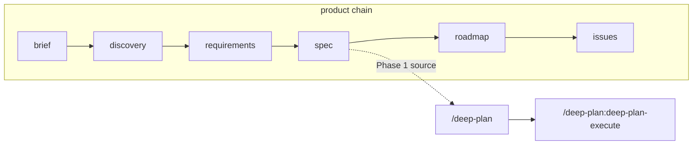

# Design rationale

This document explains *why* the `deep-plan` plugin works the way it does. What the commands do and how to use them is in [README.md](README.md) and `docs/`; this file records the design decisions behind them. The normative source for each workflow is its `SKILL.md` — where this document and a skill body disagree, the skill body wins.

## The two pipelines

The plugin ships two pipelines that meet at one seam:

```mermaid
flowchart LR
    subgraph product ["product chain"]
        B[brief] --> D[discovery] --> R[requirements] --> S[spec] --> RM[roadmap] --> I[issues]
    end
    S -.->|Phase 1 source| P["/deep-plan"]
    P --> E["/deep-plan:deep-plan-execute"]
```

**Plan-and-build** exists because one-shot planning fails in two ways: the model silently picks between meaningful options, and the resulting plan lives in chat where it can't be executed later. So `/deep-plan` makes every meaningful choice a structured question, and the plan is a file in the repo from the first resolved decision. **The product chain** exists because "what should we build" and "how do we build it" rot when mixed: each chain document answers one question, derived from exactly one upstream, and the spec is the single handoff point into planning.

## Why /deep-plan is shaped this way

The workflow is six phases (0–5) with two user gates. The reasoning behind the shape:

- **Research before decisions.** Phase 1 fans out three read-only agents in parallel — codebase exploration, a shallow web sweep, source ingestion — because options framed without evidence are guesses. Scope is confirmed with the user before any decision is asked.
- **Decisions are questions, asked one at a time, in dependency order.** Batching decisions into one multi-select question encourages skimming, and decisions are conditional — choosing Redis forecloses SQLite options downstream. Each answer is appended to the draft plan immediately, so a crashed run never loses a decision. The draft is born at the first question, not before: a plan file with no decisions in it is noise.
- **Deep research validates choices, never makes them.** Phase 3 runs one researcher per chosen option (cap 4 in parallel) against official docs. A contradiction re-opens the question with the evidence quoted. The alternative — letting research silently override the user — would break the co-authorship contract.
- **Critique before approval.** Phase 4 drafts once, sweeps six quality lenses inline (no agents — the lenses are cheap), probes assumptions with real shell commands, then Phase 4.6 launches critic agents that try to refute the plan. The fleet is triage-gated: each critic cluster is armed by a concrete signal (a weak test block, a new module boundary, a rewritten design section), so a small plan arms nothing and pays nothing. The bound is absolute — one pass, loop once — because unbounded critique loops burn tokens without converging.
- **Approval is structural.** One `AskUserQuestion` (approve / refine / drop / add / change a decision) is the only gate. Free-text "looks good?" questions are not gates: they get skimmed. Mechanical finalization runs *before* the question so it cannot be skipped.
- **Native plan mode is deliberately not used.** Its read-only guarantee is prompt-level anyway, and its injected workflow (plan file, exit approval) competes with this one. Phase 0 asks the user to toggle it off rather than fighting it.

## Why execute is a dispatcher

`/deep-plan:deep-plan-execute` never implements anything itself. It loads the plan's tasks into harness tasks with real dependencies (`TaskCreate`, then `addBlockedBy` — hence the Claude Code >= v2.1.142 floor), then launches exactly one `dp-implement-task` agent per task, in dependency order, in a fresh context each time.

Two decisions matter here:

- **The diff never reaches the dispatcher.** The implementer owns the whole increment — failing test, implementation, its own nested design and test review, a stability re-run, an implementation note — and returns a fixed six-line summary. Keeping the diff one level down keeps the dispatcher's context flat no matter how many tasks run.
- **Scope is audited from git, not from the agent's report.** The dispatcher compares what git says changed (tracked diff plus new untracked files, minus pre-existing ones) against the task's declared `Target files`. Both halves are needed: a plain diff misses created files; a bare untracked listing would blame pre-existing scratch files. Anything outside the set blocks completion and is reported; nothing is auto-reverted, because reverting user files on a heuristic is worse than asking.

Plan discovery honors a durable memo: approval records the plan path in per-project state, so execute finds the right plan even after `/clear`, falling back to the newest plan only when the memo is gone or stale. It refuses to run while the plan has open questions — an open question is an unmade decision, and unmade decisions are the planner's job, not the implementer's.

## Why the product chain is a chain

- **Single upstream per document.** Each document derives from exactly its predecessor. The moment a spec can quote the brief directly, the requirements step becomes optional in practice, and untested assumptions flow straight into planning. The chain makes ambiguity get spent at a defined step (requirements), not carried.
- **Provenance hashes, not timestamps.** Each document records the git blob hash of the upstream version it was derived from. Hashes survive rebases, clones, and touch(1); mtimes don't. Staleness computed this way is a fact about content, not filesystem accidents.
- **Stale warns, absent blocks.** Only a missing input stops a command. Treating stale as a blocker would make every upstream edit cascade into mandatory regeneration of the whole chain, which punishes iteration.
- **Unknown markers instead of invented numbers.** A generated market size is worse than a gap: it looks like research. The `[UNKNOWN: ...]` marker names what's missing and who would know, and downstream steps must carry it — a roadmap item resting on an unknown gets no score and cannot be sequenced.
- **The spec is the only member a planner reads.** `/deep-plan` opens `spec.md` and nothing upstream of it. This forces the spec to be self-contained (requirements carried verbatim, non-goals priced) and keeps the planner's input auditable: one file, one hash.
- **`issues/` is not a chain member.** The chain is closed at five documents. Issues are a projection of the roadmap into work-sized pieces, they can leave the repo (GitHub), and re-running *adds* rather than replaces — different lifecycle, different rules, so they live outside the family contract.
- **Filing is dry-run-first.** Creating GitHub issues is the only side effect in the plugin that leaves the repo, so it always shows exactly what would be created, then requires explicit confirmation, and every filed slice gets a ledger entry so re-runs are idempotent.

## Read-only enforcement

The planning orchestrator is held read-only by a prompt-level contract: it runs in the session's normal permission mode and may write only the plan folder and a per-session `/tmp` sandbox. There is no tool-level gate on the orchestrator — the harness ignores `permissionMode`, `hooks`, and `mcpServers` on plugin-bundled agents, so a hard sandbox is not available to a plugin.

The subagents are held read-only differently: each planning `dp-*` agent declares a `disallowedTools` list blocking `Write`, `Edit`, and `NotebookEdit`. The research agents (`dp-research-shallow`, `dp-research-deep`, `dp-source-ingest`) and the critic leaf (`dp-critic`) also disallow `Bash`, leaving them no shell write vector; `dp-explore-codebase` keeps `Bash` for read-only inspection — a residual vector accepted under the trusted-session model. Using `disallowedTools` instead of a `tools` allowlist is deliberate: an allowlist would strip access to ambient MCP documentation tools, which the researchers want.

**The one exception**: `dp-implement-task` must write — that's its job. It is bounded by the dispatcher's git-based scope audit, a `Workflow` denial in its frontmatter, and a prompt that forbids committing, editing the plan, or touching permission settings. `test_agents_contract.py` pins that the writable set is exactly this one agent, so a second writable agent cannot appear by accident.

One consequence is unavoidable: subagents inherit the parent session's permission mode, so in default mode every write inside every implementer prompts. The mitigation is a user-side allowlist in `.claude/settings.json` (documented in `docs/planning.md`), never a bypass flag — plugins cannot ship permissions.

## The critic fleet, shared

One agent (`dp-critic`) serves every review in the plugin. It carries no rubric of its own; the caller hands it a principles file, and the fleet recipe (triage-gate which clusters apply, one critic per armed cluster, adversarially verify each finding) is parametrized the same way. That is why `/design-review`, `/tdd-review`, `/product-review`, deep-plan's Phase 4.6, and the reviews nested inside each executed task are all the same machinery with different rubrics — a new review dimension needs a new principles file, not a new agent.

## The plan folder

A plan is a folder (`plans_dir/<slug>/`) with fixed member names: `plan.md` (canonical, carries `**Status**: draft → approved → executed`), `design.md` (the why, per decision, plus per-task implementation notes appended at execute time), `research.md` and `probes.md` (split out at archive so `plan.md` stays lean), and `architecture.md` only when a significance test passes. The draft is born as `<topic>-draft/`, renamed once behind a fail-closed `test ! -e` guard, and edited in place from then on — there is no mirror copy, so there is nothing to drift.

Generated regions (the `## Task overview` table, the `plans_dir/README.md` index, the `docs/product/README.md` index) live between HTML-comment markers and are regenerated by scripts, never hand-edited; a merge conflict inside one is resolved by regenerating. Legacy flat-file plans from old plugin versions are still discovered read-only, never rewritten.

## Engineering

Everything executable is stdlib-only Python, ruff-clean and `mypy --strict` (py312): `setup_session.py`, `finalize_plan.py`, `load_tasks.py`, `resolve_slug.py`, and the `SessionEnd` hook `cleanup.py` under deep-plan; `product_artifact.py` under product-artifacts; six filing modules under product-issues; shared primitives in `lib/artifact_common.py`. `load_tasks.py` is the single owner of the plan grammar — no other component re-parses tasks.

CI (`.github/workflows/ci.yml`) runs `ruff check lib skills`, `mypy --strict` (scope from `pyproject.toml`), and `python -m pytest -v` (discovery from `pyproject.toml` `testpaths` — 13 entries, contract tests co-located per skill plus cross-skill ones under `tests/`). Contract tests pin behavior, never wording: `GUARANTEES` in `tests/guarantees.py` declares what each shipped file must still do, `BUDGETS` caps what stays resident in context. `README.md` and this file carry no budget — they are never loaded as model context.

Releases are cut by the Conventional Commits auto-bump workflow; the version in `.claude-plugin/plugin.json` is never edited by hand. Runtime state lives under `$XDG_STATE_HOME/deep-plan/` and is never tracked. Historical designs and release-by-release rationale live in git history.
