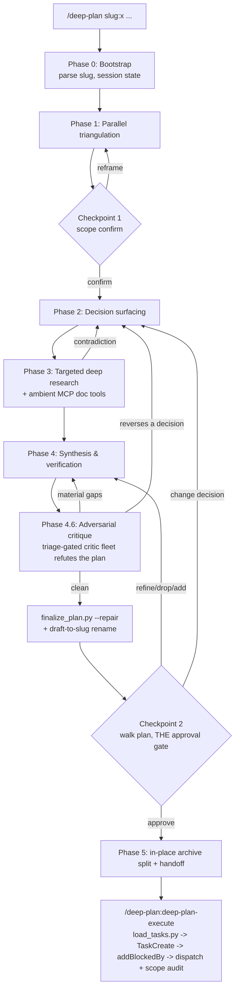

<!-- deep-plan-version: 1 -->

# Deep Plan Mode for Claude Code

`/deep-plan` is a slash-invoked deep-planning workflow for Claude Code, shipped as the `deep-plan` plugin. It co-designs a non-trivial plan with the user across seven phases, never silently picking between meaningful options, then hands the finished plan to a companion `/deep-plan:deep-plan-execute` command that builds it test-first. It runs in the session's normal permission mode and deliberately does not use Claude Code's native plan mode (see the v0.4 changelog and the History sections for why).

This document describes the **current design** (v0.6 of the plugin: the v0.2 refactor, the v0.3 power features, the v0.4 plan-mode removal, the v0.5 design-review critic fleet, and the v0.6 folder-per-plan artifact set). The superseded flat-file plan layout (v0.4/v0.5) is preserved under `## History (flat-file plan layout)`, the superseded v0.2/v0.3 plan-mode integration under `## History (v0.2/v0.3 plan-mode integration)`, and the original v0.1 design verbatim under `## History (v0.1)` at the end, all for rationale only. Where they conflict, the text above the History headings wins.

## What it does

- Fans research three ways in parallel in Phase 1 (codebase, light web, user-provided sources).
- Surfaces every meaningful sub-decision as a 3-to-5-option `AskUserQuestion`. Never silently picks.
- Does targeted deep web research per chosen option in Phase 3, opportunistically using ambient MCP documentation tools when the session exposes them.
- Runs an adversarial critique (Phase 4.6) that tries to refute the plan before the user approves it.
- Produces an AI-consumable plan folder that lives in the project: born as `plans_dir/<topic>-draft/` (canonical `plan.md` inside) at the first resolved decision, renamed to `plans_dir/<slug>/` before review. Descriptive slug, structured headings, `TaskCreate`-loadable, code-only TDD embedded, plus a `design.md` member carrying the expanded per-decision rationale and, during execution, per-task implementation notes.
- Saves the plan to a user-chosen project-local location (default `<repo>/docs/plans/`), never `~/.claude/plans/`.
- Runs one mode. Every phase states an absolute fan-out and loop bound at its call site, and the Phase 4.6 fan-out is triage-gated so a small plan pays for no critics.

The user is a co-author of the plan, not a reviewer.

## Phase workflow

```mermaid
flowchart TD
    Args["/deep-plan slug:x ..."] --> P0
    P0[Phase 0: Bootstrap<br/>parse slug, session state] --> P1[Phase 1: Parallel triangulation]
    P1 --> CP1{Checkpoint 1<br/>scope confirm}
    CP1 -->|reframe| P1
    CP1 -->|confirm| P2[Phase 2: Decision surfacing]
    P2 --> P3[Phase 3: Targeted deep research<br/>+ ambient MCP doc tools]
    P3 -->|contradiction| P2
    P3 --> P4[Phase 4: Synthesis & verification]
    P4 --> P46[Phase 4.6: Adversarial critique<br/>triage-gated critic fleet refutes the plan]
    P46 -->|material gaps| P4
    P46 -->|reverses a decision| P2
    P46 -->|clean| REP["finalize_plan.py --repair<br/>+ draft-to-slug rename"]
    REP --> CP2{Checkpoint 2<br/>walk plan, THE approval gate}
    CP2 -->|refine/drop/add| P4
    CP2 -->|change decision| P2
    CP2 -->|approve| P5[Phase 5: in-place archive split + handoff]
    P5 --> Exec["/deep-plan:deep-plan-execute<br/>load_tasks.py -> TaskCreate -> addBlockedBy -> dispatch + scope audit"]
```

### Phase 0: Bootstrap

Parse `$ARGUMENTS` for the optional `slug:` token (there is no native key:value parser); the remainder is the topic. If native plan mode is active, ask the user in one sentence to toggle it off (Shift+Tab) and stop the turn. Run `setup_session.py` to resolve the project root and `plans_dir` (prompting once per project: `docs/plans/` recommended, `.claude/plans/` warned against as a protected path, with a warn-and-offer-to-move sentinel for remembered protected dirs), detect stale `*-draft/` folders (and legacy flat drafts) left by abandoned runs (resume / overwrite / start fresh), and create the per-session sandbox.

### Phase 1: Parallel triangulation

Launch `dp-explore-codebase` (haiku) and `dp-research-shallow` (haiku) always, plus `dp-source-ingest` (sonnet) when the user supplied source material. Synthesize the findings and confirm scope with the user at Checkpoint 1.

### Phase 2: Decision surfacing

Enumerate 2 to 5 sub-decisions worth surfacing, generate option sets inline, and resolve them sequentially in dependency order via `AskUserQuestion`. The draft plan file `plans_dir/<topic>-draft/plan.md` is created when the first decision is asked, and each answer is appended to its `## Decisions made` table as it resolves, so an abandoned run never loses its decisions.

### Phase 3: Targeted deep research

Launch one `dp-research-deep` (sonnet) per decision branch, capped at 4 in parallel (waves of 4). A `## Contradiction` in any dossier loops back to Phase 2 for that one decision with the evidence quoted. Skipped entirely when no novelty needs research.

### Phase 4: Synthesis and verification

Generate the slug, rename the draft folder to `plans_dir/<slug>/` at Phase 4.2 behind a fail-closed guard (`test ! -e` on both the folder and the legacy flat form), then draft the plan body once and sweep it against the six synthesis lenses (simplicity, performance, maintainability, minimal-diff, security, deep-modules) from `references/perspectives.md` — one pass per lens, inside the synthesis turn, launching no agents. Seed `<slug>/design.md` from `references/design-md-template.md` with the expanded per-decision rationale and evidence links, and run inline verification probes (writing any fixtures into the sandbox).

### Phase 4.6: Adversarial critique

Arm each critic fleet from a named signal, then run the armed clusters through the recipe's triage gate. A code task with a missing or weak `**Tests (TDD)**` block arms the test fleet; a new module, boundary, or interface arms the design fleet; a new or rewritten `design.md` or `architecture.md` section arms the readability and plan-integrity clusters. A plan arming nothing launches no critics and goes straight to Checkpoint 2.

Plan-structure review — missing tasks, wrong or missing dependencies, code tasks lacking tests, decisions contradicted by research, untested assumptions — is carried by the `dp-critic` leaf running over a further cluster source, `references/plan-integrity-principles.md`, rather than by a dedicated agent: that leaf supplies no rubric of its own, so a new cluster source needs no new agent type. Findings are tagged `material` or `minor`. Material findings are fixed inline (or, if they reverse a user decision, loop back to Phase 2 with the contradiction quoted); minor findings go to `## Open questions`. The bound is absolute: one pass, loop once on material findings. Then Checkpoint 2 walks the plan with the user (approve / refine / drop / add / change a decision).

### Phase 5: Archive and handoff

`finalize_plan.py --repair` auto-normalizes the plan in place BEFORE the Checkpoint 2 question (including regenerating the `## Task overview` table between its markers), so finalization cannot be skipped; Checkpoint 2's `AskUserQuestion` ("Approve and finalize") is the single approval gate. On approval, `finalize_plan.py --archive` rewrites the lean `plans_dir/<slug>/plan.md` in place (source and destination are the same file), stamps `**Status**: approved` and `**Date**` under the title, splits the appendices into the `probes.md` and `research.md` folder members, and regenerates the `plans_dir/README.md` index; the orchestrator then recommends the user run `/compact` before handing the plan to `/deep-plan:deep-plan-execute`.

## Fan-out bounds

There is one mode. Every phase states its own absolute bound at its call site, and every agent launch is `effort: inherit`:

| Phase | Bound |
|-------|-------|
| Phase 1 | explore + shallow always, + source-ingest when the user supplied sources |
| Phase 3 | one `dp-research-deep` per decision, cap 4, waves of 4; skipped when no novelty exists |
| Phase 4 | no agents: six lenses swept in the synthesis turn |
| Phase 4.6 | one pass, loop once on material findings; each fleet armed by signal, then triage-gated |

## Implementation handoff

`/deep-plan:deep-plan-execute [plan-path]` is a companion skill in the same plugin. It accepts a plan folder or its `plan.md`; with no argument, discovery first consults the durable approved-plan memo that Phase 5 records at approval (read back via `setup_session.py --lookup`, and honored only while the memoized plan file still exists and carries `**Status**: approved`), and only then falls back to picking the newest plan across both shapes (`<slug>/plan.md` preferred, legacy flat `<slug>.md` still found), excluding the generated README, legacy dotted siblings, and unfinished `*-draft/` folders. It runs `load_tasks.py` to parse the finalized plan's `## Tasks` into structured JSON, refuses to start while `## Open questions` is non-empty, then performs a two-pass load against the harness Task API: pass 1 creates one task per `### Task` (`TaskCreate`), capturing the returned opaque id into an `int -> id` map; pass 2 wires each task's `Depends on` into `addBlockedBy` (`TaskUpdate`).

It then **dispatches** rather than implements. For each task in dependency order it captures a baseline ref, snapshots pre-existing untracked paths, and launches exactly one `dp-implement-task` agent with four scalars: the plan path, the task number, the baseline ref, and a `fleet_mode`. That agent owns the whole increment in a context that is discarded on return — failing test first, implement, verify, its own nested design and test critic fleets over the task diff, material-finding fixes, the post-green stability re-run, and the `design.md` implementation note — and returns a fixed six-line summary. The agent fetches its own task body via `load_tasks.py --task N`, so no field of the plan grammar is re-typed into a prompt.

The dispatcher never sees a diff. Instead it audits scope from git: the union of `git diff --name-only <baseline>` and the post-run untracked listing, minus the pre-dispatch snapshot, compared against the task's `Target files` (plus the plan folder's `design.md`, which the note append targets). Both halves are needed — a plain diff omits newly created files, and a bare untracked listing would wrongly attribute pre-existing scratch files. Any path outside that set blocks completion and is reported to the user; nothing is auto-reverted. When all tasks complete, folder plans get their `**Status**` flipped to `executed` and the index refreshed via `finalize_plan.py --index`. Requires Claude Code >= v2.1.142 for the Task dependency API.

Because the fleet is nested inside the implementer, per-task agent consumption is a range (one implementer plus 8 finders at minimum, but the verify stage launches one agent per surviving finding and is uncapped). `fleet_mode` degrades on the top of that range: `full` up to 8 tasks, `design-only` for 9 to 16, `inline` beyond 16.

`load_tasks.py` reuses the section-slicing helpers (`_header_pos`, `_section_end`, `_section_body`) from `finalize_plan.py` rather than re-implementing them.

## Read-only enforcement (current model)

The orchestrator is held read-only by a prompt-level contract (R1 in SKILL.md): it runs in the session's normal permission mode and may write only the project-local plan file and the per-session sandbox. There is no tool-level gate on the orchestrator; the contract is enforced by the skill text and the checkpoint gates. The planning subagents are **not** held read-only by `permissionMode` -- the harness ignores `permissionMode`, `hooks`, and `mcpServers` on plugin-bundled agents. Instead each planning `dp-*` agent declares a `disallowedTools` list that blocks `Write`, `Edit`, and `NotebookEdit`, reinforced by a read-only system prompt. The research agents (`dp-research-shallow`, `dp-research-deep`, `dp-source-ingest`) also disallow `Bash`, so they have no shell write vector at all; `dp-explore-codebase` keeps `Bash` for read-only inspection. That residual Bash is a theoretical write vector, mitigated by the prompt and the trusted-session model, not a hard sandbox. Every agent also defensively disallows native plan mode's approval tool, since the harness nudges plan-shaped subagents toward it even though the skill never uses plan mode.

**The execute-time exception.** `dp-implement-task` is the one agent that may write, because writing code is its job. It cannot be bounded by a tool block, so it is bounded three other ways: `disallowedTools` denies `Workflow` (whose nesting is capped at one level anyway), the dispatcher audits its changed paths against the task's `Target files` from git's report rather than the agent's self-report, and its own prompt forbids committing, editing `plan.md`, or touching permission settings. `test_agents_contract.py` pins that the writable set is exactly `{dp-implement-task}`, so a second writable agent cannot appear by accident.

One consequence is unavoidable and is documented in the execute skill's `## Preflight`: subagents **inherit** the parent session's permission mode, and since plugin-bundled agents cannot set `permissionMode`, a default-mode run prompts on every `Write`, `Edit`, and `Bash` inside every implementer. The mitigation is a user-side project-local allowlist, not a bypass flag. Restricting which agent types the implementer may spawn would likewise need a user-side `permissions.deny` rule: the parenthesised `Agent(type)` allowlist form is silently ignored inside a subagent definition, and plugins cannot ship permissions.

Dropping the old `tools` allowlist for `disallowedTools` is also what lets the agents reach any ambient MCP documentation tools during research; an explicit `tools` allowlist would have stripped MCP access.

The v0.1 bundled write-guard (`guard_writes.py`, a `PreToolUse` hook) has been removed. The prompt-level contract plus `disallowedTools` are the boundary; only the `Stop` cleanup hook remains.

## Plan file shape

Every plan is a folder: `plans_dir/<slug>/` with fixed member names (`plan.md`, `research.md`, `probes.md`, `design.md`, and -- only for architecturally significant plans per the significance test in `references/architecture-md-template.md` -- `architecture.md`). `plan.md` is the canonical plan, born as `plans_dir/<topic>-draft/plan.md` at the start of Phase 2 (so resolved decisions are crash-safe); the folder is renamed to `plans_dir/<slug>/` at Phase 4.2 behind a fail-closed `test ! -e` dual guard (v0.6 also resolved the repo's old 4.1/4.2 rename naming drift in favour of 4.2), and `plan.md` is edited in place from then on. There is no mirror and no on-approval copy; `finalize_plan.py --archive` rewrites the same file lean in place, stamps `**Status**: approved` and `**Date**` under the title, splits the `## Verification probes` and `## Research dossiers` appendices into the `probes.md` and `research.md` members, and regenerates the `plans_dir/README.md` index (a generated region between `<!-- deep-plan-index:begin generated: do not edit -->` / `<!-- deep-plan-index:end -->` markers; merge conflicts inside it are resolved by regenerating, never by hand). The session state's `plan_path` tracks the current `plan.md` for re-entry detection.

The `design.md` member has a two-phase lifecycle: Phase 4.4 seeds it per the narrative `references/design-md-template.md` -- a `## Background` section, then one plain-language-question section per decision whose body opens with the decision in its first sentence -- and `/deep-plan:deep-plan-execute` appends one terse `### Task {N}` entry under its `## Implementation notes` per completed task, gated after that task's verification passes. The plan's `## Decisions made` table is an index into it: each row's Rationale cell is one clause plus a `[question heading](design.md#anchor)` link, and `finalize_plan.py` warns (never fixes) when such a link resolves to no design.md heading or when any H2/H3 section dangles empty. The Phase 3 dossiers are question-first (`**The question**` / `**The answer**` / `**What we found**` / `**Sources**`, normative home `agents/dp-research-deep.md`), and the plan's `## Research dossiers` appendix opens with a coverage table naming, per decision, its dossier or why it was not researched.

The section order inside `plan.md` is fixed -- Context, Decisions made, Architecture, Tasks, References, Open questions -- plus the generated `## Task overview` region between `<!-- deep-plan-task-overview:begin generated: do not edit -->` / `<!-- deep-plan-task-overview:end -->` markers: a `# | Task | Files | Deps | Summary` table rebuilt by every `--repair` run, whose Summary column is each task's opening plain-English summary sentence (every `**Change**` block must open with one, PEP 257 terminator rule). Each task carries Target files, Change, Verification, and Depends on; the `**Tests (TDD)**` subsection is included only for tasks that create or modify code. `finalize_plan.py --repair` auto-repairs the plan (em-dashes, task headers, missing sections, attribution, the overview region) rather than validating-and-rejecting in a loop.

Discovery is dual-read, folder-write: every consumer reads both shapes (`<slug>/plan.md` preferred, legacy flat `<slug>.md` still found), `resolve_slug.py` treats either form as a collision, new plans are always folders, and legacy flat plans are approved historical records left untouched.

## Engineering

The repository root is both plugin and marketplace root. Skills live under `skills/`, agent definitions under `agents/`, shared helpers under `lib/`, and CI-facing tests beside their owning skill or under `tests/` for cross-skill contracts.

Keep always-resident frontmatter descriptions small, keep invoked workflow instructions within their enforced token budgets, and place optional detail under `references/`. The limits are defined once in `tests/guarantees.py` and enforced by the test suite.

Runtime state belongs under `$XDG_STATE_HOME/deep-plan/` and is never tracked. Historical designs and release-by-release rationale remain available in Git history.
Every helper is stdlib-only Python (`setup_session.py`, `resolve_slug.py`, `finalize_plan.py`, `load_tasks.py`, and the `cleanup.py` Stop hook), ruff-clean and `mypy --strict` compliant, with no runtime dependencies. CI (`.github/workflows/ci.yml`) installs `ruff`, `mypy`, `pytest` (pinned `>=9,<10`), and `tiktoken`, then runs, in order, `ruff check skills`, `mypy --strict skills/deep-plan/scripts skills/deep-plan/hooks`, and bare `python -m pytest -v` — test discovery is owned by `pyproject.toml`'s `[tool.pytest.ini_options]` (`testpaths` plus `--import-mode=importlib`), never by per-caller path lists. `pyproject.toml` pins the gate configuration. Contract tests are co-located per skill: `skills/deep-plan/tests/` covers the golden-plan drift guard, repair/archive (including the generated Task overview and README index), session state, slug normalisation and dual-form collision, the cleanup hook, the read-only agents contract, the `load_tasks` parser (file and folder inputs), the design.md template contract, and the SKILL.md frontmatter/wiring contract; `skills/design-review/tests/` pins the design-principles structure and fleet recipe; `skills/tdd-review/tests/` pins the test-principles rubric and the tdd-review wrapper.
