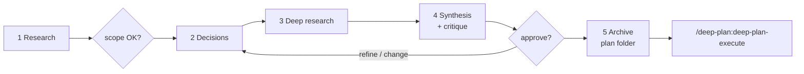

# deep-plan

A Claude Code plugin for deep, co-authored planning of non-trivial work. You are a co-author, not a reviewer: the skill never silently picks between meaningful options, and every plan it produces is an AI-consumable artifact in your repo that a companion command can implement test-first.

## How it works

`/deep-plan <topic>` runs a phased workflow with two hard user gates:

1. **Research** -- three subagents triangulate in parallel: your codebase, a light web sweep, and any sources you provide (files, URLs, Jira tickets). You confirm the scope before anything else happens.
2. **Decisions** -- every meaningful sub-decision (storage, algorithm, library, boundary placement...) becomes its own 3-to-5-option question, asked in dependency order. Each answer is written to the draft plan immediately, so a crashed run never loses a decision.
3. **Deep research** -- one researcher per chosen option validates it against official docs. Contradictions come back to you as a re-ask, never a silent override.
4. **Synthesis and critique** -- perspective drafts are merged into a task-by-task plan, assumptions are probed with real shell checks, then an adversarial critic (plus a design-review fleet) tries to refute the plan before you ever see it.
5. **Approval and archive** -- you walk the plan through a structured approve/refine/change question (the only approval gate). On approval the plan is archived as a folder in your repo and you are handed off to implementation.



`/deep-plan:deep-plan-execute` then turns the plan's tasks into real harness tasks with dependencies (`TaskCreate` + `addBlockedBy`) and implements them one at a time in dependency order: failing test first, implement, verify, a dual post-task review of the task's diff (the design fleet and the test fleet side by side), a post-green stability re-run of the task's tests to catch flakes before completion, record an implementation note. It refuses to start while the plan has open questions.

## Quick start

```
/plugin marketplace add tsadoq/claude-better-plan
/plugin install deep-plan@claude-better-plan
```

Then, in any project:

```
/deep-plan add a rate limiter to the API
/deep-plan slug:rate-limiter depth:exhaustive add a rate limiter to the API
```

- `depth: shallow | standard | exhaustive` -- how hard to work, from a quick single pass to multi-wave research with a looping critique. Default `standard`.
- `slug: my-name` -- an explicit name for the plan folder; otherwise derived from the topic.

After approval (and the recommended `/compact`), implement it:

```
/deep-plan:deep-plan-execute                      # newest plan in the project plans_dir
/deep-plan:deep-plan-execute docs/plans/my-plan   # or name a plan folder / plan.md
```

Requires Claude Code >= v2.1.142 for the Task dependency API.

## The plan folder

Each plan lives in its own folder, `plans_dir/<slug>/` (default `docs/plans/<slug>/`):

| Member | Content |
|--------|---------|
| `plan.md` | The canonical plan: context, decisions table, a generated at-a-glance `## Task overview` table, and the tasks with embedded TDD criteria. Carries a `**Status**` line (`draft` -> `approved` -> `executed`). |
| `design.md` | The why, told as a narrative design document: a Background section, then one plain-language-question section per decision (the plan's decisions table links into them), plus terse per-task implementation notes appended during execution. |
| `architecture.md` | Conditional: the Today / After world model, written only for architecturally significant plans (skipped when the change is reversible within a sprint, contained in one component, or routine). |
| `research.md` | The question-first research dossiers with an opening coverage table (one row per decision), split out on archive so `plan.md` stays lean. |
| `probes.md` | The verification probes -- why each ran, the command, what was observed, and what a failure would have meant -- split out the same way. |

Archiving also regenerates `plans_dir/README.md`, a browsable index of every plan with title, status, and date. The index and the task-overview table are fully generated between HTML-comment markers: never hand-edit them, re-run `finalize_plan.py --repair` / `--index` instead (that is also how you resolve a merge conflict in them). Plans created by older plugin versions as flat files with legacy dotted siblings are still discovered read-only; they are never rewritten.

## Configuration

The first run in a project asks where plans should live (recommended: `<repo>/docs/plans/`; never `~/.claude/plans/`) and remembers the answer in `$XDG_STATE_HOME/deep-plan/projects.json` (default `~/.local/state/deep-plan/`). Edit that file to change it.

To make plan writes prompt-free in default permission mode, allowlist the plan paths once per project in `.claude/settings.json` (plugins cannot ship permissions; the `test ! -e` rule covers the guard of the fail-closed rename, which is permission-checked per segment):

```json
{"permissions": {"allow": ["Edit(/docs/plans/**)", "Write(/docs/plans/**)", "Bash(mv docs/plans/*)", "Bash(test ! -e docs/plans/*)"]}}
```

## Guardrails

- **Read-only planning.** A prompt-level contract lets the orchestrator write only the plan folder and a per-session `/tmp` sandbox (for verification probes that need scratch files; cleaned up on session end). Subagents are held read-only by `disallowedTools`, which also leaves them free to use any ambient MCP documentation tools during research.
- **Approval is structural.** The plan is approved through one structured walk-the-plan question, never a plain-text "looks good?". Mechanical finalization (auto-repair, rename, overview regeneration) runs before the question, so it cannot be skipped.
- **No native plan mode.** Its read-only guarantee is prompt-level anyway, and its injected workflow competes with this one; if plan mode is active, Phase 0 asks you to toggle it off. The full rationale is in `PLAN.md`.
- **Crash-safe and re-entrant.** The plan lives in your repo from the first resolved decision; stale drafts and slug collisions are surfaced as resume/overwrite/rename questions, never silently clobbered.

## Design review

A parallel critic fleet (one small-model `dp-design-critic` per red-flag cluster, then an adversarial verify pass on each finding) reviews design quality at plan time, critique time, and after each executed task's tests go green; `/design-review [path | git ref | plan-file]` runs the same fleet standalone. A sibling test-critic fleet (`dp-test-critic`) runs through the same parametrized recipe against the plan's `**Tests (TDD)**` blocks at critique time and against each task's diff at execute time. The design guidelines live in `skills/design-review/references/design-principles.md`, independently paraphrased from a named source with no affiliation (see that file's `## Attribution and scope`); the test guidelines live in `skills/deep-plan/references/test-principles.md`. The fleet prefers the harness Workflow tool and falls back to a plain agent fan-out where Workflow is unavailable.

## Development

This repo is a single-plugin marketplace: the repo root is the plugin root. Orchestration lives in `skills/*/SKILL.md` with prompt fragments and templates under `references/`; the stdlib-only helper scripts and their tests live in `skills/deep-plan/scripts/` and `skills/deep-plan/tests/`; subagent definitions in `agents/`.

```
/plugin marketplace add /absolute/path/to/claude-better-plan   # local checkout
uvx ruff check skills/deep-plan                                # the CI gate, locally
uvx mypy --strict skills/deep-plan/scripts skills/deep-plan/hooks
uvx pytest skills/deep-plan/tests -q
```

`SKILL.md` and `references/` edits hot-reload within a session; changes under `agents/` need `/reload-plugins` or a restart. Contract tests pin the load-bearing strings of the skills, templates, and design principles: when you change one, change its test in the same commit. Releases flow through the Conventional Commits auto-bump CI (a `feat:`/`fix:` commit on main bumps `plugin.json`); never edit the version by hand.

## See also

- `PLAN.md`: the full design rationale, phase-by-phase semantics, and version history.
