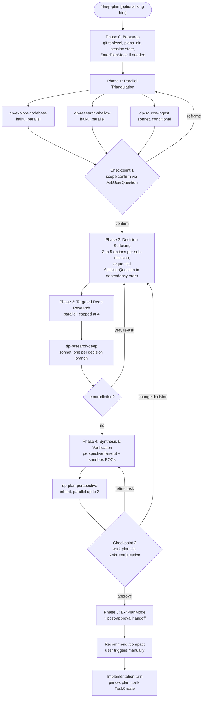

# deep-plan

A personal Claude Code skill that replaces the default plan mode for non-trivial work. It fans research three ways in parallel, surfaces every meaningful sub-decision as a multi-option `AskUserQuestion`, runs targeted deep web research per chosen option, and produces an AI-consumable plan file.

The user is a co-author of the plan, not a reviewer. The skill never silently picks between meaningful options.

## Workflow



## Quick start

In Claude Code:

```
/plugin marketplace add tsadoq/claude-better-plan
/plugin install deep-plan@claude-better-plan
```

Then in any project:

```
/deep-plan add a rate limiter to the API
```

To install from a local checkout while developing:

```
/plugin marketplace add /absolute/path/to/claude-better-plan
/plugin install deep-plan@claude-better-plan
```

## File layout

This repo is a Claude Code marketplace that ships exactly one plugin (`deep-plan`). The repo root is also the plugin root. Runtime data lives at `$XDG_STATE_HOME/deep-plan/` (default `~/.local/state/deep-plan/`) and is never git-tracked.

```
claude-better-plan/                              # repo root = plugin root = marketplace root
.claude-plugin/
  plugin.json                                    # plugin manifest
  marketplace.json                               # single-plugin marketplace manifest
README.md                                        # this file
PLAN.md                                          # design rationale
skills/deep-plan/
  SKILL.md                                       # entry point, orchestration body
  hooks/
    guard_writes.py                              # PreToolUse, write-path enforcement
    cleanup.py                                   # Stop, sandbox + state cleanup
  scripts/
    setup_session.py                             # Phase 0 bootstrap
    resolve_slug.py                              # Phase 4 slug normalise + collision check
    finalize_plan.py                             # Phase 5 validation + harness mirror
  references/
    phase-prompts.md
    perspectives.md
    plan-file-template.md
agents/
  dp-explore-codebase.md
  dp-research-shallow.md
  dp-research-deep.md
  dp-source-ingest.md
  dp-plan-perspective.md

$XDG_STATE_HOME/deep-plan/                       # runtime, auto-created on first /deep-plan run
  projects.json                                  # per-project plans_dir map
  hook-errors.log                                # append-only hook exceptions
  state/<session_id>.json                        # per-session state
```

## Key invariants

1. The plan file is the only writable artifact during planning. Everything else is read-only.
2. Approval is its own tool (`ExitPlanMode`), never a question.
3. Two-tier model usage: haiku for breadth, sonnet/inherit for synthesis.
4. Continuity across turns: the plan file survives via the `system-reminder-plan-file-reference` mechanism.
5. Re-entry is overwrite vs refine vs new-with-suffix, never silent assumption.

## Configuration

`$XDG_STATE_HOME/deep-plan/projects.json` (default `~/.local/state/deep-plan/projects.json`) maps absolute project root paths to their `plans_dir`. First run per project prompts via `AskUserQuestion`:

1. `<repo>/.claude/plans/` (Recommended)
2. `<repo>/plans/`
3. `<repo>/docs/plans/`
4. `<repo-parent>/<repo-name>-plans/`

The default is **never** `~/.claude/plans/`. Plans live with the project they describe.

To change a project's `plans_dir`, edit `projects.json` directly.

## Verification sandbox

Phase 4 verification probes can write files when needed (small fixtures, throwaway pytests). They write under `/tmp/deep-plan-<session_id>/`, mode 0700, cleaned up by the `Stop` hook plus a 7-day TTL sweep.

The `PreToolUse` hook (`guard_writes.py`) enforces write-path policy: only the canonical plan file, the harness mirror plan file, the sandbox, and the session state file are writable. Bash side-effect patterns (`>`, `>>`, `tee`, `mkdir`, `rm`, `cp`, `mv`, `sed -i`, `python -c '...open("...", "w")'`, `git add/commit/push/reset/checkout --`) are blocked unless the command literal contains the sandbox path.

This is best-effort against accidents, not a true sandbox. A determined model can construct bash that evades the regex (heredocs, `tr` tricks). Strong read-only enforcement comes from `permissionMode: plan` on the subagents, where most actual research happens.

## See also

- `PLAN.md`: the full design rationale, phase-by-phase semantics, failure-mode catalog, and end-to-end verification checklist.
