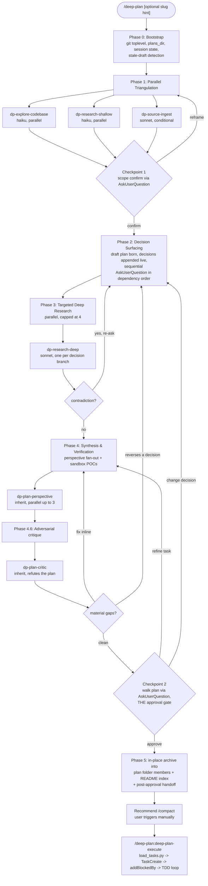

# deep-plan

A personal Claude Code skill for deep, co-authored planning of non-trivial work. It fans research three ways in parallel, surfaces every meaningful sub-decision as a multi-option `AskUserQuestion`, runs targeted deep web research per chosen option, runs an adversarial critique pass that tries to refute the plan before you approve it, and produces an AI-consumable plan file inside your repo. A companion `/deep-plan:deep-plan-execute` command then turns that plan into real harness tasks and drives a test-first implementation loop.

The user is a co-author of the plan, not a reviewer. The skill never silently picks between meaningful options. A `depth:` argument scales how hard it works, from a quick single pass to an exhaustive multi-wave run.

## Workflow



## Quick start

In Claude Code:

```
/plugin marketplace add tsadoq/claude-better-plan
/plugin install deep-plan@claude-better-plan
```

Then in any project:

```
/deep-plan add a rate limiter to the API
```

Optional arguments (parsed from the prompt; order-free):

```
/deep-plan slug:rate-limiter depth:exhaustive add a rate limiter to the API
```

- `depth: shallow | standard | exhaustive` -- scales fan-out and `effort`. `shallow` runs explore + shallow research only, skips deep research, one perspective, one quick critique pass. `standard` (default) is the full workflow with one critique loop. `exhaustive` runs multiple research waves, three perspectives, and loops the critique until it finds nothing material (cap 3 rounds).
- `slug: my-name` -- an explicit archive-slug hint; otherwise the slug is derived from the topic.

After approval and `/compact`, hand the plan to implementation:

```
/deep-plan:deep-plan-execute            # newest plan in the project plans_dir (folder or legacy flat)
/deep-plan:deep-plan-execute docs/plans/my-plan         # a plan folder is accepted as-is
/deep-plan:deep-plan-execute docs/plans/my-plan/plan.md
```

It parses the plan's `## Tasks`, creates one harness task per task (`TaskCreate`), wires `Depends on` into `addBlockedBy` (`TaskUpdate`), then implements each task test-first in dependency order, appending a terse per-task entry to the plan folder's `design.md` under `## Implementation notes` as each task completes. It refuses to start while `## Open questions` is non-empty. When all tasks complete, folder plans get their `**Status**` flipped to `executed` and the plans index refreshed. Requires Claude Code >= v2.1.142 for the Task dependency API.

To install from a local checkout while developing:

```
/plugin marketplace add /absolute/path/to/claude-better-plan
/plugin install deep-plan@claude-better-plan
```

Developing notes: edits to `SKILL.md` files and `references/` hot-reload within a session, but changes under `agents/` need `/reload-plugins` or a restart to register. Guideline content is edited only in `skills/design-review/references/design-principles.md`, whose section headings are pinned by `test_design_review_contract.py` -- change the test and every quoting caller in the same commit. Releases flow through the Conventional Commits auto-bump CI (a `feat:`/`fix:` commit on main bumps `plugin.json`); never edit the version by hand.

## File layout

This repo is a Claude Code marketplace that ships exactly one plugin (`deep-plan`). The repo root is also the plugin root. Runtime data lives at `$XDG_STATE_HOME/deep-plan/` (default `~/.local/state/deep-plan/`) and is never git-tracked.

```
claude-better-plan/                              # repo root = plugin root = marketplace root
.claude-plugin/
  plugin.json                                    # plugin manifest
  marketplace.json                               # single-plugin marketplace manifest
pyproject.toml                                   # ruff + mypy --strict gate config (no runtime deps)
README.md                                        # this file
PLAN.md                                          # design rationale
skills/deep-plan/
  SKILL.md                                       # entry point, orchestration body
  hooks/
    cleanup.py                                   # SessionEnd, sandbox + state cleanup
  scripts/
    setup_session.py                             # Phase 0 bootstrap
    resolve_slug.py                              # Phase 4 slug normalise + collision check
    finalize_plan.py                             # Checkpoint 2 auto-repair + Phase 5 in-place archive split
    load_tasks.py                                # parse a finalized plan into structured tasks (execute)
  references/
    phase-prompts.md
    perspectives.md
    plan-file-template.md
    design-md-template.md                        # design.md member skeleton (two-phase lifecycle)
  tests/
    test_finalize.py                             # repair + archive + task overview + index behaviour
    test_setup_session.py                        # session state, update, legacy migration
    test_template_contract.py                    # template/golden drift guard
    test_resolve_slug.py                         # slug normalise/validate/dual-form collision
    test_cleanup.py                              # SessionEnd-hook teardown + TTL sweep
    test_agents_contract.py                      # subagents are read-only via disallowedTools
    test_load_tasks.py                           # plan -> structured task parsing (file or folder)
    test_skill_contract.py                       # SKILL.md frontmatter + lifecycle wiring
    test_design_md_contract.py                   # design.md template shape guard
    test_design_review_contract.py               # design-principles headings + fleet wiring
    golden/example-plan.md
skills/deep-plan-execute/
  SKILL.md                                       # companion: plan -> harness tasks -> TDD loop
skills/design-review/
  SKILL.md                                       # standalone /design-review entry (thin)
  references/
    design-principles.md                         # guideline source of truth (attribution inside)
    fleet-orchestration.md                       # Workflow script, version gate, fallback, probe status
agents/
  dp-explore-codebase.md
  dp-research-shallow.md
  dp-research-deep.md
  dp-source-ingest.md
  dp-plan-perspective.md
  dp-plan-critic.md                              # Phase 4.6 adversarial critic
  dp-design-critic.md                            # design-review fleet member (haiku, Bash-free)

$XDG_STATE_HOME/deep-plan/                       # runtime, auto-created on first /deep-plan run
  projects.json                                  # per-project plans_dir map
  hook-errors.log                                # append-only hook exceptions
  state/<session_id>.json                        # per-session state
```

## Power features

- **Depth control (`depth:`)** scales the run. `shallow` is a fast single pass (explore + shallow research, no deep research, one perspective, one quick critique); `standard` is the full workflow with one critique loop; `exhaustive` runs multiple research waves, three perspectives, and loops the critique until nothing material remains (cap 3 rounds). Depth also drives the native `effort` field. See the Depth scaling table in `SKILL.md`.
- **Adversarial critique (Phase 4.6)** launches `dp-plan-critic` after synthesis to *refute* the plan, not praise it: missing tasks, wrong or missing dependencies, code tasks without tests, decisions contradicted by research, and untested assumptions. Material findings are fixed inline (or, if they reverse a user decision, loop back to Phase 2 with the contradiction quoted); minor findings drop into `## Open questions`.
- **Implementation handoff (`/deep-plan:deep-plan-execute`)** parses the finalized plan with `load_tasks.py`, creates one harness task per `### Task` (`TaskCreate`), wires `Depends on` into `addBlockedBy` (`TaskUpdate`), and drives a test-first loop task by task in dependency order. It refuses to start while `## Open questions` is non-empty. Requires Claude Code >= v2.1.142.
- **Opportunistic MCP research.** The research subagents drop the old `tools` allowlist for a `disallowedTools` list, which keeps them write-free while letting them reach any ambient MCP documentation tools (for example a HuggingFace or library doc-search server) when present. They are never required: `WebSearch`/`WebFetch` remain the baseline.

## Design review

Design-quality guidance is embedded at every stage of the pipeline, delivered by a parallel critic fleet: one small-model `dp-design-critic` (haiku, read-only, Bash-free) per red-flag cluster, then an adversarial verify stage that tries to refute each finding before it reaches you. Four surfaces share the one implementation:

- **Standalone `/design-review [path | git ref | plan-file]`** runs the fleet against any code, diff, or plan file (working diff by default) and reports deduplicated findings grouped material-then-minor.
- **Plan-time (`/deep-plan`)**: Phase 2 option generation weighs options for interface depth and information hiding, and the Phase 4 perspective fan-out always includes a `deep-modules` perspective alongside the 1 to 3 picked ones.
- **Critique-time (Phase 4.6)**: the design fleet reviews the synthesized plan body and architecture in the same launch as `dp-plan-critic`; findings merge into the existing material/minor handling.
- **Execute-time (`/deep-plan:deep-plan-execute`)**: after each task's tests go green, the fleet reviews that task's diff; material findings are fixed before the task may complete, minor ones land in the completion note.

The guideline content lives in a single file, `skills/design-review/references/design-principles.md`, grouped by stage (plan-time principles, review-time red flags as checkable questions, execute-time craft rules); orchestrators quote only the relevant group into each critic. The concepts are independently paraphrased and reorganized from a named source, with no affiliation or endorsement -- see that file's `## Attribution and scope` section for the full stance.

The fleet prefers the harness's Workflow tool (deterministic fan-out, schema-validated findings, dedup barrier). Workflow is gated: Claude Code >= 2.1.154, paid plans only, off by default on Pro, and org-disableable. Wherever it is absent, denied, or errors, the callers automatically fall back to a plain Agent-tool fan-out with the identical finder-then-verify shape, so older or restricted installs degrade gracefully. Mechanics live in `skills/design-review/references/fleet-orchestration.md`.

## Key invariants

1. A prompt-level read-only contract holds during planning: the orchestrator writes only the project-local plan folder (born as `plans_dir/<topic>-draft/` in Phase 2, renamed to `plans_dir/<slug>/` at Phase 4.2 behind a fail-closed guard; members `plan.md`, `research.md`, `probes.md`, `design.md`) and the verification sandbox. Each subagent is held read-only by a `disallowedTools` list (not `permissionMode`, which the harness ignores for plugin-bundled agents).
2. Approval is Checkpoint 2's structured walk-the-plan question, never a plain-text "looks good?". Mechanical finalization (repair + rename) runs before the question, so it cannot be skipped.
3. Two-tier model usage: haiku for breadth, sonnet/inherit for synthesis.
4. Continuity across turns and crashes: the plan lives in the repo from the first resolved decision onward, so an abandoned run never loses its decisions.
5. Re-entry is resume vs overwrite vs new-with-suffix, never silent assumption.

## Configuration

`$XDG_STATE_HOME/deep-plan/projects.json` (default `~/.local/state/deep-plan/projects.json`) maps absolute project root paths to their `plans_dir`. First run per project prompts via `AskUserQuestion`:

1. `<repo>/docs/plans/` (Recommended)
2. `<repo>/plans/`
3. `<repo-parent>/<repo-name>-plans/`
4. `<repo>/.claude/plans/` -- warned against: `.claude/` is a protected path, so every write there prompts and cannot be allowlisted

The default is **never** `~/.claude/plans/`. Plans live with the project they describe. A remembered `plans_dir` under `.claude/` triggers a bootstrap sentinel and an offer to move it; nothing is migrated silently.

To make plan writes prompt-free in default permission mode, add the allow rules once per project in `.claude/settings.json` (plugins cannot ship permissions, so this is a one-time user step; the `test ! -e` rule covers the guard segments of the fail-closed Phase 4.2 rename, which are permission-checked per segment):

```json
{"permissions": {"allow": ["Edit(/docs/plans/**)", "Write(/docs/plans/**)", "Bash(mv docs/plans/*)", "Bash(test ! -e docs/plans/*)"]}}
```

To change a project's `plans_dir`, edit `projects.json` directly.

The `plans_dir/README.md` index is fully generated between its HTML-comment markers (title, status, and date read from each plan's content, rows sorted by slug). A merge conflict inside the markers is resolved by re-running `finalize_plan.py --index --plans-dir <dir>`, never by hand-editing.

## Read-only model and verification sandbox

Planning is held read-only by a prompt-level contract: the skill runs in the session's normal permission mode and writes exactly two places, the project-local plan file and the verification sandbox. The subagents are not held read-only by `permissionMode` (the harness ignores `permissionMode`, `hooks`, and `mcpServers` on plugin-bundled agents); instead each `dp-*` agent declares a `disallowedTools` list that blocks `Write`, `Edit`, and `NotebookEdit`, reinforced by a read-only system prompt. The research agents (`dp-research-shallow`, `dp-research-deep`, `dp-source-ingest`) also disallow `Bash`, so they have no shell write vector; `dp-explore-codebase`, `dp-plan-perspective`, and `dp-plan-critic` keep `Bash` for read-only inspection (a residual theoretical write vector, mitigated by prompt and the trusted-session model, not a hard sandbox). Trading the old `tools` allowlist for `disallowedTools` is also what lets the agents opportunistically use any ambient MCP documentation tools during research. The single canonical plan file is project-local and lives in a per-plan folder: born as `plans_dir/<topic>-draft/plan.md` when the first decision is asked, renamed with its folder to `plans_dir/<slug>/` at Phase 4.2, and edited in place from then on. On approval, `finalize_plan.py --archive` rewrites the lean `plan.md` in place, splits the appendices into the `probes.md` and `research.md` folder members, and regenerates the `plans_dir/README.md` index, so the implementer file stays lean and the research is preserved. Plans archived by older plugin versions as flat files with legacy dotted siblings are still discovered read-only by every consumer; they are never rewritten.

Phase 4 verification probes that need scratch files (small fixtures, throwaway pytests) write under `/tmp/deep-plan-<session_id>/`, mode 0700, cleaned up by the `SessionEnd` hook plus a 7-day TTL sweep (which also prunes state files left by crash-killed sessions). There is no separate write-guard hook: the read-only contract is prompt-level, enforced by the skill text and the checkpoint gates.

**Why not native plan mode.** Earlier versions orchestrated inside native plan mode. In practice its read-only guarantee is prompt-level only (there is no tool gating), the workflow it injects competes with this skill's phases, and its approval tool added a second ceremony whose post-approval archive step was skipped in every observed run. The skill now stays out of native plan mode entirely: if it is active at invocation, Phase 0 asks you to toggle it off (Shift+Tab) and stops the turn, and native plan mode's approval tool is never called.

`finalize_plan.py` never rejects a normal plan. It auto-repairs the plan body before approval (normalizes em-dashes and task headers, inserts any missing section or task subsection as `n/a`, strips AI attribution) and reports what it fixed, so Phase 5 does not loop.

## See also

- `PLAN.md`: the full design rationale, phase-by-phase semantics, failure-mode catalog, and end-to-end verification checklist.
