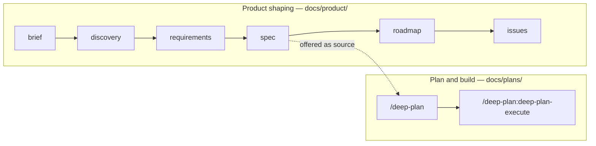

# claude-better-plan

A Claude Code plugin (`deep-plan`) with two pipelines:

- **Plan and build.** `/deep-plan` researches a change with you, asks you every real decision as a multiple-choice question, and writes a plan into your repo. `/deep-plan:deep-plan-execute` then builds that plan task by task, test-first.
- **Product shaping.** Six commands take a raw idea through brief, discovery, requirements, spec, roadmap, and GitHub-ready issues. Each writes one document into `docs/product/<slug>/`, and each refuses to run until the previous one exists.

The pipelines meet in the middle: when a product spec exists, `/deep-plan` offers it as the starting source for a technical plan.


```mermaid
flowchart LR
    subgraph product ["Product shaping &mdash; docs/product/"]
        B[brief] --> D[discovery] --> R[requirements] --> S[spec] --> RM[roadmap] --> I[issues]
    end
    subgraph plan ["Plan and build &mdash; docs/plans/"]
        P["/deep-plan"] --> E["/deep-plan:deep-plan-execute"]
    end
    S -.->|offered as source| P
```

Review commands (`/design-review`, `/tdd-review`, `/product-review`) can be pointed at any of these artifacts, or at plain code.

## Install

```
/plugin marketplace add tsadoq/claude-better-plan
/plugin install deep-plan@claude-better-plan
```

Requires Claude Code >= v2.1.142 (the Task dependency API used by execute).

## Quick start

Plan a change, then build it:

```
/deep-plan add a rate limiter to the API
/deep-plan:deep-plan-execute
```

Or start from a product idea and work forward:

```
/product-brief a CLI that summarizes my week from git history
/product-discovery
/product-requirements
/product-spec
/deep-plan          # picks up the spec and plans the implementation
```

Not sure where you left off in the product chain? `/product-status` tells you what exists, what is stale, and which command to run next.

## Commands

| Command | What it does | Details |
|---|---|---|
| `/deep-plan [slug:name] <topic>` | Research a change, decide with you, write a plan folder | [docs/planning.md](docs/planning.md) |
| `/deep-plan:deep-plan-execute [plan]` | Build an approved plan, one task per agent, test-first | [docs/planning.md](docs/planning.md) |
| `/product-brief <idea>` | Raw idea → PR-FAQ brief | [docs/product-chain.md](docs/product-chain.md) |
| `/product-discovery [slug]` | Brief → opportunities, assumptions, what to test first | [docs/product-chain.md](docs/product-chain.md) |
| `/product-requirements [slug]` | Discovery → testable one-sentence requirements | [docs/product-chain.md](docs/product-chain.md) |
| `/product-spec [slug]` | Requirements → self-contained, technology-free spec | [docs/product-chain.md](docs/product-chain.md) |
| `/product-roadmap [slug]` | Spec → scored, ordered roadmap (no dates) | [docs/product-chain.md](docs/product-chain.md) |
| `/product-issues [slug]` | Roadmap → work slices, optionally filed as GitHub issues | [docs/product-chain.md](docs/product-chain.md) |
| `/product-status [slug]` | Where the chain stands and what to run next | [docs/product-chain.md](docs/product-chain.md) |
| `/product-review [artifact]` | Critic review of one product document | [docs/reviews.md](docs/reviews.md) |
| `/design-review [target]` | Critic review of code, a diff, or a plan | [docs/reviews.md](docs/reviews.md) |
| `/tdd-review [plan-file]` | Critic review of a plan's planned tests | [docs/reviews.md](docs/reviews.md) |

## Where output lands

- **Plans**: one folder per plan under a directory you choose once per project (recommended: `docs/plans/`). The folder holds the plan, its design rationale, research notes, and verification records. See [docs/planning.md](docs/planning.md).
- **Product documents**: `docs/product/<slug>/` — one file per chain step, plus an `issues/` folder. These are ordinary committed files unless you choose to gitignore them.

## Configuration

The first `/deep-plan` run in a project asks where plans should live and remembers the answer. To avoid permission prompts on plan writes, allowlist the plan paths once per project in `.claude/settings.json` — the exact snippets are in [docs/planning.md](docs/planning.md#permissions).

## Learn more

- [docs/planning.md](docs/planning.md) — the plan-and-build pipeline in full
- [docs/product-chain.md](docs/product-chain.md) — the product pipeline in full
- [docs/reviews.md](docs/reviews.md) — the three review commands
- [docs/development.md](docs/development.md) — contributing, tests, releases
- [PLAN.md](PLAN.md) — design rationale: why it works the way it does
