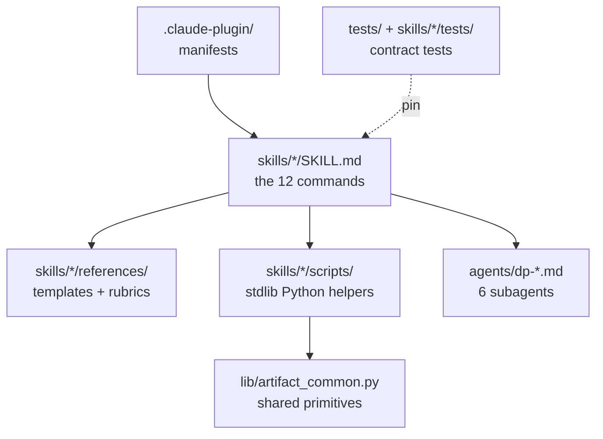

# Development

This repo is a single-plugin marketplace: the repo root is the plugin root. Everything shipped is markdown prompt content plus stdlib-only Python helpers — no runtime dependencies.

## Layout



| Path | Role |
|---|---|
| `skills/<name>/SKILL.md` | One command each. The body is the orchestration prompt; frontmatter is what's always resident. |
| `skills/<name>/references/` | Templates and principles files. Cost nothing until a run reads them. |
| `skills/deep-plan/scripts/` | `setup_session.py` (project state), `finalize_plan.py` (repair/archive/index), `load_tasks.py` (the plan-grammar parser), `resolve_slug.py`. |
| `skills/deep-plan/hooks/cleanup.py` | `SessionEnd` hook: deletes the session sandbox and state file. |
| `skills/product-artifacts/` | Not a command — the shared substrate for the product chain: `scripts/product_artifact.py` (folders, provenance, freshness, the product index) and `references/artifact-family.md` (the chain contract). |
| `skills/product-issues/scripts/` | Six modules for slicing and GitHub filing (`file_issues.py` is the CLI). |
| `agents/` | The six `dp-*` subagent definitions. Only `dp-implement-task` may write; the rest are read-only. |
| `lib/artifact_common.py` | Slug validation and generated-region primitives shared by both pipelines. |
| `tests/`, `skills/*/tests/` | Contract tests; cross-skill ones at the root, the rest co-located with their skill. |
| `docs/plans/` | Gitignored dogfood output from planning this repo with its own plugin. Not documentation. |

## Local development

```
/plugin marketplace add /absolute/path/to/claude-better-plan   # local checkout
```

`SKILL.md` and `references/` edits hot-reload within a session; changes under `agents/` need `/reload-plugins` or a restart.

The CI gate, runnable locally:

```
uvx ruff check lib skills
uvx mypy --strict          # scope comes from pyproject.toml
uvx pytest -q              # discovery owned by pyproject testpaths
```

CI pins `pytest>=9,<10` and installs `tiktoken` for the token-budget test.

## Contract tests: behavior, not wording

The tests pin what shipped prose must still *do*, never how it says it. `GUARANTEES` in `tests/guarantees.py` declares each behavior (a heading that must exist, a script flag that must be invoked, an anchor that must appear); the suite asserts them. Rephrasing a sentence never breaks CI — deleting the behavior behind it does.

`BUDGETS` in the same file caps sizes: the always-resident skill listing (per-entry and aggregate), frontmatter description length, and token budgets for the largest prompt files. No assertion hard-codes its own limit, and a budget never justifies dropping a guaranteed behavior. `README.md` and `PLAN.md` are not budgeted — they are never loaded as model context.

Two tests scan `README.md`, `PLAN.md`, and every shipped markdown file: one fails on any `dp-*` agent name the plugin doesn't ship, one on known-false claims about the harness. Keep both files accurate when editing docs.

## Releases

Versions are cut by CI, never by hand. A `feat:` or `fix:` commit on `main` bumps `.claude-plugin/plugin.json` and tags a release (`chore(release): vX.Y.Z [skip ci]`). Two rules follow:

- Never edit the version field manually.
- A change that moves files (a renamed skill, a moved reference) must land as `feat:` or `fix:` — that version bump is what re-keys the installed plugin cache onto the new layout. Documentation-only changes use `docs:` and cut no release.
