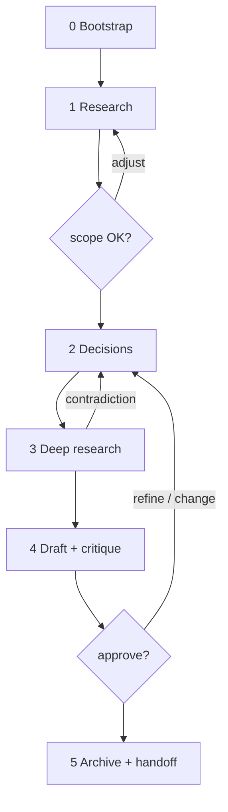
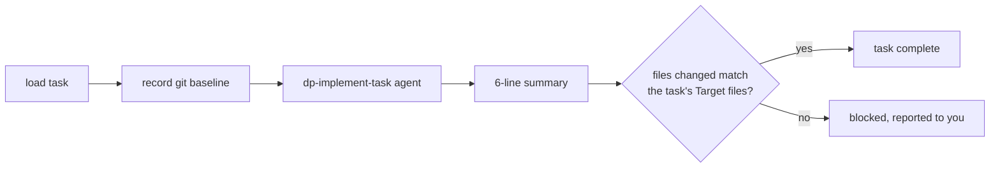

# The plan-and-build pipeline

Two commands: `/deep-plan` writes a plan with you, `/deep-plan:deep-plan-execute` builds it. The plan is a folder of markdown files in your repo — readable by you, precise enough for an agent to implement task by task.

## /deep-plan

```
/deep-plan add a rate limiter to the API
/deep-plan slug:rate-limiter add a rate limiter to the API   # explicit folder name
```

The run moves through six phases with two hard stops where you decide:



- **Phase 0 — Bootstrap.** Reads the optional `slug:` token, resolves where plans live (asked once per project), and detects leftover drafts from abandoned runs (you choose: resume, overwrite, or start fresh). If native plan mode is on, it asks you to turn it off — this skill replaces it.
- **Phase 1 — Research.** Three agents run in parallel: one explores your codebase, one does a quick web sweep, and one ingests any sources you gave (files, URLs, Jira tickets). If a finished product spec exists at `docs/product/<slug>/spec.md`, it is offered as the recommended source (see [product-chain.md](product-chain.md)). You then confirm the scope before anything else happens.
- **Phase 2 — Decisions.** Every meaningful choice — storage, algorithm, library, where a boundary goes — becomes its own 3-to-5-option question, asked in dependency order. Nothing is picked silently. Each answer is written to the draft plan the moment you give it, so a crashed run never loses a decision.
- **Phase 3 — Deep research.** One researcher per chosen option checks it against official docs (up to 4 in parallel). If the docs contradict a choice, the question comes back to you with the evidence quoted — never a silent override. Skipped entirely when every decision just followed existing convention.
- **Phase 4 — Draft and critique.** The plan body is drafted, swept against six quality lenses (simplicity, performance, maintainability, minimal diff, security, deep modules), and its assumptions are checked with real shell probes. Then a fleet of critic agents tries to refute it before you ever see it — a small plan triggers no critics and pays for none.
- **Phase 5 — Approval and archive.** One structured question walks you through the plan: approve, refine a task, drop a task, add one, or change a decision. On approval the plan is finalized, stamped, and archived; the handoff message recommends `/compact` before implementation.

## The plan folder

Each plan is a folder, `<plans_dir>/<slug>/` (recommended default `docs/plans/<slug>/`):

| File | Content |
|---|---|
| `plan.md` | The plan itself: context, decisions table, a generated task-overview table, and the tasks with their tests. Carries a `**Status**` line: `draft` → `approved` → `executed`. |
| `design.md` | The why: background, one section per decision explaining the choice, plus short per-task implementation notes added during execution. |
| `research.md` | The research dossiers, split out at archive time so `plan.md` stays lean. |
| `probes.md` | The shell checks that verified the plan's assumptions: command, result, what a failure would have meant. |
| `architecture.md` | Only for architecturally significant plans: the before/after picture. Usually absent. |

Archiving also regenerates `<plans_dir>/README.md`, an index of every plan with title, status, and date. The index and the task-overview table are generated between HTML-comment markers: never edit them by hand — re-run `finalize_plan.py --repair` or `--index` instead (also how you resolve a merge conflict inside them).

## /deep-plan:deep-plan-execute

```
/deep-plan:deep-plan-execute                      # the plan you last approved, else the newest
/deep-plan:deep-plan-execute docs/plans/my-plan   # or name a plan folder / plan.md
```

The executor is a dispatcher, not an implementer. It refuses to start while the plan has open questions. Then it loads the plan's tasks into real harness tasks with dependencies, and works through them in order:



Each task goes to one `dp-implement-task` agent in a fresh context. That agent owns the whole increment: write the failing test, implement, verify, run its own design and test review over the diff, re-run tests once more to catch flakes, note what it did in `design.md`, and return a six-line summary. The dispatcher never reads the diff — it asks git what actually changed and compares that against the task's declared `Target files`. Any file outside that set blocks completion and is reported to you; nothing is auto-reverted.

When all tasks finish, the plan's status flips to `executed` and the index refreshes.

Requires Claude Code >= v2.1.142 (the `TaskCreate` / `addBlockedBy` dependency API).

## Configuration

**Where plans live.** The first run in a project asks (recommended: `<repo>/docs/plans/`; never `~/.claude/plans/`). The answer is stored in `$XDG_STATE_HOME/deep-plan/projects.json` (default `~/.local/state/deep-plan/`). Edit that file to change it.

**Permissions.** Plugins cannot ship permission rules, so to make plan writes prompt-free in default permission mode, allowlist the plan paths once per project in `.claude/settings.json`:

```json
{"permissions": {"allow": ["Edit(/docs/plans/**)", "Write(/docs/plans/**)", "Bash(mv docs/plans/*)", "Bash(test ! -e docs/plans/*)"]}}
```

The `test ! -e` rule covers the guarded rename step, which is permission-checked per command segment.

Execute time needs more, because the implementer writes real source files, and subagents inherit the session's permission mode — in default mode every write inside every implementer prompts separately. Allowlist what your plan's tasks actually touch:

```json
{"permissions": {"allow": ["Edit(/src/**)", "Write(/src/**)", "Bash(uv run pytest*)"]}}
```

## Guardrails

- **Planning is read-only.** During planning, only the plan folder and a per-session `/tmp` sandbox are writable. Research agents cannot write files at all.
- **One agent may write.** `dp-implement-task` is the only agent allowed to change code, and a contract test pins that it stays the only one.
- **The audit trusts git, not the agent.** Task completion is judged by what git says changed, never by the agent's own report.
- **Approval is one structured question.** There is no "looks good?" free-text gate; the walk-the-plan question is the only way to approve.
- **Crash-safe.** The plan file exists in your repo from the first resolved decision; stale drafts and name collisions become questions, never silent overwrites.
