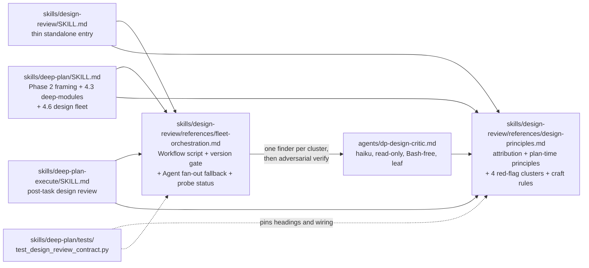

# Embed A Philosophy of Software Design Guidelines into deep-plan

## Context

The deep-plan plugin (v0.4.0 on origin/main) produces implementation plans through triangulated research, decision surfacing, perspective synthesis, and adversarial critique, then executes them task by task via deep-plan-execute. Neither skill currently encodes software-design quality guidance: the plans and code they produce are never checked against principles such as deep modules, information hiding, or interface minimality. The user has curated notes from John Ousterhout's "A Philosophy of Software Design" (16 principles, 14 red flags, a module-design checklist, and general-purpose self-check questions) and wants them embedded so the plugin's outputs follow those guidelines. Placement spans four surfaces: plan-time guidance, the Phase 4.6 critique, the execute loop, and a new standalone design-review skill, all delivered through a highly parallel small-model critic fleet. The local worktree is stale (v0.1.1), so implementation begins by branching off origin/main.

## Decisions made

| # | Decision | Chosen | Rejected | Rationale |
|---|----------|--------|----------|-----------|
| 1 | Guideline content storage | Single source-of-truth reference file, quoted into agent prompts by orchestrators | Duplicating tailored guideline text into each agent prompt | Follows existing convention (references/perspectives.md pattern); avoids information leakage of the guideline text itself |
| 2 | Delivery mechanism bias | Parallel subagent fleets on small models (haiku) wherever detection or critique fans out | Inline prompt text as the primary mechanism | Fixed by user prompt: "very multiagent distributed approach... smaller model but highly parallel" |
| 3 | Design-review capability boundary | New shared agents/dp-design-critic.md (haiku, read-only, parallel fan-out) invoked directly by both pipelines, plus a NEW thin skills/design-review SKILL.md exposing the same fleet standalone | Standalone skill as sole entry point; pipeline-internal fleet only; extending dp-plan-critic alone | One general-purpose implementation with three callers; avoids dragging a SKILL.md into context on pipeline calls; matches clairvoyance prior art |
| 4 | Plan-time guidance | New always-on 'deep-modules' perspective in the Phase 4.3 fan-out, plus APoSD framing in Phase 2 option generation (options weighed for interface depth and information hiding) | Phase 2 lens only; heuristic-selected perspective; per-module perspective fleet | Plan-time principles (design it twice, define errors out of existence) only act while design is fluid; perspective mechanism already parallel and additive |
| 5 | Execute-time integration | Post-task review fan-out: after tests go green, dp-design-critic agents run in parallel on the task diff (one per red-flag cluster); material findings trigger a fix loop before task completion | Batch review at milestones; pre plus post per task; no execute-time review | Catches code-level red flags (naming, comments, pass-through) on real code before more code stacks on the flaw |
| 6 | Fleet orchestration | Workflow scripts everywhere: all three callers (Phase 4.6, post-task, standalone skill) drive the haiku finder fleet plus adversarial verify stage via the Workflow tool, with a prose Agent-fan-out fallback for harnesses lacking the tool | Agent fan-out with two-tier verify; hybrid Workflow-for-standalone-only; fewer smarter critics | User choice: deterministic fan-out, schema-validated findings, dedup barrier, and budget caps outweigh the harness-feature dependency. Research: Workflow is gated (>= 2.1.154, paid plans, off by default on Pro, org-disableable, no feature detection), so the fallback is load-bearing, not polish |
| 7 | Content curation and phrasing (PROVISIONAL, user away at prompt) | One design-principles.md with paraphrased, operationalized items grouped by stage: plan-time principles, review-time red flags as checkable questions, execute-time craft rules; orchestrators quote only the relevant group per agent | Full lists lightly paraphrased; minimal core set; tiered core plus appendix | Full 16+14 coverage while keeping per-agent prompts short and checkable; paraphrase plus disclaimer is the community-normal, copyright-clean pattern (clairvoyance precedent); stage re-grouping also mitigates thin compilation copyright in the book's numbered lists |
| 8 | Finding severity semantics | Design findings reuse the existing material/minor pipeline (material: fix inline or reloop; minor: appended to Open questions) at plan-time, and the fix-loop-before-complete semantics at execute-time | New dedicated severity scheme or hard approval gate | Follows existing convention (dp-plan-critic tagging and Phase 4.6 handling); consistency gives cognitive leverage |
| 9 | Reference file split | Two reference files: design-principles.md (guideline content) and fleet-orchestration.md (Workflow script, version gate, fallback, probe status) | Single combined file; restating mechanics in each caller | Content and mechanism change at different rates and serve different readers; probe-status updates must not churn the guideline file |
| 10 | Scope addition: cleanup hook bug (PROVISIONAL, user away at prompt) | Include Task 12: move the cleanup hook off the per-turn Stop event so live session state survives multi-turn planning runs | Defer to a separate branch; fix immediately outside the plan | Bug discovered during this planning session (state file deleted twice mid-run by skills/deep-plan/hooks/cleanup.py registered on Stop); small, same-branch fix; droppable at Checkpoint 2 |

## Architecture



## Tasks

### Task 1: Branch off origin/main

**Target files**:
- none (git operation only)

**Change**:
Fetch and create branch `feat/aposd-design-review` from `origin/main` (the local worktree is stale at v0.1.1; all subsequent tasks edit v0.4.0 content).

**Verification**:
```
git merge-base --is-ancestor origin/main HEAD && git rev-parse --abbrev-ref HEAD
```

**Depends on**: none

### Task 2: Author design-principles.md and its contract test

**Target files**:
- skills/design-review/references/design-principles.md (new)
- skills/deep-plan/tests/test_design_review_contract.py (new)

**Change**:
Create the guideline source of truth with five H2 sections: `## Attribution and scope` (derived from "A Philosophy of Software Design", 2nd edition 2021, by John Ousterhout; independently paraphrased and reorganized; not affiliated with or endorsed by the author or publisher; book title appears only here, never in file or skill names), `## Plan-time principles` (deep modules, simple-interface-over-simple-implementation, general-purpose modules, layer-distinct abstractions, pull complexity downward, define errors out of existence, design it twice, increments are abstractions), `## Review-time red flags` as four H3 clusters of checkable yes/no questions with severity hints (cluster 1 module depth and interfaces: shallow module, pass-through method, overexposure, special-general mixture, conjoined methods; cluster 2 information hiding and decomposition: information leakage, temporal decomposition, repetition; cluster 3 naming: vague name, hard to pick name, hard to describe; cluster 4 comments and obviousness: comment repeats code, implementation documentation contaminates interface, nonobvious code), `## Execute-time craft rules` (comments first as design tool, precise names, consistency, common case simple, defaults for common cases), and `## How to update these guidelines` (names the contract test pinning the headings and lists the caller files that quote this file). Prose register matches references/perspectives.md.

**Tests (TDD)**:
- File: skills/deep-plan/tests/test_design_review_contract.py (new)
- Test name: `test_design_principles_structure`
- Asserts: the file exists under skills/design-review/references/, contains all five H2 headings, has at least 3 H3 clusters under `## Review-time red flags`, and the attribution section contains "2nd edition", "2021", and "not affiliated". Stdlib-only, dual-runnable (python3 direct and pytest), path via `Path(__file__).resolve().parents[3]`, matching test_agents_contract.py conventions.
- This test MUST fail before implementation begins. The implementation turn writes the test first, runs it (must fail), then implements, then runs again (must pass).

**Verification**:
```
uv run pytest skills/deep-plan/tests/test_design_review_contract.py -q
```

**Depends on**: 1

### Task 3: Author fleet-orchestration.md and extend the contract test

**Target files**:
- skills/design-review/references/fleet-orchestration.md (new)
- skills/deep-plan/tests/test_design_review_contract.py (modify)

**Change**:
Write the single shared fleet spec all three callers point at: `## Workflow fleet` (canonical Workflow script skeleton: meta block, one finder `agent()` per H3 red-flag cluster with `agentType` targeting dp-design-critic and findings JSON schema `{cluster, severity: material|minor, principle, evidence: file:line, finding}`, dedup barrier, adversarial verify stage that relaunches dp-design-critic instances to refute survivors), `## Version gate` (Workflow requires Claude Code >= 2.1.154, paid plans only, off by default on Pro, org-disableable via disableWorkflows or CLAUDE_CODE_DISABLE_WORKFLOWS, not programmatically feature-detectable), `## Fallback` (plain Agent-tool fan-out with the identical finder-then-verify shape; normative whenever Workflow is absent, denied, or errors), and `## agentType resolution` containing the marker line `Probe status: unprobed` and stating that plugin-namespaced agentType resolution is undocumented, so the fallback is normative until a probe result is recorded.

**Tests (TDD)**:
- File: skills/deep-plan/tests/test_design_review_contract.py (modify)
- Test name: `test_fleet_orchestration_contract`
- Asserts: the file exists and contains "2.1.154", a `## Fallback` heading, the tokens "material" and "minor", and a line starting `Probe status:`.
- This test MUST fail before implementation begins.

**Verification**:
```
uv run pytest skills/deep-plan/tests/test_design_review_contract.py -q
```

**Depends on**: 2

### Task 4: Create the dp-design-critic agent and harden the agents contract test

**Target files**:
- agents/dp-design-critic.md (new)
- skills/deep-plan/tests/test_agents_contract.py (modify)

**Change**:
Create the shared finder/verifier agent mirroring agents/dp-plan-critic.md house style: multi-line `description:` ending "Read-only. Used by /design-review, deep-plan Phase 4.6, and the deep-plan-execute post-task review.", `model: haiku`, `disallowedTools: Write, Edit, NotebookEdit, Bash, Agent, ExitPlanMode` (Bash-free leaf; Agent listed because subagents can spawn subagents since v2.1.172), the `=== CRITICAL: READ-ONLY MODE ===` banner, an "Inputs you will receive" section (assigned red-flag cluster name plus its checkable questions quoted by the caller, plus the review target as diff text, plan excerpt, or file paths readable via Read/Grep/Glob), and an output format of one finding per line `[material|minor] {cluster}/{principle}: {finding} -- evidence: {file:line}`, carrying the same fields as the fleet-orchestration.md JSON schema so fallback-mode callers lose no information relative to Workflow-mode schema output.

**Tests (TDD)**:
- File: skills/deep-plan/tests/test_agents_contract.py (modify)
- Test name: `test_design_critic_agent_present`
- Asserts: agents/dp-design-critic.md exists, carries no `tools:` allowlist, and its disallowedTools include Write, Edit, NotebookEdit, Bash, and Agent; also adds "dp-design-critic" to the BASH_FREE set so the existing sweep enforces Bash-denial permanently.
- This test MUST fail before implementation begins.

**Verification**:
```
uv run pytest skills/deep-plan/tests/test_agents_contract.py -q
```

**Depends on**: 2, 3

### Task 5: Probe Workflow agentType resolution and record the result

**Target files**:
- skills/design-review/references/fleet-orchestration.md (modify)

**Change**:
First install the plugin FROM THE FEATURE BRANCH so dp-design-critic actually exists in the installed agent registry (the marketplace cache at ~/.claude/plugins/cache/ holds v0.4.0 without it; probing against that records a false negative). Reinstall or marketplace-add from the local checkout, run /reload-plugins or restart, and confirm the agent is listed before probing. Then empirically probe whether the Workflow tool resolves `agentType: "deep-plan:dp-design-critic"` and, failing that, bare `"dp-design-critic"`, on a trivial one-file review; replace the `Probe status: unprobed` line with `Probe status: probed {date}, Claude Code {version}` plus the observed resolution behaviour under `## agentType resolution`. If Workflow is unavailable in the probe environment, record that outcome in the same marker format; callers need no edits either way because the fallback is already normative.

**Verification**:
```
grep -q 'Probe status: probed' skills/design-review/references/fleet-orchestration.md
```

**Depends on**: 4

### Task 6: Create the standalone design-review skill

**Target files**:
- skills/design-review/SKILL.md (new)
- skills/deep-plan/tests/test_skill_contract.py (modify)
- skills/deep-plan/tests/test_design_review_contract.py (modify)

**Change**:
Write a deliberately thin SKILL.md (target under 80 body lines; skill content persists in session context): frontmatter `name: design-review`, multi-line `description:` with trigger phrases for standalone design review of code, diffs, or plan files, `argument-hint: "[path | git ref | plan-file]"`. The body only resolves the review target from $ARGUMENTS (working diff by default), runs the critic fleet exactly as specified in `${CLAUDE_PLUGIN_ROOT}/skills/design-review/references/fleet-orchestration.md` against the clusters in design-principles.md, and reports deduplicated findings grouped material-then-minor. No guideline text and no Workflow mechanics are duplicated into the body.

**Tests (TDD)**:
- File: skills/deep-plan/tests/test_design_review_contract.py (modify; plus add the new SKILL.md path to the frontmatter sweep in test_skill_contract.py)
- Test name: `test_design_review_skill_contract`
- Asserts: skills/design-review/SKILL.md exists with `name` and `description` frontmatter keys, and its body contains both literal substrings `references/fleet-orchestration.md` and `references/design-principles.md`.
- This test MUST fail before implementation begins.

**Verification**:
```
uv run pytest skills/deep-plan/tests/test_skill_contract.py skills/deep-plan/tests/test_design_review_contract.py -q
```

**Depends on**: 2, 3, 4

### Task 7: Wire the always-on deep-modules perspective into deep-plan

**Target files**:
- skills/deep-plan/references/perspectives.md (modify)
- agents/dp-plan-perspective.md (modify)
- skills/deep-plan/SKILL.md (modify)
- skills/deep-plan/references/phase-prompts.md (modify)
- skills/deep-plan/tests/test_design_review_contract.py (modify)

**Change**:
Add a `### deep-modules` entry to perspectives.md (Frame/Use when/Anti-pattern shape identical to its five siblings; Frame points at the `## Plan-time principles` section of design-principles.md) and amend the "How to choose" paragraph: deep-modules is always launched in addition to the 1 to 3 picked perspectives, total fan-out 2 to 4. Sweep ALL stale enumerations of the old five-perspective world: perspectives.md line 3 ("picks 1 to 3") and the "Cap is 3" sentence, SKILL.md section 4.3 and the Phase 4 perspectives row of the Depth scaling table, the perspective fan-out fragment in phase-prompts.md, and in agents/dp-plan-perspective.md both the frontmatter description listing the five perspective names and the body lines "one of: simplicity, performance, maintainability, minimal-diff, security" and "up to 2 other instances", adding the deep-modules definition block so catalogue, orchestrator, and agent prompt cannot drift.

**Tests (TDD)**:
- File: skills/deep-plan/tests/test_design_review_contract.py (modify)
- Test name: `test_deep_modules_perspective_wiring`
- Asserts: the literal string `deep-modules` appears in perspectives.md, agents/dp-plan-perspective.md, phase-prompts.md, and the section 4.3 region of skills/deep-plan/SKILL.md; and perspectives.md contains `design-principles.md`.
- This test MUST fail before implementation begins.

**Verification**:
```
uv run pytest skills/deep-plan/tests/test_design_review_contract.py -q
```

**Depends on**: 2

### Task 8: Add plan-time design framing to Phase 2 option generation

**Target files**:
- skills/deep-plan/SKILL.md (modify)
- skills/deep-plan/tests/test_design_review_contract.py (modify)

**Change**:
Insert a short **Design framing** paragraph into "Phase 2: Decision surfacing" between the surfacing criteria and the cap: when generating options for architectural-axis and boundary-placement decisions, consult the `## Plan-time principles` section of design-principles.md, prefer options that deepen module interfaces, and name inside an option's description any red flag it would introduce (for example a pass-through layer or information leakage). Two to four sentences, pointer only, no guideline text copied in.

**Tests (TDD)**:
- File: skills/deep-plan/tests/test_design_review_contract.py (modify)
- Test name: `test_phase2_design_framing`
- Asserts: the text between the "## Phase 2" and "## Phase 3" headings of skills/deep-plan/SKILL.md contains the substring `design-principles.md`.
- This test MUST fail before implementation begins.

**Verification**:
```
uv run pytest skills/deep-plan/tests/test_design_review_contract.py -q
```

**Depends on**: 2

### Task 9: Run the design fleet in deep-plan Phase 4.6

**Target files**:
- skills/deep-plan/SKILL.md (modify)
- skills/deep-plan/references/phase-prompts.md (modify)
- skills/deep-plan/tests/test_design_review_contract.py (modify)

**Change**:
Extend "Phase 4.6: Adversarial critique" so the same launch message that starts dp-plan-critic also runs the design fleet per the fleet-orchestration.md recipe (one dp-design-critic per red-flag cluster over the synthesized plan body and architecture section); design findings merge into the existing material/minor handling and reuse the existing depth loop bounds, introducing no new depth knobs or table rows. Add `Workflow` to the skill's `allowed-tools` frontmatter list (currently absent at lines 11-23; without it the Workflow tool is unavailable inside /deep-plan and this caller would silently degrade to the fallback, contradicting decision 6). Update the R1 read-only contract paragraph to add dp-design-critic to the Bash-free agent enumeration, and update the Phase 4.6 node of the high-level mermaid flowchart to mention the design fleet. Mirror the Phase 4.6 fragment in phase-prompts.md.

**Tests (TDD)**:
- File: skills/deep-plan/tests/test_design_review_contract.py (modify)
- Test name: `test_phase46_design_fleet_wiring`
- Asserts: `dp-design-critic` and `fleet-orchestration.md` both appear in the Phase 4.6 region of skills/deep-plan/SKILL.md, `Workflow` appears in the skill's `allowed-tools` frontmatter, and `dp-design-critic` appears in phase-prompts.md.
- This test MUST fail before implementation begins.

**Verification**:
```
uv run pytest skills/deep-plan/tests/test_design_review_contract.py -q
```

**Depends on**: 3, 4

### Task 10: Add the post-task design review to deep-plan-execute

**Target files**:
- skills/deep-plan-execute/SKILL.md (modify)
- skills/deep-plan/tests/test_design_review_contract.py (modify)

**Change**:
In "Step 5: Implement test-first, in dependency order", insert a new item between the current items 3 (verification green) and 4 (mark completed): collect the diff of THIS task only, not the accumulated run (the loop never commits between tasks, so plain `git diff` would re-review earlier tasks' edits to shared files; capture a baseline ref with `git stash create` before implementation starts and diff baseline-to-worktree scoped to the task's Target files, passed as text because the critic has no Bash), run the design fleet per the fleet-orchestration.md recipe; material findings are fixed within the task and verification re-run before `completed`; minor findings are logged in the task completion note without blocking. Add one Anti-patterns bullet: marking a task completed with unresolved material design findings.

**Tests (TDD)**:
- File: skills/deep-plan/tests/test_design_review_contract.py (modify)
- Test name: `test_execute_post_task_review_wiring`
- Asserts: skills/deep-plan-execute/SKILL.md contains both literal substrings `dp-design-critic` and `fleet-orchestration.md`.
- This test MUST fail before implementation begins.

**Verification**:
```
uv run pytest skills/deep-plan/tests/test_design_review_contract.py -q
```

**Depends on**: 3, 4

### Task 11: Document the feature, gates, and contributor notes in README

**Target files**:
- README.md (modify)

**Change**:
Add a `## Design review` section covering the standalone /design-review skill, the always-on deep-modules perspective, the Phase 4.6 design fleet, and the execute post-task review; document the Workflow gate (Claude Code >= 2.1.154, paid plans, off by default on Pro, org-disableable) and the automatic Agent-fan-out fallback so older installs degrade gracefully; state the attribution stance with a pointer to `## Attribution and scope` in design-principles.md. Update the file-layout tree with the new agent, skill, references, and test file. Add a short developing-the-plugin note: SKILL.md and references/ edits hot-reload but agents/ changes require /reload-plugins or restart, and guideline content is edited only in design-principles.md whose headings are pinned by test_design_review_contract.py. Update the README lines that describe the cleanup hook (file-layout annotation and the read-only section's "cleaned up by the Stop hook" sentence) to match whichever event Task 12 lands on. Release flows through the existing Conventional Commits auto-bump CI (feat: commit), no manual version edit.

**Verification**:
```
grep -q 'design-review' README.md
```

**Depends on**: 6, 7, 8, 9, 10, 12

### Task 12: Fix the cleanup hook firing every turn (PROVISIONAL scope addition)

**Target files**:
- skills/deep-plan/SKILL.md (modify)
- skills/deep-plan/hooks/cleanup.py (modify)
- skills/deep-plan/tests/test_cleanup.py (modify)

**Change**:
The hooks frontmatter of skills/deep-plan/SKILL.md registers hooks/cleanup.py on `Stop`, which fires at the end of every assistant turn and deletes the live session's state file and sandbox mid-run. First check the current hooks documentation for whether skill-frontmatter hooks support `SessionEnd`; record the answer in the task note. Preferred path (SessionEnd supported): change the event to `SessionEnd` and extend cleanup.py's TTL sweep to also prune state JSONs older than 7 days under the state dir (today it globs only /tmp/deep-plan-*, so crash-killed sessions would otherwise accumulate state forever). Fallback path (SessionEnd unsupported): keep `Stop` but guard cleanup.py to skip state files and sandboxes younger than a session-scale TTL; this flips two existing assertions that create fresh fixtures and expect immediate deletion (`test_session_teardown_and_ttl_sweep`, `test_cleanup_tolerates_minimal_state`), so update both to age their fixtures or inject a TTL override. Either way the per-session state must survive across turns within one live session.

**Tests (TDD)**:
- File: skills/deep-plan/tests/test_cleanup.py (modify)
- Test name: `test_cleanup_not_registered_on_stop` (preferred path) or `test_cleanup_preserves_fresh_state` (fallback path; also updates the two existing fresh-fixture assertions named above)
- Asserts: preferred path, the hooks frontmatter of skills/deep-plan/SKILL.md does not bind cleanup.py to `Stop` and the state-dir sweep prunes aged JSONs; fallback path, cleanup.py leaves a freshly written state file and sandbox in place for a live session id while still removing aged ones.
- This test MUST fail before implementation begins.

**Verification**:
```
uv run pytest skills/deep-plan/tests/test_cleanup.py -q
```

**Depends on**: 1

## References

- skills/deep-plan/SKILL.md (Phase 2 at line 199, section 4.3 at 277, Phase 4.6 at 309 on origin/main)
- skills/deep-plan-execute/SKILL.md (Step 5 items 3 and 4; existing version-gate precedent at line 20)
- skills/deep-plan/references/perspectives.md, phase-prompts.md, plan-file-template.md
- agents/dp-plan-critic.md, agents/dp-explore-codebase.md (frontmatter house style)
- skills/deep-plan/tests/test_agents_contract.py (BASH_FREE convention), test_skill_contract.py
- https://code.claude.com/docs/en/workflows (Workflow gate, approval semantics, resume)
- https://code.claude.com/docs/en/plugins-reference (plugin agents/skills discovery, ignored frontmatter fields, live-change detection)
- https://code.claude.com/docs/en/sub-agents (model aliases, disallowedTools, subagent spawn depth, shadowing precedence)
- https://github.com/codybrom/clairvoyance (prior art and attribution/disclaimer pattern)
- https://www.copyright.gov/circs/circ33.pdf (idea/expression distinction)
- https://fairuse.stanford.edu/2003/09/09/copyright_protection_for_short/ (thin compilation copyright)

## Open questions

- none

## Verification probes (appendix)

[probe 1]: git show origin/main:skills/deep-plan/SKILL.md | grep -n "4.3 Perspective fan-out\|4.6\|Phase 2: Decision surfacing\|dp-plan-critic"
199:## Phase 2: Decision surfacing
277:### 4.3 Perspective fan-out
309:## Phase 4.6: Adversarial critique
311:Before asking for approval, try to break the plan. Launch `dp-plan-critic` (inherit) ... findings under `## Missing tasks`, `## Wrong or missing dependencies`, `## Code tasks lacking tests`, `## Decisions contradicted by research`, `## Untested assumptions`, each tagged `material` or `minor`.

[probe 2]: git show origin/main:agents/dp-plan-critic.md | head -12
name: dp-plan-critic / description: multi-line / model: inherit
disallowedTools: Write, Edit, NotebookEdit, Agent, ExitPlanMode
(dp-explore-codebase.md confirms the same shape with model: haiku)

[probe 3]: git show origin/main:skills/deep-plan-execute/SKILL.md | grep -n "green\|verify\|complete\|TaskUpdate\|loop"
20:**Requires Claude Code >= v2.1.142** for the Task dependency API
95:...mark it `in_progress` via `TaskUpdate`, then:
103:3. **Run the `verification` command.** For a code task it must now pass (green).
106:4. On green, mark the task `completed` via `TaskUpdate`.
(insertion point for the post-task design review is between items 3 and 4; version-gate documentation precedent at line 20)

[probe 4]: git ls-tree origin/main .github/ plus git show origin/main:.claude-plugin/plugin.json
.github/workflows/auto-bump.yml and ci.yml present; plugin.json name deep-plan, version 0.4.0

[probe 5]: git ls-tree -r --name-only origin/main | grep -E 'test|pyproject|\.py$'
pyproject.toml present at root (uv run pytest valid); tests at skills/deep-plan/tests/: test_agents_contract.py (BASH_FREE set, frontmatter helpers, dual-runnable convention), test_skill_contract.py, test_template_contract.py, plus script tests. Also surfaced skills/deep-plan/hooks/cleanup.py registered on the Stop hook in SKILL.md frontmatter: it deletes the CURRENT session's state file and sandbox at the end of every assistant turn (Stop fires per turn, not per session), which destroyed this session's state twice during planning. Likely intended event: SessionEnd.

## Research dossiers (appendix)

### Decisions 3 and 6 mechanics: plugin agents, skills, and Workflow agentType

Verdict: a plugin can ship agents/*.md and skills/NAME/SKILL.md side by side, auto-discovered, no plugin.json entries required; the shared agent is namespaced PLUGIN:dp-design-critic so sibling skills delegate by name (code.claude.com/docs/en/plugins-reference, /sub-agents). model: haiku and disallowedTools are supported plugin-agent frontmatter; hooks, mcpServers, and permissionMode are documented as ignored on plugin agents. Workflow agentType resolution of plugin-namespaced types is NOT documented (absence confirmed by fetching the referenced Agent SDK page); nothing suggests it will not work, but it must be probed empirically.

Gotchas: (1) plugin agents are lowest-priority on name collision (user or project agents named dp-design-critic silently shadow them); (2) disallowedTools does not implicitly block Agent; subagents can spawn subagents since v2.1.172 (depth 5), so a leaf critic must disallow Agent explicitly; (3) skill content persists in context (up to 25k combined budget) while agent results return only the final summary, so keep the standalone SKILL.md thin; (4) agents/ edits do not hot-reload; /reload-plugins or restart required.

Versioning: no version gate for plugin agents/skills basics; Workflow requires >= v2.1.154 plus enablement; nested subagent spawning v2.1.172+; model: haiku is a first-class alias.

Canonical snippet: frontmatter with name, multi-line description, model: haiku, disallowedTools: Write, Edit, NotebookEdit, Bash, Agent (plus ExitPlanMode per house style).

### Decision 6 portability: Workflow tool for a distributed plugin

Verdict: dynamic workflows are a real, documented, GA Claude Code feature (code.claude.com/docs/en/workflows) supporting exactly the finder, dedup barrier, adversarial-verify shape planned. But "everywhere" is materially weaker than it sounds: paid-plan-only, off by default on Pro (/config toggle), org-disableable (disableWorkflows, CLAUDE_CODE_DISABLE_WORKFLOWS), per-run approval cards in default modes, and no programmatic feature detection, so the prose fallback to plain Agent fan-out is load-bearing.

Gotchas: (1) a skill instructing "call the Workflow tool" triggers a permission request, not guaranteed execution; (2) the docs' promised Agent SDK reference section for Workflow options could not be located, so agentType resolution, budget shape, and schema-retry semantics are only secondarily corroborated; (3) trigger keyword changed at v2.1.160 (workflow to ultracode), do not hard-code either; (4) no mid-run user input; a human gate between find and verify needs two runs; (5) resume is per-session only; (6) Date.now and Math.random blocked in scripts (secondary source, consistent with documented resume mechanics; re-verify before asserting in plugin text).

Versioning: floor v2.1.154; sub-behaviours individually gated (unverified-claim reporting v2.1.196+, nested .claude/workflows v2.1.178+); one blog post claims an Opus 4.8 model requirement that conflicts with the docs page; treat CLI version as authoritative and re-check before documenting. Available on CLI, desktop, IDE, headless, SDK; headless runs have no interactive approval gate.

Canonical snippet: export const meta block; pipeline over clusters with one finder agent per cluster carrying a findings schema; dedup barrier; verify stage relaunching the critic to refute survivors.

### Decision 7 hygiene: paraphrase, attribution, and naming

Verdict: paraphrased, re-grouped, checkable rules with attribution is the community-normal safe pattern; clairvoyance (MIT) explicitly avoids reproducing the book's numbered lists, uses thematic paraphrase, and carries a not-affiliated disclaimer; the US Copyright Office confirms copyright protects expression not ideas, and short phrases are excluded (Circular 33). Engineering due diligence, not legal advice.

Gotchas: (1) copy the clairvoyance disclaimer pattern in spirit (derived-from, independently authored, not affiliated); (2) the weaker precedent (software-design-philosophy-skill) is thin, not proof of a safe floor; (3) the assumption that Ousterhout publicly republishes the standalone lists was NOT confirmed on web.stanford.edu, so do not lean on it; (4) numbered compilations can carry thin selection-and-arrangement copyright, so keep the stage-based re-grouping, do not restore book order for tidiness; (5) avoid the book title in skill or file names (implied endorsement), keep it in prose attribution only; name the edition (2nd ed., 2021) because list numbering differs across editions. No takedown history found for APoSD-derived projects (absence of evidence, not a guarantee).

Canonical snippet: attribution block stating concepts derived from the named book and edition, wording independently paraphrased and reorganized, not affiliated with or endorsed by the author, university, or publisher.
