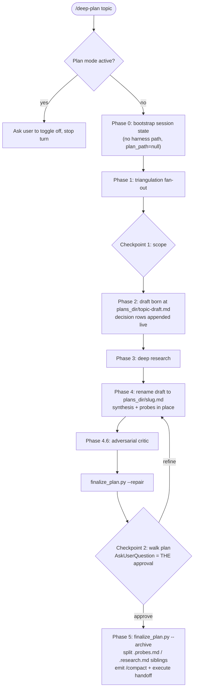

# Deep-plan: drop native plan mode and adopt a draft-to-slug plan lifecycle

## Context

The deep-plan skill currently orchestrates inside Claude Code's native plan mode, writing the plan to the harness-issued file under ~/.claude/plans/ and copying it into the project plans_dir only after ExitPlanMode approval. Evidence from six past runs, the skill source, and ecosystem research shows this integration adds friction without real guarantees: plan mode's read-only contract is prompt-level only, the harness injects a competing workflow, Enter/ExitPlanMode each cost a ToolSearch round-trip, the post-approval archive step was skipped or never reached in every observed run, and the state file's phase and decisions tracking never advanced past Phase 0 in any session. This plan removes the plan-mode dependency entirely: the skill runs in the session's normal permission mode, the plan is born early as a crash-safe draft inside the project, is renamed to its final slug before review, and a single AskUserQuestion checkpoint becomes the approval gate.

## Decisions made

| # | Decision | Chosen | Rejected | Rationale |
|---|----------|--------|----------|-----------|
| 1 | Plan-mode posture | Drop plan mode entirely | Keep with harness file as sole artifact; hybrid (use only if active); keep as-is and fix bugs | Enforcement is prompt-level only (anthropics/claude-code#19874, #6716); harness injects a competing workflow; archive dance failed in every observed run; user bypassed a rejected ExitPlanMode by manually referencing the harness path; prior art (superpowers writing-plans, planning-with-files) manages in-repo plan files without plan mode. |
| 2 | Plan-file lifecycle | Born at Phase 2 start as `plans_dir/<topic>-draft.md`, decisions appended live, renamed to `plans_dir/<slug>.md` at Phase 4.1 | Born only at Phase 4; sandbox draft copied on approval | Crash-safe: every resolved decision survives an abandoned run (wandering-quokka lost its plan entirely; the abandoned cryptic run's artifact was wanted afterwards). Stale drafts handled by re-entry detection. |
| 3 | Plan mode active at invocation | One sentence asking the user to toggle it off (Shift+Tab), stop the turn | Proceed inside plan mode with a mini-dance; harness-file-only runs | No second code path to maintain or test; research shows plan-mode system prompts silently override skill instructions (claude-code#29950), so staying out is load-bearing. |
| 4 | Approval gate | Checkpoint 2 AskUserQuestion is the single gate; `finalize_plan.py --repair` and the draft-to-slug rename run BEFORE it | Walk plus separate final confirm; no explicit gate after critic | One ceremony instead of two; finalization cannot be skipped because it precedes the question (the post-approval archive was skipped in the one fully observed approved run). Superpowers also runs mechanical self-review before its gate. |
| 5 | Session-state tracking | Strip to minimal: projects.json plans_dir memory, sandbox_dir for the cleanup hook, plan_path for re-entry detection; delete `phase`, `decisions`, `harness_plan_path`, `archive_plan_path` | Wire up phase tracking properly; remove state entirely | Dead in 6 of 6 real runs; the draft plan file is now the single source of planning progress; cleanup hook still needs sandbox_dir; plans_dir memory still wanted. |
| 6 | Default plans_dir | `<repo>/docs/plans/` | `<repo>/plans/`; keep `.claude/plans/` | `.claude/` is a protected path: writes always prompt and cannot be whitelisted (code.claude.com permission-modes#protected-paths). `docs/plans/` is whitelistable via `Edit(/docs/plans/**)` and `Write(/docs/plans/**)` project permissions. Existing projects.json entries under `.claude/` get warn-and-offer-to-move. |

## Architecture



## Tasks

### Task 1: Strip dead fields and plan-mode wiring from setup_session.py

**Target files**:
- skills/deep-plan/scripts/setup_session.py (modify)
- skills/deep-plan/tests/test_setup_session.py (modify)

**Change**:
In `cmd_bootstrap`, replace the `harness_plan_path` state key with `plan_path` (initialised `None`) and delete the `phase`, `decisions`, and `archive_plan_path` keys. The new bootstrap signature reads ONLY `args.session_id`; `cmd_bootstrap` must no longer reference `args.harness_plan_path`, and `main()`'s dispatch changes from `elif args.harness_plan_path` (setup_session.py:297) to "bootstrap when `--update` is absent". Reduce `PERMITTED_UPDATE_KEYS` to `{"plans_dir", "plan_path"}`. Update the module docstring. In the SAME task, rewrite the now-obsolete tests: delete or rewrite `test_bootstrap_state_has_archive_field_and_no_custom_path` (asserts on `archive_plan_path` and `harness_plan_path`) and `test_archive_plan_path_is_a_permitted_update_key`, and drop `harness_plan_path=` from every `types.SimpleNamespace(...)` bootstrap call site, including the two inside surviving tests (`test_update_plans_dir_persists_and_creates_dir` line 62, `test_unknown_update_key_rejected` line 82, plus line 39).

**Tests (TDD)**:
- File: skills/deep-plan/tests/test_setup_session.py (modify)
- Test name: `test_bootstrap_state_drops_dead_fields_and_uses_plan_path`
- Asserts: bootstrap result and on-disk state JSON contain `plan_path` equal to `None` and contain none of `harness_plan_path`, `phase`, `decisions`, `archive_plan_path`, `custom_plan_path`; `setup.PERMITTED_UPDATE_KEYS == {"plans_dir", "plan_path"}`.
- This test MUST fail before implementation begins. The implementation turn writes the test first, runs it (must fail), then implements, then runs again (must pass).

**Verification**:
```
python3 -m pytest skills/deep-plan/tests/test_setup_session.py -x
```

**Depends on**: none

### Task 2: plans_dir defaults reorder and protected-path sentinel

**Target files**:
- skills/deep-plan/scripts/setup_session.py (modify)

**Change**:
In `candidate_plans_dirs`, make `<repo>/docs/plans/` the first entry with `"recommended": "true"`, demote `<repo>/.claude/plans/` to last with a non-empty `"warn"` field naming the protected-path prompting. Add `_is_protected_plans_dir(path)` and emit sentinel `plans_dir_under_protected_path` (with the offending path) from `cmd_bootstrap` when the remembered plans_dir resolves under `.claude/`. No auto-migration; the orchestrator offers the move.

**Tests (TDD)**:
- File: skills/deep-plan/tests/test_setup_session.py (modify)
- Test name: `test_docs_plans_recommended_and_protected_sentinel`
- Asserts: `candidate_plans_dirs(Path("/proj"))[0]["path"]` ends with `/docs/plans` and is recommended; the `.claude/plans` entry carries a non-empty `warn`; bootstrap with a remembered `/proj/.claude/plans` plans_dir returns `sentinels["plans_dir_under_protected_path"]` truthy and a `docs/plans` plans_dir returns it falsy.
- This test MUST fail before implementation begins. The implementation turn writes the test first, runs it (must fail), then implements, then runs again (must pass).

**Verification**:
```
python3 -m pytest skills/deep-plan/tests/test_setup_session.py -x
```

**Depends on**: 1

### Task 3: v0.3 forward-compat regression tests for legacy state, projects.json, and cleanup hook

**Target files**:
- skills/deep-plan/tests/test_setup_session.py (modify)
- skills/deep-plan/tests/test_cleanup.py (modify)

**Change**:
Add `test_v03_state_and_projects_forward_compat`: seed `projects.json` with a v0.3-shaped record plus a stray legacy key, and a state file carrying legacy `harness_plan_path`, `phase`, `decisions`; assert bootstrap returns the remembered plans_dir without raising, `cmd_update("plans_dir=...")` succeeds over the legacy state, and `cmd_update("harness_plan_path=x")` now returns `ok: False` (key no longer permitted). In test_cleanup.py add `test_cleanup_tolerates_minimal_state`: the Stop hook succeeds on a new-shape state file containing only `{plans_dir, plan_path, sandbox_dir, session_id, project_root, started_at}` (pins that cleanup.py reads only `sandbox_dir`).

**Tests (TDD)**:
- File: skills/deep-plan/tests/test_setup_session.py (modify)
- Test name: `test_v03_state_and_projects_forward_compat`
- Asserts: legacy-shaped inputs parse; `cmd_update` over legacy state returns `ok: True` for `plans_dir` and `ok: False` for `harness_plan_path`.
- This test MUST fail before implementation begins (the `ok: False` assertion fails until Task 1 strips the key). The implementation turn writes the test first, runs it (must fail), then implements, then runs again (must pass). The cleanup pin may already pass; it stays as a regression guard.

**Verification**:
```
python3 -m pytest skills/deep-plan/tests/test_setup_session.py::test_v03_state_and_projects_forward_compat skills/deep-plan/tests/test_cleanup.py -x
```

**Depends on**: 1

### Task 4: finalize_plan.py: support and test in-place --archive, plus wording sweep

**Target files**:
- skills/deep-plan/scripts/finalize_plan.py (modify)
- skills/deep-plan/tests/test_finalize.py (modify)

**Change**:
The new Phase 5 calls `cmd_archive` with `--plan` pointing AT `plans_dir/<slug>.md`, the same path `cmd_archive` writes its lean output to (source equals destination; in the old flow they always differed). Add `test_archive_splits_in_place` exercising `cmd_archive(plan=plans_dir/<slug>.md, plans_dir=plans_dir, slug=slug)` on a plan containing both appendices: asserts the lean body is rewritten in place, `<slug>.probes.md` and `<slug>.research.md` siblings are created, and the result is `ok`. Inspection shows `cmd_archive` already reads the full plan text (finalize_plan.py:288) before any write (line 293), so this pin is EXPECTED to pass against current code; it exists to lock the new source==dest invocation pattern against future refactors, not to drive a fix. Also update the module docstring, `--plan`/`--repair`/`--archive` help strings, and mode comments (lines 6, 14, 21-22, 312) to drop harness and plan-mode language. `repair`, `split_appendices`, and `cmd_repair` behavior stays pinned by the existing tests.

**Tests (TDD)**:
- File: skills/deep-plan/tests/test_finalize.py (modify)
- Test name: `test_archive_splits_in_place`
- Asserts: after `cmd_archive` with plan path equal to `plans_dir/<slug>.md`, the file at that path contains the lean body (no appendix sections) and both sibling files exist with the appendix contents.
- This test is written and run FIRST as a regression pin; it is expected to pass against current code (read-before-write already holds). If it unexpectedly fails, apply the minimal source==dest fix in `cmd_archive`.

**Verification**:
```
python3 -m pytest skills/deep-plan/tests/test_finalize.py skills/deep-plan/tests/test_template_contract.py -x
```

**Depends on**: none

### Task 5: Rewrite SKILL.md for the no-plan-mode flow (contract test first)

**Target files**:
- skills/deep-plan/tests/test_skill_contract.py (modify)
- skills/deep-plan/SKILL.md (modify)

**Change**:
FIRST author the anti-drift contract test in this same task, then rewrite SKILL.md to make it pass. Test `test_skill_forbids_plan_mode_tools`: the frontmatter `allowed-tools` list contains neither `EnterPlanMode` nor `ExitPlanMode`; the body does not contain `harness_plan_path`, `--harness-plan-path`, or `archive_plan_path` (this bans the live Phase 4.2/Phase 5 `setup_session.py --update archive_plan_path=...` call at SKILL.md:248, which after Task 1 would return ok: False; the rename step updates `plan_path` instead); the body DOES contain an explicit prohibition sentence ("never call EnterPlanMode or ExitPlanMode") and still references `Phase 4.6` and the session-id placeholder. SKILL.md rewrite: remove both tools from `allowed-tools`; rewrite R1 as a prompt-level read-only contract (writable: the draft/final plan file and the sandbox); rewrite Phase 0: if the latest system reminder contains "Plan mode is active.", print one sentence asking the user to toggle it off (Shift+Tab) and stop the turn (this guard string is permitted in the body; the contract test must not ban it); drop the harness-path capture; call `setup_session.py` without `--harness-plan-path`; plans-dir first-run options lead with `docs/plans/` (Recommended) and demote `.claude/plans/` with the protected-path warning; on sentinel `plans_dir_under_protected_path`, offer the move via AskUserQuestion; stale-draft re-entry detection runs in Phase 0 BEFORE Phase 2 creates a new draft (resume seeds from the stale draft, overwrite deletes it), so no orphan draft can reach Phase 4 and `resolve_slug.py` stays unchanged. Rewrite Phase 2 persistence: create `plans_dir/<topic>-draft.md` when the first decision is asked, append each resolved decision row, update state `plan_path`. Rewrite Phase 4.1: rename draft to `plans_dir/<slug>.md` (Bash `mv`; may prompt once unless allowlisted) and edit it in place. Rewrite Checkpoint 2: run `finalize_plan.py --repair` then the rename BEFORE the question; option 1 becomes "Approve and finalize". Rewrite Phase 5: on approve, run `finalize_plan.py --archive` (in-place sibling split per Task 4), then emit the /compact + deep-plan-execute handoff. Rewrite R2: Checkpoint 2 is the sole approval mechanism; plain-text "looks good?" stays banned; never call EnterPlanMode or ExitPlanMode (harness-nudge rationale). Update the mermaid flowchart and anti-patterns. Keep `ExitPlanMode` in the dp-* agents' `disallowedTools` (defensive; see Task 8). Document the one-time permissions snippet: `{"permissions": {"allow": ["Edit(/docs/plans/**)", "Write(/docs/plans/**)", "Bash(mv docs/plans/*)"]}}` in project `.claude/settings.json` (plugins cannot ship permissions).

**Tests (TDD)**:
- File: skills/deep-plan/tests/test_skill_contract.py (modify)
- Test name: `test_skill_forbids_plan_mode_tools`
- Asserts: frontmatter excludes both plan-mode tools; body lacks `harness_plan_path`/`--harness-plan-path`/`archive_plan_path`; body contains the never-call prohibition, `Phase 4.6`, and the session-id placeholder.
- This test MUST fail before implementation begins (current frontmatter lists both tools). The implementation turn writes the test first, runs it (must fail), then rewrites SKILL.md, then runs again (must pass).

**Verification**:
```
python3 -m pytest skills/deep-plan/tests/test_skill_contract.py -x
```

**Depends on**: 1, 2, 4

### Task 6: Align phase-prompts.md with the rewritten flow

**Target files**:
- skills/deep-plan/references/phase-prompts.md (modify)

**Change**:
Rewrite the Phase 0 fragment (plan-mode-active warn-and-stop replaces the EnterPlanMode gate; no harness-path capture; no `--harness-plan-path`; docs/plans-first options; stale-draft detection), the Phase 2 fragment (draft creation and live decision appends), the Phase 4 fragment (draft-to-slug rename, `plan_path` update, in-place editing), the Checkpoint 2 fragment ("Approve and finalize"; repair plus rename before the question), and the Phase 5 fragment, including its heading `## Phase 5: ExitPlanMode and handoff` at phase-prompts.md:239 (drop ExitPlanMode and the exited-plan-mode reminder; `--archive` splits siblings in place). The tool names must not appear anywhere in the file; the prohibition prose lives only in SKILL.md R2. The plan-mode-active guard sentence is the only permitted plan-mode mention.

**Verification**:
```
test -z "$(grep -nE 'harness|EnterPlanMode|ExitPlanMode' skills/deep-plan/references/phase-prompts.md)"
```

**Depends on**: 5

### Task 7: Update plan-file-template.md intro wording

**Target files**:
- skills/deep-plan/references/plan-file-template.md (modify)

**Change**:
Replace the line-3 phrase "writing directly to the harness plan file (the canonical plan)" with the project-local lifecycle: born as `plans_dir/<topic>-draft.md`, renamed to `plans_dir/<slug>.md` at Phase 4.1; `--repair`/`--archive` and sibling-split description stay intact so `test_template_contract.py` stays green.

**Verification**:
```
test -z "$(grep -niE 'harness' skills/deep-plan/references/plan-file-template.md)"
```

**Depends on**: 5

### Task 8: Reconcile dp-* agent prose with the defensive ExitPlanMode block

**Target files**:
- agents/dp-research-deep.md (modify)
- agents/dp-source-ingest.md (modify)
- agents/dp-research-shallow.md (modify)

**Change**:
Keep `ExitPlanMode` in every agent's `disallowedTools` (deliberate defensive config: research shows the harness nudges plan-ish subagents toward that tool). In the three agents whose prose narrates the blocked-tools list (dp-research-deep.md line 29, dp-source-ingest.md line 16, dp-research-shallow.md line 17), add the word "defensively" with a half-sentence noting the skill itself never uses plan mode, so the prose and the config read as intentional rather than stale.

**Verification**:
```
test "$(grep -lE 'defensiv' agents/dp-research-deep.md agents/dp-source-ingest.md agents/dp-research-shallow.md | wc -l | tr -d ' ')" = "3"
```

**Depends on**: none

### Task 9: Update README.md

**Target files**:
- README.md (modify)

**Change**:
Drop plan-mode framing throughout: the line-3 tagline, the mermaid P0/P5 nodes (no EnterPlanMode, no ExitPlanMode), the read-only model section -- explicitly rewriting lines 145 ("Plan mode makes the orchestrator read-only"), 166 ("Planning runs in plan mode..."), and 168 ("plan mode is the enforcement boundary") to the prompt-level contract plus single project-local plan file, the plans-dir option list (docs/plans recommended; `.claude/plans/` carries the protected-path warning), and add the permissions snippet `{"permissions": {"allow": ["Edit(/docs/plans/**)", "Write(/docs/plans/**)", "Bash(mv docs/plans/*)"]}}` with a note that plugins cannot ship permissions so users add it once per project. Also rewrite the key-invariant line 146 ("Approval is its own tool (ExitPlanMode), never a question") for the Checkpoint-2 gate. A short "Why not native plan mode" rationale paragraph is allowed, but it must not name the tools (write "native plan mode's approval tool"); assertions that the skill RUNS in plan mode are not allowed.

**Verification**:
```
test -z "$(grep -niE 'runs in plan mode|plan mode makes|plan mode is the enforcement|EnterPlanMode|ExitPlanMode' README.md)" && grep -q "docs/plans" README.md
```

**Depends on**: 5

### Task 10: PLAN.md: rewrite current design, demote plan-mode rationale to History, add v0.4 changelog

**Target files**:
- PLAN.md (modify)

**Change**:
Rewrite the current-design sections (read-only enforcement model, plan file shape, Phase 0 and Phase 5 descriptions, mermaid nodes) for the no-plan-mode flow with the draft-to-slug lifecycle and Checkpoint-2-as-approval. Move the superseded plan-mode/EnterPlanMode/ExitPlanMode/harness-canonical-file rationale into the History area using the existing demoted-history convention (matching how guard_writes.py v0.1 history is kept). Plan-mode references inside the already-demoted v0.1 History appendix stay untouched (explicitly historical). Add a v0.4 changelog block documenting the six resolved decisions.

**Verification**:
```
grep -qE "v0\.4" PLAN.md
```

**Depends on**: 5

### Task 11: Refresh plugin and marketplace manifests

**Target files**:
- .claude-plugin/plugin.json (modify)
- .claude-plugin/marketplace.json (modify)

**Change**:
In plugin.json rewrite `description` to drop "Replaces default plan mode" and replace the `"plan-mode"` keyword with `"planning"`. In marketplace.json rewrite the top-level and entry descriptions to plan-mode-free phrasing.

**Verification**:
```
python3 -c "import json; json.load(open('.claude-plugin/plugin.json')); json.load(open('.claude-plugin/marketplace.json'))" && test -z "$(grep -i 'plan-mode' .claude-plugin/plugin.json .claude-plugin/marketplace.json)"
```

**Depends on**: none

### Task 12: Dogfood the new plans_dir in this repo's own project settings

**Target files**:
- .claude/settings.json (new)

**Change**:
Create the checked-in project settings with the same permissions snippet the README recommends: `{"permissions": {"allow": ["Edit(/docs/plans/**)", "Write(/docs/plans/**)", "Bash(mv docs/plans/*)"]}}`. Note for the user (do not edit it programmatically): `.claude/settings.local.json` still allowlists `mkdir -p .../.claude/plans`, a stale rule from the abandoned protected-path default that can be removed by hand.

**Verification**:
```
python3 -c "import json; a=json.load(open('.claude/settings.json'))['permissions']['allow']; assert 'Write(/docs/plans/**)' in a and 'Edit(/docs/plans/**)' in a and any(r.startswith('Bash(mv ') for r in a)"
```

**Depends on**: none

### Task 13: Full quality gate

**Target files**:
- none (verification-only aggregate)

**Change**:
No code change. Run the repo's CI gate locally to confirm scripts, hooks, tests, agent contracts, and skill contracts are mutually consistent after the plan-mode removal. Note: pytest must run as `python3 -m pytest` (the pyproject has no `[project]` table, so `uv run pytest` fails).

**Verification**:
```
ruff check skills/deep-plan && mypy --strict skills/deep-plan/scripts skills/deep-plan/hooks && python3 -m pytest skills/deep-plan/tests -q
```

**Depends on**: 1, 2, 3, 4, 5, 6, 7, 8, 9, 10, 11, 12

## References

- skills/deep-plan/SKILL.md (23 plan-mode/harness touchpoints)
- skills/deep-plan/scripts/setup_session.py (PERMITTED_UPDATE_KEYS at line 89; cmd_bootstrap state shape)
- skills/deep-plan/scripts/finalize_plan.py (--repair, --archive, split_appendices)
- skills/deep-plan/references/phase-prompts.md (12 touchpoints), references/plan-file-template.md (1 touchpoint)
- skills/deep-plan/hooks/cleanup.py (reads sandbox_dir only; unaffected)
- skills/deep-plan-execute/SKILL.md (only "harness tasks" = TaskCreate references; no changes needed)
- skills/deep-plan/tests/test_setup_session.py (asserts on harness_plan_path/archive_plan_path at lines 37-57; rewritten in Task 1)
- agents/dp-*.md (ExitPlanMode kept in disallowedTools deliberately; prose reconciled in Task 8)
- .claude/settings.local.json (stale .claude/plans mkdir allow rule; user removes by hand, noted in Task 12)
- skills/deep-plan/scripts/resolve_slug.py (unchanged: Phase 0 stale-draft detection runs before Phase 2, so no draft/slug orphan reaches Phase 4)
- PLAN.md (41 touchpoints), README.md (9 touchpoints), .claude-plugin/plugin.json, .claude-plugin/marketplace.json
- https://code.claude.com/docs/en/permission-modes (protected paths; plan mode semantics)
- https://code.claude.com/docs/en/permissions (Edit/Write path allow-rule syntax)
- https://github.com/anthropics/claude-code/issues/19874 (plan mode has no tool-level enforcement)
- https://github.com/anthropics/claude-code/issues/37683 (skill allowed-tools does not pre-authorize; closed not-planned)
- https://github.com/anthropics/claude-code/issues/29950 (plan-mode system prompts override skill guardrails)
- https://github.com/obra/superpowers writing-plans skill (self-review before gate; docs/plans persistence)

## Open questions

- none
