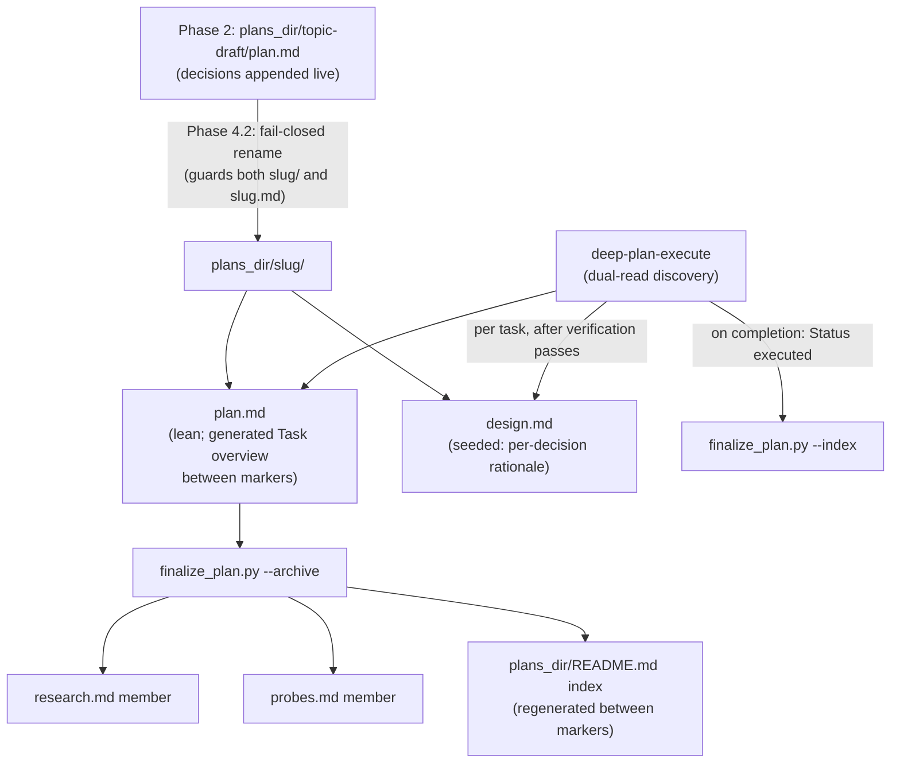

# Deep-plan: restructure plan artifacts into per-plan folders with human-readable views and rationale capture

## Context

The deep-plan plugin emits each plan as a flat trio of files in plans_dir (`<slug>.md` plus `.probes.md` and `.research.md` siblings), and as the repo and its plans have grown this layout has become hard to navigate. The task blocks in the canonical plan are optimized for regex parsing by load_tasks.py and read as dense machine-oriented blobs, so a human skimming a plan cannot easily tell what will change or why. Nothing in the current artifact set captures why the implemented code ends up looking the way it does; the only rationale that survives is the one-line-per-decision column in the Decisions made table plus raw research dossiers. This plan rethinks the full artifact set and its layout: what files a plan consists of, where they live, how humans read them, how rationale is captured across the plan and execute phases, and how the tooling (both SKILL.md orchestrators, finalize_plan.py, load_tasks.py, resolve_slug.py, session state) and existing flat plans adapt.

## Decisions made

| # | Decision | Chosen | Rejected | Rationale |
|---|----------|--------|----------|-----------|
| 1 | Plan layout | Folder per plan, slug-named: `plans_dir/<slug>/` with fixed member names, canonical `plan.md` inside; draft born as `<topic>-draft/`, renamed at Phase 4.2 (the rename step's actual SKILL.md heading; this plan also resolves the repo's existing 4.1/4.2 naming drift in favour of 4.2) | Numbered `NNN-<slug>/` folders; keep flat + index; hybrid folder-when-multi-file | Matches spec-kit/OpenSpec convention from Phase 1 recon; fixed member names keep the load_tasks.py machine contract simple; spec-kit's numbering exists only for git-branch collision avoidance, which does not apply here (Phase 3 dossier 1). |
| 2 | Artifact set | Keep appendix splits as folder members (`research.md`, `probes.md`) and auto-regenerate a `docs/plans/README.md` index at archive | Merge probes+research into one `evidence.md`; drop probes entirely; keep everything inline in `plan.md` | Preserves the proven lean-plan philosophy (PLAN.md decision 3) while fixing sibling sprawl; the index directly addresses the manageability complaint that motivated this plan. |
| 3 | Human-readable tasks | Generated, zero-drift: `finalize_plan.py --repair` auto-generates a `## Task overview` table in plan.md (name, files, deps, one-line summary per task) between HTML-comment markers, and the template requires each **Change** to open with one plain-English sentence | Split plan.md (human) + tasks.md (machine); summary sentence only; no human version | Serves both human moments (Checkpoint 2 walk and later revisits) with a single source of truth; marker-guarded generated regions are established practice (doctoc, terraform-docs; Phase 3 dossier 3); generation avoids the dual-authored drift Phase 1 recon flagged. |
| 4 | Design-rationale capture | New `design.md` folder member, two-phase lifecycle: plan phase seeds expanded per-decision rationale (why chosen, why alternatives rejected, evidence links); execute phase appends per-task Implementation notes (deviations, gotchas, non-obvious code shapes) as a mandatory step gated after each task's verification passes | ADR files per decision (MADR); execute-phase notes.md only; no new artifact (widen Decisions table) | Covers both the plan-time why (currently squeezed into one-line table cells) and the execute-time why-the-code-looks-this-way gap the user identified; entries stay terse and scoped, not a journal (OpenSpec anti-pattern warning, Phase 3 dossier 4); lighter than ADR ceremony while keeping evidence links. |
| 5 | Discovery and legacy plans | Dual-read, folder-write: all consumers read both shapes (`<slug>/plan.md` preferred, legacy flat `<slug>.md` still found); resolve_slug treats either as a collision; new plans always folders; legacy plans untouched | One-time migration script then folder-only; folder-only with manual cleanup | Legacy plans are approved historical records and should not be rewritten; dual-read is a small glob change in each consumer versus silently orphaning existing plans. |

Merge calls made during synthesis (below decision-surfacing bar, recorded for traceability): layout constants live in finalize_plan.py rather than a new module because load_tasks.py already imports helpers from it (existing precedent, simplicity perspective); the README index reads status and date from stamped `**Status**`/`**Date**` lines in plan.md rather than mtime because git does not preserve mtime, so mtime would break the determinism the Phase 3 research requires (maintainability perspective); design.md gets a reference template file because that is the repo's existing convention for authored-shape contracts (plan-file-template.md precedent).

## Architecture



## Tasks

### Task 1: Pin the new plan shape in the template and template contract

**Target files**:
- skills/deep-plan/references/plan-file-template.md (modify)
- skills/deep-plan/tests/test_template_contract.py (modify)

**Change**:
Document the folder member set and the new human-readability rules in the plan template, making it the written contract every later task conforms to. In plan-file-template.md: rewrite the preamble for the folder lifecycle (draft born as `plans_dir/<topic>-draft/plan.md`, folder renamed to `plans_dir/<slug>/` at Phase 4.2; members `plan.md`, `research.md`, `probes.md`, `design.md`); add a `## Task overview` region to the skeleton between `## Architecture` and `## Tasks` -- the marker comments wrap a literal `## Task overview` H2 heading plus the generated table -- using the exact marker literals defined by the Task 2 constants (`OVERVIEW_BEGIN`/`OVERVIEW_END`), documented as fully generated content owned by `finalize_plan.py --repair` (hand edits inside are discarded on the next run); add the formatting rule that every task's `**Change**` block opens with exactly one plain-English summary sentence, terminated per the PEP 257/Javadoc rule (first period followed by whitespace or end of text, so dots in versions and file names do not truncate it).

**Tests (TDD)**:
- File: skills/deep-plan/tests/test_template_contract.py (modify)
- Test name: `test_template_declares_overview_markers_and_summary_rule`
- Asserts: the template text contains `finalize_plan.OVERVIEW_BEGIN` and `finalize_plan.OVERVIEW_END` (imported, not re-hardcoded, so template and constants cannot drift; test_template_contract.py already importlib-loads the script as `finalize`) exactly once each, positioned after `## Architecture` and before `## Tasks` in the skeleton with the `## Task overview` heading between them; the formatting rules mention the opening plain-English summary sentence and name the folder members `plan.md`, `research.md`, `probes.md`, `design.md`; the template no longer contains the dotted-sibling literals `<slug>.probes.md`/`<slug>.research.md` (the current line 80 appendix comment names them).
- This test MUST fail before implementation begins. The implementation turn writes the test first, runs it (must fail), then implements, then runs again (must pass).

**Verification**:
```
uvx pytest skills/deep-plan/tests/test_template_contract.py -x
```

**Depends on**: 2

### Task 2: Single-source layout constants and folder-path resolution in finalize_plan.py

**Target files**:
- skills/deep-plan/scripts/finalize_plan.py (modify)
- skills/deep-plan/tests/test_finalize.py (modify)

**Change**:
Add the folder-layout constants and a shared path resolver to finalize_plan.py so every script reads one source of truth. Module-level constants: `PLAN_FILE_NAME = "plan.md"`, `RESEARCH_FILE_NAME = "research.md"`, `PROBES_FILE_NAME = "probes.md"`, `DESIGN_FILE_NAME = "design.md"`, `DRAFT_SUFFIX = "-draft"`, the four normative marker literals `OVERVIEW_BEGIN = "<!-- deep-plan-task-overview:begin generated: do not edit -->"`, `OVERVIEW_END = "<!-- deep-plan-task-overview:end -->"`, `INDEX_BEGIN = "<!-- deep-plan-index:begin generated: do not edit -->"`, `INDEX_END = "<!-- deep-plan-index:end -->"`, and `STATUSES = ("draft", "approved", "executed", "legacy")` with a docstring declaring it the authoritative status vocabulary. New helper `resolve_plan_path(path: Path) -> Path`: a directory resolves to `path / PLAN_FILE_NAME`, a file passes through unchanged. No new module: load_tasks.py already imports helpers from finalize_plan.py, so resolve_slug.py and load_tasks.py import these constants the same way.

**Tests (TDD)**:
- File: skills/deep-plan/tests/test_finalize.py (modify)
- Test name: `test_layout_constants_and_resolve_plan_path`
- Asserts: the exact literal values of the four member-name constants, both marker pairs, and the `STATUSES` tuple; `resolve_plan_path` on a tmp directory returns `<dir>/plan.md` and on a file path returns it unchanged.
- This test MUST fail before implementation begins. The implementation turn writes the test first, runs it (must fail), then implements, then runs again (must pass).

**Verification**:
```
uvx pytest skills/deep-plan/tests/test_finalize.py -x
```

**Depends on**: none

### Task 3: Dual-form collision detection in resolve_slug.py

**Target files**:
- skills/deep-plan/scripts/resolve_slug.py (modify)
- skills/deep-plan/tests/test_resolve_slug.py (modify)

**Change**:
Teach the slug collision check to see plan folders as well as legacy flat files so a rename can never clobber either form. The collision predicate becomes `(plans_dir / f"{slug}.md").exists() or (plans_dir / slug).exists()`; `next_v_suffix` skips candidates existing in either form; the JSON `path` field changes to `str(plans_dir / slug / "plan.md")` (folder-write, using `PLAN_FILE_NAME` imported from finalize_plan.py); `extract_context` reads `<slug>/plan.md` via `resolve_plan_path` when the collision is a folder, falling back to `<slug>.md`. The test file's importlib loader gains the `sys.path.insert(0, scripts_dir)` line that test_load_tasks.py:16-18 already uses, because resolve_slug.py now imports finalize_plan as a sibling and would otherwise fail collection with ModuleNotFoundError.

**Tests (TDD)**:
- File: skills/deep-plan/tests/test_resolve_slug.py (modify)
- Test name: `test_folder_collision_and_v_suffix_skips_both_forms`
- Asserts: with only `plans_dir/x/plan.md` on disk, the CLI reports `collision: true` with `collision_context` read from that plan.md; with `x.md` and `x-v2/` both present, `auto_v_suffix` is `x-v3`; a collision-free slug yields `path` ending in `/<slug>/plan.md`.
- This test MUST fail before implementation begins. The implementation turn writes the test first, runs it (must fail), then implements, then runs again (must pass).

**Verification**:
```
uvx pytest skills/deep-plan/tests/test_resolve_slug.py -x
```

**Depends on**: 2

### Task 4: Task overview generation in --repair

**Target files**:
- skills/deep-plan/scripts/finalize_plan.py (modify)
- skills/deep-plan/tests/test_finalize.py (modify)
- skills/deep-plan/tests/golden/example-plan.md (modify)

**Change**:
Generate a human-readable Task overview table inside plan.md on every repair run so the approval walk and later revisits get an at-a-glance view that can never drift. New helpers in finalize_plan.py: `first_sentence(text: str) -> str` implementing the PEP 257/Javadoc terminator rule (first `.` followed by whitespace or end of text; falls back to the whole first line when no terminator exists), collapsing internal newlines and runs of whitespace to single spaces and escaping `|` as `\|` so multi-line sentences and embedded regexes cannot break the table; `render_task_overview(tasks) -> str` building a deterministic markdown table (`# | Task | Files | Deps | Summary`, one row per `### Task N:`, Summary from each `**Change**` block's first sentence) headed by the literal `## Task overview` H2 inside the marker pair; `upsert_task_overview(text, fixes) -> str` wired into `repair()` AFTER `ensure_sections` and `ensure_task_subsections` (so `## Architecture` and `## Tasks` are guaranteed present before anchoring, and `ensure_sections` can never insert a section between the overview and `## Tasks`): replaces the region between `OVERVIEW_BEGIN`/`OVERVIEW_END` wholesale when the markers exist, otherwise inserts the marked region at the fixed anchor immediately before `## Tasks`; when an existing marker region does NOT lie between `## Architecture` and `## Tasks` (degenerate input, e.g. an author deleted `## Tasks` and `ensure_sections` re-inserted it above the region), delete the stray region and reinsert at the anchor so repair is self-healing. `REQUIRED_SECTIONS` stays unchanged (the overview is generated, never required of authors). The golden plan's `**Change**` blocks gain opening summary sentences and the exact generated overview region, keeping the golden no-fixes round-trip green.

**Tests (TDD)**:
- File: skills/deep-plan/tests/test_finalize.py (modify)
- Test name: `test_first_sentence_pep257_edge_cases`
- Asserts: `first_sentence("Bumps the plugin to v0.5.0 and renames finalize_plan.py entry points. Second sentence.")` returns the entire first sentence (dots inside `v0.5.0` and `finalize_plan.py` are not terminators); a no-period input falls back to its first line; a sentence containing `|` and an internal newline renders as one table-safe cell (`\|`, single spaces). Companion `test_repair_upserts_task_overview` asserts: repairing a two-task plan without markers inserts exactly one marker pair with the `## Task overview` heading immediately before `## Tasks`; stale hand-edited content inside the markers is replaced by the regenerated table; a second `repair()` pass is byte-identical, including for the pipe-containing sentence.
- This test MUST fail before implementation begins. The implementation turn writes the test first, runs it (must fail), then implements, then runs again (must pass).

**Verification**:
```
uvx pytest skills/deep-plan/tests/test_finalize.py skills/deep-plan/tests/test_template_contract.py skills/deep-plan/tests/test_load_tasks.py -x
```

**Depends on**: 1, 2

### Task 5: Archive writes folder members and stamps Status/Date

**Target files**:
- skills/deep-plan/scripts/finalize_plan.py (modify)
- skills/deep-plan/tests/test_finalize.py (modify)

**Change**:
Retarget archive at the plan folder so the lean plan and its split appendices live as members of one slug-named directory instead of dotted siblings. `cmd_archive(plan, plans_dir, slug)` writes the lean plan to `plans_dir/<slug>/plan.md` and the split appendices to `plans_dir/<slug>/research.md` and `plans_dir/<slug>/probes.md` (names from the Task 2 constants; `split_appendices` unchanged); it stamps `**Status**: approved` and `**Date**: YYYY-MM-DD` lines immediately under the H1 title only when absent, preserving existing values so a re-archive is deterministic. The module docstring drops the dotted-sibling description in favour of the folder lifecycle and fixes its "Phase 4.1" rename wording to 4.2 (finalize_plan.py:23-24, part of the naming-drift sweep). In the same task, rewrite `test_archive_splits_in_place` (skills/deep-plan/tests/test_finalize.py:157-180, which asserts `<slug>.probes.md`/`<slug>.research.md` and the flat `archive_path`) to assert the folder-member outputs instead, so this task's own verification run is green; `test_archive_extracts_siblings` (test_finalize.py:144-154) tests `split_appendices` purely in memory with no file-name assertions and stays untouched.

**Tests (TDD)**:
- File: skills/deep-plan/tests/test_finalize.py (modify)
- Test name: `test_archive_writes_folder_members`
- Asserts: archiving a tmp plan containing both appendices produces `<slug>/plan.md` (lean, appendix headings absent), `<slug>/research.md`, `<slug>/probes.md`, no `<slug>.probes.md` dotted sibling; the JSON report names all three paths; the stamped `**Status**: approved` line survives a second archive run unchanged.
- This test MUST fail before implementation begins. The implementation turn writes the test first, runs it (must fail), then implements, then runs again (must pass).

**Verification**:
```
uvx pytest skills/deep-plan/tests/test_finalize.py -x
```

**Depends on**: 2, 4

### Task 6: Deterministic plans_dir README index and --index CLI mode

**Target files**:
- skills/deep-plan/scripts/finalize_plan.py (modify)
- skills/deep-plan/tests/test_finalize.py (modify)

**Change**:
Regenerate a browsable README index of all plans whenever a plan is archived, deterministic enough that merge conflicts are resolved by regenerating rather than hand-editing. New `regenerate_index(plans_dir: Path) -> Path`: scans `plans_dir/*/plan.md` plus legacy flat `plans_dir/*.md` (excluding `README.md` and `.probes.md`/`.research.md` siblings); per plan reads title (first `# ` heading, fallback folder or file name), status (value of the `**Status**:` line when present; else `draft` for folders, `legacy` for flat files), and date (`**Date**:` line or blank), never mtime; sorts rows by slug; rewrites only the region between `INDEX_BEGIN`/`INDEX_END` in `plans_dir/README.md`, creating the file with markers when missing and preserving any content outside them. `cmd_archive` calls it last and reports `index_path`. New CLI mode `--index --plans-dir <dir>` runs `regenerate_index` standalone so the execute skill can refresh the index after flipping a plan's status; this changes the argparse contract -- `--plan` drops `required=True` (finalize_plan.py:316) and is instead validated per mode (`--repair`/`--archive` need `--plan`, `--index` needs only `--plans-dir`), and the index-mode result carries `ok: true` so the exit-code logic at finalize_plan.py:332 keeps working.

**Tests (TDD)**:
- File: skills/deep-plan/tests/test_finalize.py (modify)
- Test name: `test_index_regeneration_is_deterministic`
- Asserts: with two folder plans (one stamped `**Status**: approved`, one unstamped) and one legacy flat plan in a tmp plans_dir, two consecutive `regenerate_index` calls produce byte-identical README.md; the marked region lists exactly three rows sorted by slug with title, status (`approved`, `draft`, `legacy`), and date; README.md does not list itself; a hand-written line outside the markers survives regeneration.
- This test MUST fail before implementation begins. The implementation turn writes the test first, runs it (must fail), then implements, then runs again (must pass).

**Verification**:
```
uvx pytest skills/deep-plan/tests/test_finalize.py -x
```

**Depends on**: 5

### Task 7: load_tasks.py accepts a plan folder or a plan file

**Target files**:
- skills/deep-plan/scripts/load_tasks.py (modify)
- skills/deep-plan/tests/test_load_tasks.py (modify)

**Change**:
Let the task parser accept a plan folder as well as a plan file so callers never need to know the member layout. `main()` resolves `--plan` through `resolve_plan_path` (imported from finalize_plan.py alongside the existing helper imports) before the existence check, so `plans_dir/<slug>/` and `plans_dir/<slug>/plan.md` parse identically; the not-found error for a folder missing its member names the expected `<folder>/plan.md` path explicitly.

**Tests (TDD)**:
- File: skills/deep-plan/tests/test_load_tasks.py (modify)
- Test name: `test_load_tasks_accepts_folder_path`
- Asserts: invoking the parser with a tmp folder containing a copy of the golden plan as `plan.md` returns the same `tasks` JSON as invoking it with the file path directly; a folder missing `plan.md` exits non-zero with `plan.md` named in the error.
- This test MUST fail before implementation begins. The implementation turn writes the test first, runs it (must fail), then implements, then runs again (must pass).

**Verification**:
```
uvx pytest skills/deep-plan/tests/test_load_tasks.py -x
```

**Depends on**: 2

### Task 8: design.md reference template with contract-pinned shape

**Target files**:
- skills/deep-plan/references/design-md-template.md (new)
- skills/deep-plan/tests/test_design_md_contract.py (new)

**Change**:
Define the design-rationale document's shape once, as a reference template both skills write against. The template specifies: `# Design rationale: {title}`; a `## Decisions` section with one `### D{N}: {decision}` subsection per row of the plan's `## Decisions made` table, each carrying `**Chosen**`, `**Rejected**`, `**Why**` (the expanded reasoning that does not fit a table cell), and `**Evidence**` (links into the sibling `research.md` when Phase 3 ran; when Phase 3 was skipped, cite the Phase 1 evidence inline or write `n/a` -- research.md does not exist for every plan); and a trailing `## Implementation notes` section that starts empty and receives one terse `### Task {N}: {name}` entry per completed task during execution (deviations from the plan, gotchas hit, non-obvious code shapes; 2 to 4 lines each). The preamble states the two-phase lifecycle and the terseness rule explicitly: design.md is a design document, not a chronological journal.

**Tests (TDD)**:
- File: skills/deep-plan/tests/test_design_md_contract.py (new)
- Test name: `test_design_template_required_sections`
- Asserts: the template file exists and contains the heading literals `# Design rationale`, `## Decisions`, `### D`, `**Chosen**`, `**Rejected**`, `**Why**`, `**Evidence**`, and `## Implementation notes`, in that order.
- This test MUST fail before implementation begins. The implementation turn writes the test first, runs it (must fail), then implements, then runs again (must pass).

**Verification**:
```
uvx pytest skills/deep-plan/tests/test_design_md_contract.py -x
```

**Depends on**: none

### Task 9: Folder lifecycle in deep-plan SKILL.md and phase-prompts.md

**Target files**:
- skills/deep-plan/SKILL.md (modify)
- skills/deep-plan/references/phase-prompts.md (modify)
- skills/deep-plan/tests/test_skill_contract.py (modify)

**Change**:
Move the orchestrator's plan lifecycle from a flat draft file to a per-plan folder, pinned by the existing contract-test pattern. SKILL.md changes: Phase 2 persistence creates `plans_dir/<topic>-draft/plan.md` and records `--update plan_path=<plans_dir>/<topic>-draft/plan.md`; Phase 0 R3 stale-draft detection globs `plans_dir/*-draft/` alongside legacy `plans_dir/*-draft.md`; Phase 4.2 becomes the single fail-closed rename point using `test ! -e <plans_dir>/<slug> && test ! -e <plans_dir>/<slug>.md && mv <plans_dir>/<topic>-draft <plans_dir>/<slug>` (guards BOTH the folder and the legacy flat form, matching the Task 3 collision predicate; on failure, fall back to the R3 collision flow rather than clobbering) followed by `--update plan_path=<plans_dir>/<slug>/plan.md`; Phase 4.4 synthesis gains a design.md seeding step, writing `<slug>/design.md` from references/design-md-template.md with expanded per-decision rationale and evidence links per the template's fallback rules; R1's writable-path list becomes the plan folder (draft and renamed) plus the sandbox, and the documented one-time permission snippet gains a rule for the guard segments -- `{"permissions": {"allow": ["Edit(/docs/plans/**)", "Write(/docs/plans/**)", "Bash(mv docs/plans/*)", "Bash(test ! -e docs/plans/*)"]}}` -- because compound commands are permission-checked per segment and a `test`-prefixed segment is not matched by the `mv` rule; Phase 5 names the folder members and the regenerated index in the archive step and handoff message. Sweep the remaining "Phase 4.1 rename" phrasings in this task's own targets (SKILL.md:47 and any in phase-prompts.md) to the correct 4.2, resolving the repo's naming drift; the finalize_plan.py docstring's matching fix belongs to Task 5 and README.md's to Task 11 (each file's owner). Because the permission rules prefix-match the literal command string, the rename step instructs issuing the guarded command with project-relative paths (`docs/plans/...`) from the project root when plans_dir is inside the project, falling back to absolute paths (which may prompt once). phase-prompts.md mirrors the Phase 2/4/5 fragments. Contract test pins the new invariants.

**Tests (TDD)**:
- File: skills/deep-plan/tests/test_skill_contract.py (modify)
- Test name: `test_skill_pins_folder_lifecycle`
- Asserts: SKILL.md contains the `*-draft/` stale-glob, both `test ! -e` guards on the same line as the `mv` rename, the string `<slug>/plan.md`, the `Bash(test ! -e docs/plans/*)` permission rule, and a design-md-template.md seeding reference; the body contains `<topic>-draft/plan.md` and no longer contains the string `<topic>-draft.md` (the legacy R3 glob `*-draft.md` remains legal) nor `.probes.md`/`.research.md` as archive outputs.
- This test MUST fail before implementation begins. The implementation turn writes the test first, runs it (must fail), then implements, then runs again (must pass).

**Verification**:
```
uvx pytest skills/deep-plan/tests/test_skill_contract.py -x
```

**Depends on**: 3, 4, 5, 6, 8

### Task 10: Dual-read discovery, design-notes gate, and status flip in deep-plan-execute

**Target files**:
- skills/deep-plan-execute/SKILL.md (modify)
- skills/deep-plan/tests/test_skill_contract.py (modify)

**Change**:
Teach the execute skill to find both plan shapes and to record implementation rationale as it works. Step 1 discovery replaces the flat glob with the probe-validated pipeline `ls -td "$PLANS_DIR"/*/plan.md "$PLANS_DIR"/*.md 2>/dev/null | grep -vE '(/(README|[^/]*\.(probes|research))\.md$|-draft/plan\.md$)' | head -1` (newest mtime wins across both shapes; path-anchored exclusion so the generated README, legacy dotted siblings, and unfinished `*-draft/` folders never match), and the argument hint documents that a folder path is accepted (load_tasks.py resolves it). Step 5 gains a MANDATORY sub-step between "verification passes" and "mark completed via TaskUpdate": for folder plans, append one terse `### Task {N}: {name}` entry (2 to 4 lines: deviations, gotchas, non-obvious code shapes) under `## Implementation notes` in the sibling design.md, creating design.md from the reference template first if a crashed or hand-made folder lacks it; legacy flat plans skip the append. After ALL tasks complete, for folder plans only, flip the plan.md `**Status**: approved` line to `**Status**: executed` (when no Status line exists, add `**Status**: executed` under the H1 rather than failing) and run `finalize_plan.py --index --plans-dir <plans_dir>` to refresh the index; legacy flat plans skip both completion steps (they carry no Status line and may predate the README). The anti-patterns list gains "marking a task completed without its design.md implementation note (folder plans)".

**Tests (TDD)**:
- File: skills/deep-plan/tests/test_skill_contract.py (modify)
- Test name: `test_execute_skill_dual_reads_and_gates_on_design_notes`
- Asserts: the execute SKILL.md contains the `*/plan.md` preferred glob, the README and `-draft/` exclusions in the discovery pipeline, still invokes load_tasks.py, contains an `Implementation notes` append instruction ordered after the verification-pass step and before the TaskUpdate completion wording, and contains the `--index` refresh instruction with the `executed` status flip scoped to folder plans.
- This test MUST fail before implementation begins. The implementation turn writes the test first, runs it (must fail), then implements, then runs again (must pass).

**Verification**:
```
uvx pytest skills/deep-plan/tests/test_skill_contract.py -x
```

**Depends on**: 6, 7, 8, 9

### Task 11: PLAN.md History demotion, README.md truth sync, and settings update

**Target files**:
- PLAN.md (modify)
- README.md (modify)
- .claude/settings.json (modify)

**Change**:
Document the folder-per-plan artifact set in the design documents, demote the flat-file design to History, and update this repo's own permission allowlist. PLAN.md: rewrite the plan-file-shape, Phase 2/4/5, and engineering sections for the folder lifecycle (member set `plan.md`/`research.md`/`probes.md`/`design.md`, generated Task overview and index regions with their marker literals, the design.md two-phase lifecycle, the dual-read/folder-write legacy policy); demote the superseded "single canonical plan file" and "lean plan plus dotted siblings" passages into the History section per the existing demotion convention; add a version changelog block documenting the five resolved decisions. README.md: update the layout tree, key invariants, discovery description, mermaid captions, the "renamed at Phase 4.1" line (README.md:194, part of the 4.2 naming-drift sweep), and the documented permission snippet (adding `Bash(test ! -e docs/plans/*)`, matching Task 9's SKILL.md snippet); document the index conflict rule (regenerate, never hand-resolve); phrase any legacy-compat note as "legacy dotted siblings" without the `<slug>.probes.md` literal so the verification discriminates. .claude/settings.json: add the `Bash(test ! -e docs/plans/*)` rule to the existing allow list so the fail-closed rename works unprompted in this repo. Probes confirmed `.claude-plugin/plugin.json`, `.claude-plugin/marketplace.json`, `agents/dp-*.md`, and `skills/design-review/references/fleet-orchestration.md` carry no plan-path or sibling-naming assumptions, so they need no edits.

**Verification**:
```
grep -q '<slug>/plan.md' PLAN.md && grep -q 'design.md' README.md && test -z "$(grep -n '<slug>\.probes\.md' README.md)" && python3 -c "import json; a=json.load(open('.claude/settings.json'))['permissions']['allow']; assert any(r.startswith('Bash(test ! -e') for r in a)"
```

**Depends on**: 9, 10

### Task 12: Full quality gate

**Target files**:
- none (verification-only aggregate)

**Change**:
Run the full lint, type, and test gate to confirm scripts, references, skills, and contract tests are mutually consistent after the restructure. Note for this machine: pytest is not importable by the system python3, so the suite runs via `uvx pytest` (probe 2); the stdlib direct-run fallback (`python3 skills/deep-plan/tests/test_finalize.py`) also remains available. CI (.github/workflows/ci.yml) runs the same three tools via `pip install ruff mypy pytest` on Python 3.12, so the local `uvx` gate mirrors CI's unpinned-latest approach (probe 6).

**Verification**:
```
uvx ruff check skills/deep-plan && uvx mypy --strict skills/deep-plan/scripts skills/deep-plan/hooks && uvx pytest skills/deep-plan/tests -q
```

**Depends on**: 1, 2, 3, 4, 5, 6, 7, 8, 9, 10, 11

## References

- skills/deep-plan/SKILL.md (Phase 2 persistence, Phase 4.2 rename, R1 writable paths, R3 stale-draft detection)
- skills/deep-plan/references/plan-file-template.md (skeleton, formatting rules, AI-consumable rationale)
- skills/deep-plan/references/phase-prompts.md (Phase 2/4/5 fragments)
- skills/deep-plan/scripts/finalize_plan.py (repair pipeline, split_appendices, cmd_archive; helpers _header_pos/_section_end reused by load_tasks.py -- import precedent for shared constants)
- skills/deep-plan/scripts/load_tasks.py (machine contract: regex over `### Task N:` and `**Label**:` blocks)
- skills/deep-plan/scripts/resolve_slug.py (collision predicate, next_v_suffix, extract_context)
- skills/deep-plan/scripts/setup_session.py (plan_path is a free-form permitted key; no code change needed)
- skills/deep-plan-execute/SKILL.md (Step 1 discovery glob, Step 5 implementation loop)
- skills/deep-plan/tests/ (test_finalize.py, test_load_tasks.py, test_resolve_slug.py, test_skill_contract.py, test_template_contract.py, golden/example-plan.md)
- PLAN.md (History demotion convention; superseded decisions 2 and 3)
- docs/plans/deep-plan-drop-plan-mode-draft-lifecycle.md (+.probes.md/.research.md: legacy flat example that stays untouched)
- https://github.com/github/spec-kit (specs/<feature>/ layout; numbering rationale that does not transfer)
- https://github.com/Fission-AI/OpenSpec (changes/<name>/ fixed members; design.md revision semantics; journal anti-pattern)
- https://github.com/thlorenz/doctoc and https://terraform-docs.io/reference/terraform-docs/ (HTML-comment marker convention for generated regions)
- https://peps.python.org/pep-0257/ and the Javadoc doc-comment spec (first-sentence terminator rule)
- https://kiro.dev/docs/specs/ (design.md member precedent)
- https://adr.github.io/madr/ (rejected per-decision ADR alternative)

## Open questions

- none

## Technical Approach
{chosen approach and why}

## Architecture Decisions
{rationale for key decisions}

## Data Flow
{how data moves through the change}

## File Changes
{files being created or modified}
```
