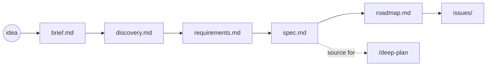

# The product pipeline

Six commands take a raw idea to implementable work items. Each one reads exactly one input document, writes exactly one output, and refuses to run until its input exists. Everything lands in `docs/product/<slug>/` — ordinary files, committed with your repo unless you choose to gitignore them.



`/product-status` tells you where you are in the chain; `/product-review` reviews any one document. Neither is a chain step.

## How the chain stays honest

Three mechanics apply to every step:

- **Provenance.** Each document (after the first) records a hash of the exact upstream version it was derived from. If the upstream changes later, the downstream document is **stale**.
- **Freshness.** A document is `fresh`, `stale` (its upstream changed since it was written), `unresolvable` (its provenance line is damaged), or `absent`. Stale is a warning, never a blocker — only a *missing* input stops a command.
- **Unknown markers.** When nobody has established a value (a market size, a user count), the document says `[UNKNOWN: what is missing -- who would know]` instead of inventing a number. Downstream steps carry the marker; a roadmap item resting on an unknown gets no score.

## The six steps

### /product-brief — idea → brief

```
/product-brief a CLI that summarizes my week from git history
```

Writes `docs/product/<slug>/brief.md`, an Amazon-style PR-FAQ: a future press release plus the hard questions and answers. It interviews you while a research agent sweeps the web in parallel, so the wait hides behind your answers. Market figures carry citations; customer quotes are written as illustrations and labeled as such, never faked as research. Re-running replaces the brief.

### /product-discovery — brief → discovery

```
/product-discovery my-cli
```

Writes `discovery.md`: an opportunity solution tree (which customer problems the brief implies), an assumption map, and the riskiest-assumption tests worth running first. The ranking is by *testing urgency* — what would kill the idea fastest if false — not by delivery order. Refuses without a brief. Re-running replaces the document.

### /product-requirements — discovery → requirements

```
/product-requirements my-cli
```

Writes `requirements.md`: one testable sentence per thing that must be true, in EARS form ("When X, the system shall Y"), functional and non-functional, each traced to the opportunity it answers. This is where the chain's ambiguity gets spent — everything upstream is deliberately prose. Refuses without a discovery. Re-running revises in place: requirement IDs are never renumbered or reused, and dropped requirements move to an "Out of scope" section instead of vanishing.

### /product-spec — requirements → spec

```
/product-spec my-cli
```

Writes `spec.md`: the problem, every in-scope requirement carried over word for word, and the non-goals — each with what excluding it costs. It names no technology. It is the only chain document `/deep-plan` ever reads, so it must stand alone: whatever it leaves out, the planner never sees. Refuses without requirements. Re-running replaces the spec wholesale, with a warning that a plan already built from the old spec won't see the new one.

### /product-roadmap — spec → roadmap

```
/product-roadmap my-cli
```

Writes `roadmap.md`: the spec's requirements grouped into items, each RICE-scored (reach, impact, confidence, effort) with a fixed appetite decided *before* effort is estimated, then placed in a sequence with the rejected orderings recorded. No dates. An item with an unknown-marked input has no score and cannot enter the sequence. Refuses without a spec. Re-running revises in place; item IDs never change.

### /product-issues — roadmap → work slices

```
/product-issues my-cli
```

Writes `docs/product/<slug>/issues/`, one markdown file per slice of work one person can pick up and finish. Slicing follows a story map: a walking skeleton first, then vertical cuts, each checked against the INVEST criteria. Refuses without a roadmap. Re-running *adds* new slices; slice IDs are never reused.

Optionally, it then files the slices as **GitHub issues** (GitLab and Jira are not supported):

1. You pick the destination: markdown only, or GitHub.
2. A **dry run** shows exactly what would be created — always, not optional.
3. You confirm, per sequence.
4. Issues are created (with parent/sub-issue links where your `gh` version supports them), and each filed slice gets a ledger entry in its file — so a re-run skips everything already filed.

## The helpers

### /product-status

```
/product-status my-cli
```

One line per chain document — exists or not, fresh or stale — then exactly one recommendation: the next command to run. Read-only.

### /product-review

```
/product-review docs/product/my-cli/spec.md
/product-review my-cli        # picks the artifact to review
```

Runs a critic-fleet review (see [reviews.md](reviews.md)) of one product document, judged against the rubric shipped by the command that owns it — a spec is judged by spec principles, a roadmap by roadmap principles. It cannot edit anything: the skill's tool set has no write access. If a document has no rubric, it is reported as unreviewable rather than judged by the wrong one.

## The bridge to planning

When you run `/deep-plan` in a repo that has a finished `docs/product/<slug>/spec.md`, Phase 1 detects it and offers it as the recommended source for the plan. A stale spec is flagged but still offered. Nothing is ingested without your pick. From there the normal planning flow takes over — see [planning.md](planning.md).
