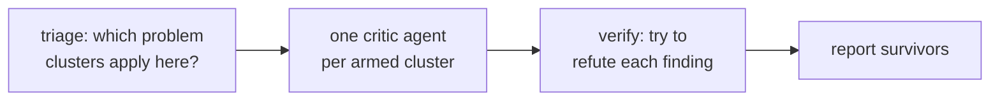

# The review commands

Three commands run the same review machinery against different targets. None of them edits anything — they report findings, you decide.

## How a review runs

Every review is a critic fleet with a filter at each end:



A cheap triage pass first decides which clusters of problems are even worth checking for this target — a small change arms few critics and pays for few. One `dp-critic` agent then hunts per armed cluster, guided by a principles file (the rubric). Finally each finding is handed to a fresh critic told to refute it; only findings that survive are reported. This kills plausible-but-wrong findings before they reach you.

## /design-review

```
/design-review                       # the current working diff
/design-review src/api/limiter.py    # a file or directory
/design-review HEAD~3                # a git ref
/design-review docs/plans/my-plan    # a deep-plan plan
```

Reviews design quality: shallow modules, leaked implementation detail, unclear names, missing or misplaced comments, pass-through layers. The rubric lives in `skills/design-review/references/design-principles.md`.

## /tdd-review

```
/tdd-review docs/plans/my-plan/plan.md
```

Reviews the **planned tests** in a `/deep-plan` plan — their assertions, doubles, fixtures, test level, and flake risk. It reads the plan's `Tests (TDD)` blocks only, not diffs or implemented code. The rubric lives in `skills/tdd-review/references/test-principles.md`.

## /product-review

```
/product-review docs/product/my-cli/roadmap.md
```

Reviews one product-chain document against the rubric shipped by the command that owns it. A document with no rubric is reported as unreviewable, never judged against a borrowed one. The skill's tool set has no write access, so "it never edits what it reads" is enforced, not promised.

## Where reviews run automatically

You rarely need to invoke these by hand during the pipelines:

- `/deep-plan` runs design, test, readability, and plan-integrity critics over the draft plan before you're asked to approve it (Phase 4.6).
- Each task executed by `/deep-plan:deep-plan-execute` runs its own design and test review over its diff, inside the implementer agent, before the task is reported done.
