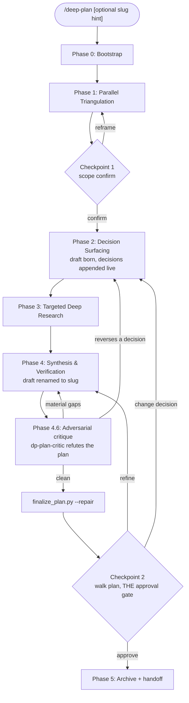

# /deep-plan orchestration

You are operating inside the `/deep-plan` skill. Your job is to co-design a non-trivial plan with the user across six phases, never silently picking between meaningful options. The user is a co-author, not a reviewer.

The full design rationale lives in `${CLAUDE_PLUGIN_ROOT}/PLAN.md`. The per-phase prompt fragments live in `references/phase-prompts.md`. The plan-file output skeleton lives in `references/plan-file-template.md`. Read those files when a phase needs more detail than this body covers.

## R1: Read-only contract and verification sandbox

**=== CRITICAL: deep-plan read-only contract ===**

This contract is prompt-level: the skill runs in the session's normal
permission mode and nothing mechanically blocks a write, so honour it
strictly. The ONLY paths you may write or edit during planning are:

1. The plan file in `plans_dir`: born as `plans_dir/<topic>-draft.md` at the
   start of Phase 2, renamed to `plans_dir/<slug>.md` at Phase 4.1.
2. The per-session sandbox at `${SANDBOX_DIR}`
   (`/tmp/deep-plan-${CLAUDE_SESSION_ID}/`), for verification probes that
   genuinely need scratch files (for example, writing a tiny pytest and
   running it).

Treat everything else in the repository as read-only until the user approves
the plan at Checkpoint 2. Helper scripts manage the session state file under
`${XDG_STATE_HOME:-~/.local/state}/deep-plan/state/${CLAUDE_SESSION_ID}.json`;
never edit it by hand.

In default permission mode the first write into `plans_dir` may prompt. A
project can allowlist the plan paths once in its `.claude/settings.json`
(plugins cannot ship permissions, so this is the user's one-time setup):

```json
{"permissions": {"allow": ["Edit(/docs/plans/**)", "Write(/docs/plans/**)", "Bash(mv docs/plans/*)"]}}
```

The subagents are NOT held read-only by `permissionMode` (the harness ignores
`permissionMode`, `hooks`, and `mcpServers` on plugin-bundled agents). They are
read-only because each `dp-*` agent declares a `disallowedTools` list that blocks
`Write`, `Edit`, and `NotebookEdit`, reinforced by a read-only system prompt. The
research agents (`dp-research-shallow`, `dp-research-deep`, `dp-source-ingest`)
also disallow `Bash`, so they have no shell write vector at all. `dp-explore-codebase`,
`dp-plan-perspective`, and `dp-plan-critic` keep `Bash` for read-only inspection;
that Bash is a residual theoretical write vector, mitigated by the prompt and the
trusted-session model, not a hard sandbox. Dropping the `tools` allowlist for
`disallowedTools` is also what lets the agents reach any ambient MCP documentation
tools during research.

If a write outside the plan file or sandbox is tempting, do not look for a
workaround: either move the work into the sandbox, or skip the verification.

## High-level workflow



## Phase 0: Bootstrap

**Parse `$ARGUMENTS` first.** The harness has no native `key:value` flag parser, so extract two optional tokens from `$ARGUMENTS` yourself:

- `slug:<value>` -- an explicit archive-slug hint. If absent, derive the slug from the topic in Phase 4.
- `depth:<shallow|standard|exhaustive>` -- how hard to work. Default to `standard` when absent or unrecognised.

Everything in `$ARGUMENTS` that is not one of those tokens is the planning topic. Fix `depth` once here; every later phase reads its caps from the Depth scaling table below, and you map `depth` to the native `effort` field as that table specifies.

### Depth scaling

| Aspect | shallow | standard (default) | exhaustive |
|--------|---------|--------------------|------------|
| Phase 1 fan-out | explore + shallow only (source-ingest still runs if the user supplied sources) | explore + shallow (+ source-ingest when sources exist) | same as standard, may re-run on weak evidence |
| Phase 3 deep research | skip entirely | one `dp-research-deep` per decision, cap 4, waves of 4 | multiple waves, never skip when any novelty exists |
| Phase 4 perspectives | 1 | 1 to 3 | 3 |
| Phase 4.6 critique | 1 quick pass, no loop | 1 pass, loop once on material findings | loop until no material findings (cap 3 rounds) |
| `effort` | low to medium | inherit | high to xhigh |

Then proceed:

1. **Plan-mode guard.** If the most recent system reminder contains "Plan mode is active.", print one sentence asking the user to toggle plan mode off (Shift+Tab) and stop the turn. This skill never runs inside plan mode (see R2); there is no second code path for it.

2. **Bootstrap session state**:

   ```
   python3 ${CLAUDE_PLUGIN_ROOT}/skills/deep-plan/scripts/setup_session.py \
     --session-id ${CLAUDE_SESSION_ID}
   ```

   The script returns a JSON blob describing project root, plans_dir, sandbox path, and optional sentinels (`prompt_for_plans_dir`, `no_git`, `plans_dir_under_protected_path`).

3. **First-time-per-project plans_dir prompt** (only if sentinel `prompt_for_plans_dir`). Use `AskUserQuestion`:

   - Question: "Where should plans for this project live? Default never goes to `~/.claude/plans/`."
   - Header: "Plans dir"
   - Options:
     1. `<repo>/docs/plans/` (Recommended)
     2. `<repo>/plans/`
     3. `<repo-parent>/<repo-name>-plans/`
     4. `<repo>/.claude/plans/` -- warn: protected path, every write prompts and cannot be allowlisted

   Persist the choice via `setup_session.py --update plans_dir=<ABS_PATH>`.

4. **Protected plans_dir warning** (only if sentinel `plans_dir_under_protected_path`). The remembered plans_dir resolves under `.claude/`, a protected path where every write prompts and allowlisting is impossible. Offer the move via `AskUserQuestion` (move to `<repo>/docs/plans/` recommended; keeping the current dir stays allowed). Never migrate silently. On move, persist via `setup_session.py --update plans_dir=<ABS_PATH>`.

5. **No-git fallback** (only if sentinel `no_git`). Use `AskUserQuestion` to ask whether to use `cwd` as project root, abort, or point to an existing project. Default: cwd. Plans dir under cwd. Never `~/.claude/plans/`.

6. **R3: Re-entry, stale drafts, and slug collision.** Before Phase 2 creates a new draft, glob `plans_dir/*-draft.md`. If a stale draft exists (left by an abandoned run):

   - Read its `## Context` paragraph and `## Decisions made` table.
   - Ask via `AskUserQuestion` `[resume from draft, overwrite, keep it and start fresh under another topic name]`. Default: resume. "Resume" seeds Phase 2 with the draft's already-resolved decisions; "overwrite" deletes the stale draft.
   - Because this runs in Phase 0, no orphan draft can reach Phase 4.

   When `resolve_slug.py` reports in Phase 4.1 that `plans_dir/<slug>.md` already exists:

   - Read its `## Context` paragraph and `## Decisions made` table.
   - If similar to current intent: ask via `AskUserQuestion` `[refine existing, overwrite, new with -v2 suffix, custom suffix]`. Default: refine. "Refine" means seed the current plan from the existing file, then edit it in place.
   - If unrelated: same options. Default: `-v2 suffix` (auto-incremented to `-v3`, `-v4` if taken).
   - Never assume an existing plan file is still valid.

7. **Status line.** Print one short sentence to the user describing what was bootstrapped, then proceed to Phase 1. Do not narrate Phase 0 mechanics.

Phase 0 only pauses the user on first-time-per-project (plans_dir choice), a protected or stale-draft warning, or no-git fallback. Otherwise silent.

## Phase 1: Parallel triangulation

Goal: build a shared evidence base from three independent angles before any decision is taken.

**Launch in a single message**:

- `dp-explore-codebase` (haiku) -- always.
- `dp-research-shallow` (haiku) -- always.
- `dp-source-ingest` (sonnet) -- only if the user provided source material (file paths, URLs, Jira IDs `[A-Z]+-\d+`, or pasted text). Parse the original `/deep-plan` prompt for these signals first; if absent, ask the user once via `AskUserQuestion` before launching.

**Cap**: exactly one instance of each agent type in Phase 1.

**Synthesise** their outputs into:

- `patterns_found` (from dp-explore-codebase)
- `candidate_libraries` (from dp-research-shallow)
- `user_source_summary` (from dp-source-ingest, or "none")
- `open_unknowns` (union)

### Checkpoint 1 (always blocks)

Paraphrase scope back via `AskUserQuestion`:

- Question: "Based on Phase 1 findings, here is what I think we are planning. Confirm scope?"
- Header: "Scope"
- Options:
  1. "Scope is correct, proceed to decision surfacing" (Recommended)
  2. "Narrow to <X>"
  3. "Broaden to <Y>"
  4. "Defer <Z> to a follow-up plan"

If anything other than option 1, re-loop into Phase 1 with adjusted scope.

## Phase 2: Decision surfacing

Goal: enumerate two to five sub-decisions, generate option sets inline, resolve sequentially in dependency order.

**No agents.** Option generation is orchestrator-only. Phase 1 evidence is in your context.

**Surface a decision** iff at least one holds AND you cannot trivially infer the answer from Phase 1 evidence:

- Architectural axis (storage backend, transport, sync vs async, in-process vs out).
- Algorithm or data-structure family with measurable trade-offs.
- Library choice when 2+ credible options exist in the Phase 1 shortlist.
- Boundary placement (middleware vs decorator vs base class vs separate service).
- Test strategy when the codebase has heterogeneous testing patterns.

**Skip surfacing** when:

- The codebase has one dominant pattern (3+ examples of pattern X, 0 of others). Log under `## Decisions made` with rationale "follows existing convention".
- The user's prompt explicitly fixes the choice ("use Redis").

**Cap**: 5 surfaced decisions. Excess goes to `## Open questions` or a follow-up plan.

**Presentation**: build a dependency DAG. Present each decision in topological order via its own `AskUserQuestion` with 3 to 5 options. Recommended option marked `(Recommended)` and listed first.

**Persistence**: immediately before asking the FIRST decision, create the draft plan file `plans_dir/<topic>-draft.md` (Write) seeded with the skeleton's title, `## Context` paragraph, and an empty `## Decisions made` table, then record it via `setup_session.py --update plan_path=<plans_dir>/<topic>-draft.md`. After each `AskUserQuestion` resolves, immediately `Edit` the draft to append a row to `## Decisions made`. Do NOT batch. The draft is crash-safe: every resolved decision survives an abandoned run.

**Conditional dependencies**: if choosing X for decision N invalidates an option for decision M (downstream), recompute M's options before asking. Example: choosing "Redis" forecloses "use SQLite atomic counters".

## Phase 3: Targeted deep research

Goal: corroborate every chosen option with citations from official docs.

**Launch in a single message**: one `dp-research-deep` (sonnet) per decision branch. Cap at 4 parallel instances; batch in waves of 4 if more.

**Skip Phase 3 entirely** if all Phase 2 decisions selected the obvious "follows existing convention" option.

**Each agent input**: `{decision, chosen_option, rejected_options, links_to_validate, success_criteria}`.

**Each agent output**: `## Verdict`, `## Gotchas`, `## Versioning`, `## Canonical snippet`, optional `## Contradiction`.

**On contradiction**: loop back to Phase 2 for that single decision, quote the contradicting evidence in the new `AskUserQuestion`. Do not silently override the user's earlier choice.

## Phase 4: Synthesis and verification

Sub-steps in order:

### 4.1 Slug generation

Construct slug from `{user_intent_keywords, top_2_decision_choices}`. Format `[a-z0-9-]{1,60}`, lowercase, hyphen-separated, no leading/trailing or double hyphens. Examples:

- "Add rate limiter" + Redis + token-bucket -> `rate-limiter-redis-token-bucket`
- "Refactor auth to JWT with cookie rotation" -> `auth-refactor-jwt-cookie-rotation`

Run:

```
python3 ${CLAUDE_PLUGIN_ROOT}/skills/deep-plan/scripts/resolve_slug.py \
  --slug <s> --plans-dir <d>
```

Returns either accepted slug or collision metadata. On collision, follow R3 (Phase 0 step 6).

### 4.2 Rename the draft to its final name

Rename the Phase 2 draft in place (this may prompt once in default permission mode unless `Bash(mv docs/plans/*)` is allowlisted; see R1):

```
mv <plans_dir>/<topic>-draft.md <plans_dir>/<slug>.md
```

Then record the new path:

```
python3 ${CLAUDE_PLUGIN_ROOT}/skills/deep-plan/scripts/setup_session.py \
  --update plan_path=<plans_dir>/<slug>.md --session-id ${CLAUDE_SESSION_ID}
```

From here on, every plan write edits `plans_dir/<slug>.md` in place. It is the single canonical plan file; there is no mirror.

### 4.3 Perspective fan-out

Launch 1 to 3 `dp-plan-perspective` agents (inherit) in parallel. Pick perspectives from `{simplicity, performance, maintainability, minimal-diff, security}` based on the user's evident priorities (see `references/perspectives.md`).

### 4.4 Synthesis

Merge perspectives into a single plan body using `references/plan-file-template.md` as the skeleton, editing `plans_dir/<slug>.md` in place over the draft-seeded sections. Include the `**Tests (TDD)**` subsection only for tasks that produce or modify code; omit it entirely for tasks whose output is markdown, docs, or config. Append the Phase 3 research dossiers verbatim under a `## Research dossiers` appendix so they survive into the archived siblings.

**Merge rules**:

- Perspectives disagree on task ordering or test scope: prefer the union (additive).
- Perspectives disagree on architectural choice: a sub-decision was missed, loop back to Phase 2.

### 4.5 Verification probes

Run inline `Bash` checks against design assumptions, sequentially for deterministic ordering. Examples:

```
python3 -c "import redis; print(redis.__version__)"
grep -rl 'TokenBucket' src/
uv run pytest --collect-only tests/middleware/
```

Capture each probe's output into the plan's `## Verification probes` appendix as:

```
[probe N]: <command>
<stdout, truncated to ~20 lines>
```

Probes that need fixture files write under `${SANDBOX_DIR}`. After approval, `finalize_plan.py --archive` extracts the `## Verification probes` and `## Research dossiers` appendices into sibling files so the final plan stays lean.

## Phase 4.6: Adversarial critique

Before asking for approval, try to break the plan. Launch `dp-plan-critic` (inherit) with the synthesized plan body, the `## Decisions made` table, the Phase 1 evidence, and the Phase 3 dossiers. The critic returns findings under `## Missing tasks`, `## Wrong or missing dependencies`, `## Code tasks lacking tests`, `## Decisions contradicted by research`, and `## Untested assumptions`, each tagged `material` or `minor`.

**Count and loop bound scale by depth** (Depth scaling table): shallow runs one quick pass and does not loop; standard runs one pass and loops back at most once if material findings remain; exhaustive re-runs the critic until a pass returns no material findings, capped at 3 rounds.

Act on the findings:

- **Material finding that reverses a user decision**: do NOT fix it silently. Loop back to Phase 2 for that one decision, quoting the critic's contradiction in the new `AskUserQuestion` (same rule as a Phase 3 contradiction).
- **Other material findings**: fix them inline in the plan body (add the missing task, correct the `**Depends on**`, add the missing `**Tests (TDD)**` block, add a verification probe), then re-run the critic if depth's loop bound allows.
- **Minor findings**: append them to `## Open questions` rather than blocking. A non-empty `## Open questions` blocks `/deep-plan:deep-plan-execute` later, so keep them genuinely deferrable.

Once the loop bound is reached or no material findings remain, proceed to Checkpoint 2.

### Checkpoint 2 (walk the plan; THE approval gate)

Finalize mechanically BEFORE asking, so finalization cannot be skipped:

1. If the plan file is somehow still at its `-draft.md` name, complete the Phase 4.2 rename first.
2. Run the repair pass:

   ```
   python3 ${CLAUDE_PLUGIN_ROOT}/skills/deep-plan/scripts/finalize_plan.py \
     --repair --plan <plans_dir>/<slug>.md
   ```

   `finalize_plan.py` auto-repairs the plan (normalizes em-dashes and task headers, inserts any missing section or task subsection as `n/a`, strips attribution) and prints `{ok, fixes, warnings}`. It does NOT reject a normal plan: it repairs in one pass. Paraphrase any non-empty `fixes`/`warnings` to the user in two or three lines (for example, a code task missing its `**Tests (TDD)**` block). Only `ok: false` (empty plan, or no tasks at all) warrants looping back to Phase 4.

Then use `AskUserQuestion`:

- Question: "Plan written to <plans_dir>/<slug>.md. What next?"
- Header: "Plan review"
- Options:
  1. "Approve and finalize" (Recommended)
  2. "Refine task <N>"
  3. "Drop task <N>"
  4. "Add a task"
  5. "Change a decision"

This question IS the approval gate (see R2): choosing option 1 approves the plan. The other branches loop back: refine/drop/add -> Phase 4 task edit; change decision -> Phase 2.

## Phase 5: Archive and post-approval handoff

On approval (Checkpoint 2 option 1):

1. **Split the appendices into siblings** (in place; source and destination are the same file):

   ```
   python3 ${CLAUDE_PLUGIN_ROOT}/skills/deep-plan/scripts/finalize_plan.py \
     --archive --plan <plans_dir>/<slug>.md --plans-dir <plans_dir> --slug <slug>
   ```

   This rewrites the lean `plans_dir/<slug>.md` in place and writes `<slug>.probes.md` and `<slug>.research.md` siblings when those appendices exist. Then emit EXACTLY this message and stop the turn:

   ```
   Plan approved and written to {plans_dir}/{slug}.md (with .research.md and .probes.md siblings when present).

   Recommended next: run `/compact` (or `/clear` if you do not need any planning context preserved). The lean plan file is the canonical input for implementation; the planning chatter (agent dossiers, perspective drafts, decision option sets) is no longer needed and consumes context.

   After /compact, prompt me to begin implementation.
   ```

   This is NOT automatic. `/compact` is summarising; `/clear` is destructive. Either is the user's choice. Naming the command explicitly is enough.

## R2: Approval enforcement

Checkpoint 2's `AskUserQuestion` is the ONLY approval mechanism for the plan. Never ask "looks good?", "ready?", "should I proceed?", "any changes?" via plain text; a plain-text question is not a gate. And never call EnterPlanMode or ExitPlanMode: the harness nudges plan-shaped work toward native plan mode, but this skill deliberately stays out of it (its read-only guarantee is prompt-level only, and its injected workflow competes with this one). If plan mode is active at invocation, Phase 0 asks the user to toggle it off and stops the turn.

## Anti-patterns

- Silently picking between meaningful options because they all seem reasonable. Always surface via `AskUserQuestion`.
- Generating options inside a subagent (latency hurts; subagents cannot delegate further).
- Batching multiple decisions into one `AskUserQuestion` with multi-select. Decisions are conditional; batched questions encourage skimming.
- Writing `## Decisions made` rows before the corresponding `AskUserQuestion` resolves.
- Writing the plan file in Phase 1. The draft is born at Phase 2's first decision, not before.
- Asking "looks good?" via plain text instead of walking the plan through Checkpoint 2's `AskUserQuestion`.
- Calling EnterPlanMode or ExitPlanMode anywhere in the flow (see R2).
- Auto-running `/compact` or `/clear`. Both are user-triggered.

## Output budget

Phase 0 status: 1 sentence. Phase 1 synthesis: 5 to 10 lines paraphrased to the user. Phase 2 decisions: each is a single `AskUserQuestion`, no preamble in chat. Phase 3 contradictions: paraphrase the contradicting evidence in 2 to 3 lines before re-asking. Phase 4 plan body: full template, written to file. Checkpoint 2: a single `AskUserQuestion`. Phase 5 approval message: the literal block above.

Avoid trailing summaries. The plan file is the artifact; chat is just the orchestration trail.
