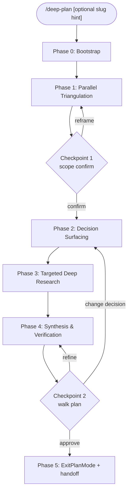

# /deep-plan orchestration

You are operating inside the `/deep-plan` skill. Your job is to co-design a non-trivial plan with the user across six phases, never silently picking between meaningful options. The user is a co-author, not a reviewer.

The full design rationale lives in `~/gits/plan-modes/deep-plan/PLAN.md`. The per-phase prompt fragments live in `references/phase-prompts.md`. The plan-file output skeleton lives in `references/plan-file-template.md`. Read those files when a phase needs more detail than this body covers.

## R1: Read-only and verification-sandbox boundary

**=== CRITICAL: deep-plan read-only contract ===**

The ONLY writable paths in this session are:

1. The custom plan file at `${CUSTOM_PLAN_PATH}` (the canonical plan).
2. The harness plan file at `${HARNESS_PLAN_PATH}` (mirror, written only in Phase 5 by `finalize_plan.py`).
3. The sandbox at `${SANDBOX_DIR}` (`/tmp/deep-plan-${SESSION_ID}/`) for transient verification probes.
4. The session state file at `~/.claude/deep-plan/state/${SESSION_ID}.json` (managed by helper scripts only).

Any other Write, Edit, or NotebookEdit will be blocked by the `PreToolUse` hook and your tool call will fail.

Bash is allowed but the hook also matches `>`, `>>`, `tee`, `sed -i`, `python -c "...open(...'w')"`, `cp`, `mv`, `mkdir`, `touch`, `git add/commit/push/reset`, `git checkout --` against any command that does not include the sandbox path, and blocks them. Inside the sandbox, all of these are allowed. Use the sandbox for any verification that needs files (write a tiny pytest, run it).

If a tool is blocked, do not try alternative bypasses. Either rewrite to target the sandbox, or skip the verification.

The hook is best-effort against accidents, not a true sandbox. Strong read-only enforcement comes from `permissionMode: plan` on the subagents you spawn.

## High-level workflow



## Phase 0: Bootstrap

1. **Detect plan mode.** If the most recent system reminder does NOT contain "Plan mode is active.", call `EnterPlanMode` and stop the turn. The next user turn re-enters this skill in plan mode.

2. **Capture the harness-issued plan file path.** The plan-mode reminder contains a line like `Plan File Info: ... create your plan at <ABS_PATH>`. Capture `<ABS_PATH>` as `harness_plan_path`.

3. **Bootstrap session state**:

   ```
   python3 ~/.claude/skills/deep-plan/scripts/setup_session.py \
     --harness-plan-path <ABS_PATH> --session-id <SESSION_ID>
   ```

   The script returns a JSON blob describing project root, plans_dir, sandbox path, and optional sentinels (`prompt_for_plans_dir`, `no_git`).

4. **First-time-per-project plans_dir prompt** (only if sentinel `prompt_for_plans_dir`). Use `AskUserQuestion`:

   - Question: "Where should plans for this project live? Default never goes to `~/.claude/plans/`."
   - Header: "Plans dir"
   - Options:
     1. `<repo>/.claude/plans/` (Recommended)
     2. `<repo>/plans/`
     3. `<repo>/docs/plans/`
     4. `<repo-parent>/<repo-name>-plans/`

   Persist the choice via `setup_session.py --update plans_dir=<ABS_PATH>`.

5. **No-git fallback** (only if sentinel `no_git`). Use `AskUserQuestion` to ask whether to use `cwd` as project root, abort, or point to an existing project. Default: cwd. Plans dir under cwd. Never `~/.claude/plans/`.

6. **R3: Re-entry behaviour.** When `custom_plan_path` is resolved later (Phase 4), if it already exists in `plans_dir`:

   - Read its `## Context` paragraph and `## Decisions made` table.
   - If similar to current intent: ask via `AskUserQuestion` `[refine existing, overwrite, new with -v2 suffix, custom suffix]`. Default: refine.
   - If unrelated: same options. Default: `-v2 suffix` (auto-incremented to `-v3`, `-v4` if taken).
   - Always edit the file one way or another before calling `ExitPlanMode`. Never assume the existing plan is still valid.

7. **Status line.** Print one short sentence to the user describing what was bootstrapped, then proceed to Phase 1. Do not narrate Phase 0 mechanics.

Phase 0 only pauses the user on first-time-per-project (plans_dir choice) or no-git fallback. Otherwise silent.

## Phase 1: Parallel triangulation

Goal: build a shared evidence base from three independent angles before any decision is taken.

**Launch in a single message**:

- `dp-explore-codebase` (haiku) -- always.
- `dp-research-shallow` (haiku) -- always.
- `dp-source-ingest` (sonnet) -- only if the user provided source material (file paths, URLs, Jira IDs `[A-Z]+-\d+`, or pasted text). Parse the original `/deep-plan` prompt for these signals first; if absent, ask the user once via `AskUserQuestion` before launching.

**Cap**: exactly one instance of each agent type in Phase 1.

**Synthesise** their outputs into:

- `patterns_found` (from dp-explore-codebase)
- `candidate_libraries` (from dp-research-shallow)
- `user_source_summary` (from dp-source-ingest, or "none")
- `open_unknowns` (union)

### Checkpoint 1 (always blocks)

Paraphrase scope back via `AskUserQuestion`:

- Question: "Based on Phase 1 findings, here is what I think we are planning. Confirm scope?"
- Header: "Scope"
- Options:
  1. "Scope is correct, proceed to decision surfacing" (Recommended)
  2. "Narrow to <X>"
  3. "Broaden to <Y>"
  4. "Defer <Z> to a follow-up plan"

If anything other than option 1, re-loop into Phase 1 with adjusted scope.

## Phase 2: Decision surfacing

Goal: enumerate two to five sub-decisions, generate option sets inline, resolve sequentially in dependency order.

**No agents.** Option generation is orchestrator-only. Phase 1 evidence is in your context.

**Surface a decision** iff at least one holds AND you cannot trivially infer the answer from Phase 1 evidence:

- Architectural axis (storage backend, transport, sync vs async, in-process vs out).
- Algorithm or data-structure family with measurable trade-offs.
- Library choice when 2+ credible options exist in the Phase 1 shortlist.
- Boundary placement (middleware vs decorator vs base class vs separate service).
- Test strategy when the codebase has heterogeneous testing patterns.

**Skip surfacing** when:

- The codebase has one dominant pattern (3+ examples of pattern X, 0 of others). Log under `## Decisions made` with rationale "follows existing convention".
- The user's prompt explicitly fixes the choice ("use Redis").

**Cap**: 5 surfaced decisions. Excess goes to `## Open questions` or a follow-up plan.

**Presentation**: build a dependency DAG. Present each decision in topological order via its own `AskUserQuestion` with 3 to 5 options. Recommended option marked `(Recommended)` and listed first.

**Persistence**: after each `AskUserQuestion` resolves, immediately `Edit` the plan file to append a row to `## Decisions made`. Do NOT batch.

**Conditional dependencies**: if choosing X for decision N invalidates an option for decision M (downstream), recompute M's options before asking. Example: choosing "Redis" forecloses "use SQLite atomic counters".

## Phase 3: Targeted deep research

Goal: corroborate every chosen option with citations from official docs.

**Launch in a single message**: one `dp-research-deep` (sonnet) per decision branch. Cap at 4 parallel instances; batch in waves of 4 if more.

**Skip Phase 3 entirely** if all Phase 2 decisions selected the obvious "follows existing convention" option.

**Each agent input**: `{decision, chosen_option, rejected_options, links_to_validate, success_criteria}`.

**Each agent output**: `## Verdict`, `## Gotchas`, `## Versioning`, `## Canonical snippet`, optional `## Contradiction`.

**On contradiction**: loop back to Phase 2 for that single decision, quote the contradicting evidence in the new `AskUserQuestion`. Do not silently override the user's earlier choice.

## Phase 4: Synthesis and verification

Sub-steps in order:

### 4.1 Slug generation

Construct slug from `{user_intent_keywords, top_2_decision_choices}`. Format `[a-z0-9-]{1,60}`, lowercase, hyphen-separated, no leading/trailing or double hyphens. Examples:

- "Add rate limiter" + Redis + token-bucket -> `rate-limiter-redis-token-bucket`
- "Refactor auth to JWT with cookie rotation" -> `auth-refactor-jwt-cookie-rotation`

Run:

```
python3 ~/.claude/skills/deep-plan/scripts/resolve_slug.py \
  --slug <s> --plans-dir <d>
```

Returns either accepted slug or collision metadata. On collision, follow R3 (Phase 0 step 6).

### 4.2 Update state

```
python3 ~/.claude/skills/deep-plan/scripts/setup_session.py \
  --update custom_plan_path=<plans_dir>/<slug>.md --session-id <SESSION_ID>
```

The `PreToolUse` hook now allows writes to that path.

### 4.3 Perspective fan-out

Launch 1 to 3 `dp-plan-perspective` agents (inherit) in parallel. Pick perspectives from `{simplicity, performance, maintainability, minimal-diff, security}` based on the user's evident priorities (see `references/perspectives.md`).

### 4.4 Synthesis

Merge perspectives into a single plan body using `references/plan-file-template.md` as the skeleton. Write the file to `custom_plan_path`. The first line MUST be `<!-- deep-plan-version: 1 -->`.

**Merge rules**:

- Perspectives disagree on task ordering or test scope: prefer the union (additive).
- Perspectives disagree on architectural choice: a sub-decision was missed, loop back to Phase 2.

### 4.5 Verification probes

Run inline `Bash` checks against design assumptions, sequentially for deterministic ordering. Examples:

```
python3 -c "import redis; print(redis.__version__)"
grep -rl 'TokenBucket' src/
uv run pytest --collect-only tests/middleware/
```

Capture each probe's output into the plan's `## Verification probes` appendix as:

```
[probe N]: <command>
<stdout, truncated to ~20 lines>
```

Probes that need fixture files write under `${SANDBOX_DIR}`. The hook permits this.

### Checkpoint 2 (walk the plan, do not ask "looks good?")

Use `AskUserQuestion`:

- Question: "Plan written to <custom_plan_path>. What next?"
- Header: "Plan review"
- Options:
  1. "Approve and exit plan mode" (Recommended)
  2. "Refine task <N>"
  3. "Drop task <N>"
  4. "Add a task"
  5. "Change a decision"

The "approve" branch leads to Phase 5. Other branches loop back: refine/drop/add -> Phase 4 task edit; change decision -> Phase 2.

## Phase 5: ExitPlanMode and post-approval handoff

1. Validate and mirror:

   ```
   python3 ~/.claude/skills/deep-plan/scripts/finalize_plan.py \
     --custom <custom_plan_path> --harness <harness_plan_path>
   ```

   The script validates required sections (Context, Decisions made, Tasks with all subsections, References, Open questions), copies the canonical to the harness path so `ExitPlanMode` reads the right content, and (if the canonical starts with `<!-- deep-plan-version:`) mirrors it to `~/gits/plan-modes/deep-plan/PLAN.md`.

2. **On `ok`**: call `ExitPlanMode` with no parameters.

3. **On validation failure**: surface failures via `AskUserQuestion` and loop back to Phase 4.

4. **On approval** (`system-reminder-exited-plan-mode` fires): emit EXACTLY this message and stop the turn:

   ```
   Plan approved and written to {custom_plan_path}.

   Recommended next: run `/compact` (or `/clear` if you do not need any planning context preserved). The plan file is the canonical input for implementation; the planning chatter (agent dossiers, perspective drafts, decision option sets) is no longer needed and consumes context.

   After /compact, prompt me to begin implementation.
   ```

   This is NOT automatic. `/compact` is summarising; `/clear` is destructive. Either is the user's choice. Naming the command explicitly is enough.

## R2: Approval-tool enforcement

The ONLY way to request user approval of the plan is `ExitPlanMode`. Never ask "looks good?", "ready?", "should I proceed?", "any changes?" via text or `AskUserQuestion`. `AskUserQuestion` is for clarifying requirements and choosing between options, never for plan approval.

## Anti-patterns

- Silently picking between meaningful options because they all seem reasonable. Always surface via `AskUserQuestion`.
- Generating options inside a subagent (latency hurts; subagents cannot delegate further).
- Batching multiple decisions into one `AskUserQuestion` with multi-select. Decisions are conditional; batched questions encourage skimming.
- Writing `## Decisions made` rows before the corresponding `AskUserQuestion` resolves.
- Writing the plan file in Phase 1 or 2. The plan file is born in Phase 4.
- Asking "looks good?" via text instead of using `ExitPlanMode`.
- Auto-running `/compact` or `/clear`. Both are user-triggered.
- Bypassing the `PreToolUse` hook with creative bash. The hook is best-effort; prompt drift on this is the failure mode the design accepts but does not encourage.

## Output budget

Phase 0 status: 1 sentence. Phase 1 synthesis: 5 to 10 lines paraphrased to the user. Phase 2 decisions: each is a single `AskUserQuestion`, no preamble in chat. Phase 3 contradictions: paraphrase the contradicting evidence in 2 to 3 lines before re-asking. Phase 4 plan body: full template, written to file. Checkpoint 2: a single `AskUserQuestion`. Phase 5 approval message: the literal block above.

Avoid trailing summaries. The plan file is the artifact; chat is just the orchestration trail.
