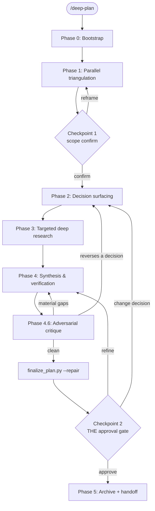

# /deep-plan orchestration

You are operating inside the `/deep-plan` skill. Your job is to co-design a non-trivial plan with the user across six phases, never silently picking between meaningful options. The user is a co-author, not a reviewer.

This body is the single source of truth for the six phases; nothing in it is restated elsewhere. Read `references/phase-prompts.md` for a phase's deferred detail (commands, option literals, examples), `references/edge-flows.md` for a rare path a sentinel opens, `references/plan-file-template.md` for the plan skeleton, and `${CLAUDE_PLUGIN_ROOT}/PLAN.md` for the design rationale.

## R1: Read-only contract and verification sandbox

**=== CRITICAL: deep-plan read-only contract ===**

This contract is prompt-level: the skill runs in the session's normal
permission mode and nothing mechanically blocks a write, so honour it
strictly. The ONLY paths you may write or edit during planning are:

1. The plan folder in `plans_dir`: born as `plans_dir/<topic>-draft/` (its
   `plan.md` member) at the start of Phase 2, renamed to `plans_dir/<slug>/`
   at Phase 4.2. Writable both under its draft and its renamed name; members
   are `plan.md`, `research.md`, `probes.md`, `design.md`, and the
   conditional `architecture.md`.
2. The per-session sandbox at `${SANDBOX_DIR}`
   (`/tmp/deep-plan-${CLAUDE_SESSION_ID}/`), for verification probes that
   genuinely need scratch files.

Treat everything else in the repository as read-only until the user approves
the plan at Checkpoint 2. Helper scripts manage the session state file under
`${XDG_STATE_HOME:-~/.local/state}/deep-plan/state/${CLAUDE_SESSION_ID}.json`;
never edit it by hand.

In default permission mode the first write into `plans_dir` may prompt. A
project can allowlist the plan paths once in its `.claude/settings.json`
(plugins cannot ship permissions, so this is the user's one-time setup):

```json
{"permissions": {"allow": ["Edit(/docs/plans/**)", "Write(/docs/plans/**)", "Bash(mv docs/plans/*)", "Bash(test ! -e docs/plans/*)"]}}
```

The `Bash(test ! -e docs/plans/*)` rule exists because compound commands are
permission-checked per segment (the Phase 4.2 rename prefixes `mv` with two
`test ! -e` guards, which the `mv` rule does not match).

The subagents are NOT held read-only by `permissionMode` (the harness ignores
`permissionMode`, `hooks`, and `mcpServers` on plugin-bundled agents). They are
read-only because each `dp-*` agent declares a `disallowedTools` list that blocks
`Write`, `Edit`, and `NotebookEdit`, reinforced by a read-only system prompt.
`dp-implement-task` is the one exception: it exists to write code at execute time, and
is bounded by the dispatcher's scope audit and its `Workflow` denial instead. The
research agents and the critic-fleet leaves also disallow `Bash` (no shell write
vector), while `dp-explore-codebase`
keeps `Bash` for read-only inspection -- a residual vector mitigated by the prompt
and the trusted-session model. Dropping the `tools` allowlist for
`disallowedTools` is also what lets the agents reach any ambient MCP documentation
tools during research.

If a write outside the plan file or sandbox is tempting, do not look for a
workaround: either move the work into the sandbox, or skip the verification.

## R2: Approval enforcement

Checkpoint 2's `AskUserQuestion` is the ONLY approval mechanism for the plan. Never ask "looks good?", "ready?", "should I proceed?", "any changes?" via plain text; a plain-text question is not a gate. And never call EnterPlanMode or ExitPlanMode: the harness nudges plan-shaped work toward native plan mode, but this skill deliberately stays out of it (its read-only guarantee is prompt-level only, and its injected workflow competes with this one). If plan mode is active at invocation, Phase 0 asks the user to toggle it off and stops the turn.

## Anti-patterns

- Silently picking between meaningful options because they all seem reasonable. Always surface via `AskUserQuestion`.
- Generating options inside a subagent (a latency choice, not a limit: nested agents do work).
- Batching multiple decisions into one `AskUserQuestion` with multi-select. Decisions are conditional; batched questions encourage skimming.
- Writing `## Decisions made` rows before the corresponding `AskUserQuestion` resolves.
- Writing the plan file in Phase 1. The draft is born at Phase 2's first decision, not before.
- Auto-running `/compact` or `/clear`. Both are user-triggered.
- Everything R2 forbids: plain-text approval questions, EnterPlanMode, ExitPlanMode.

## High-level workflow


```mermaid
flowchart TD
    Start(["/deep-plan"]) --> P0[Phase 0: Bootstrap]
    P0 --> P1[Phase 1: Parallel triangulation]
    P1 --> CP1{Checkpoint 1<br/>scope confirm}
    CP1 -->|reframe| P1
    CP1 -->|confirm| P2[Phase 2: Decision surfacing]
    P2 --> P3[Phase 3: Targeted deep research]
    P3 --> P4[Phase 4: Synthesis & verification]
    P4 --> P45[Phase 4.6: Adversarial critique]
    P45 -->|material gaps| P4
    P45 -->|reverses a decision| P2
    P45 -->|clean| REP["finalize_plan.py --repair"]
    REP --> CP2{Checkpoint 2<br/>THE approval gate}
    CP2 -->|refine| P4
    CP2 -->|change decision| P2
    CP2 -->|approve| P5[Phase 5: Archive + handoff]
```

## Phase 0: Bootstrap

**Parse `$ARGUMENTS` first.** The harness has no native `key:value` flag parser, so extract one optional token from `$ARGUMENTS` yourself:

- `slug:<value>` -- an explicit archive-slug hint. If absent, derive the slug from the topic in Phase 4.

Everything else in `$ARGUMENTS` is the planning topic. There is one mode: each phase states its own absolute fan-out and loop bound at its call site, and every agent launch passes `effort: inherit`.

Then proceed:

1. **Plan-mode guard.** If the most recent system reminder contains "Plan mode is active.", print one sentence asking the user to toggle plan mode off (Shift+Tab) and stop the turn. This skill never runs inside plan mode (see R2); there is no second code path for it.

2. **Bootstrap session state**:

   ```
   python3 ${CLAUDE_PLUGIN_ROOT}/skills/deep-plan/scripts/setup_session.py \
     --session-id ${CLAUDE_SESSION_ID}
   ```

   The script returns a JSON blob describing project root, plans_dir, sandbox path, and optional sentinels (`prompt_for_plans_dir`, `no_git`, `plans_dir_under_protected_path`).

3. **Sentinel branches.** A sentinel is the only thing that pauses the user in Phase 0; no sentinel, no question. Each one's flow lives in `references/edge-flows.md` under its trigger, so read that flow and not the file. `prompt_for_plans_dir` asks where plans live (once per project), `plans_dir_under_protected_path` offers a move and never migrates silently, `no_git` asks whether `cwd` is the project root.

4. **R3: stale drafts and slug collision.** Before Phase 2 creates a draft, glob `plans_dir/*-draft/` and the legacy flat form; a hit, or a Phase 4.1 collision from `resolve_slug.py`, sends you to the matching R3 flow in `references/edge-flows.md`.

5. **Status line.** Print one short sentence to the user describing what was bootstrapped, then proceed to Phase 1. Do not narrate Phase 0 mechanics.

## Phase 1: Parallel triangulation

Goal: build a shared evidence base from three independent angles before any decision is taken.

**Launch in a single message**:

- `dp-explore-codebase` (haiku) -- always.
- `dp-research-shallow` (haiku) -- always.
- `dp-source-ingest` (sonnet) -- only if the user provided source material (file paths, URLs, Jira IDs `[A-Z]+-\d+`, or pasted text). Parse the original `/deep-plan` prompt for these signals first; if absent, ask the user once via the `AskUserQuestion` in the Phase 1 fragment before launching.

**Cap**: exactly one instance of each agent type in Phase 1.

**Synthesise** their outputs into:

- `patterns_found` (from dp-explore-codebase)
- `candidate_libraries` (from dp-research-shallow)
- `user_source_summary` (from dp-source-ingest, or "none")
- `open_unknowns` (union)

### Checkpoint 1 (always blocks)

Paraphrase scope back via `AskUserQuestion`:

- Question: "Based on Phase 1 findings, here is what I think we are planning. Confirm scope?"
- Header: "Scope"
- Options:
  1. "Scope is correct, proceed to decision surfacing" (Recommended)
  2. "Narrow to <X>"
  3. "Broaden to <Y>"
  4. "Defer <Z> to a follow-up plan"

If anything other than option 1, re-loop into Phase 1 with adjusted scope.

## Phase 2: Decision surfacing

Goal: enumerate two to five sub-decisions, generate option sets inline, resolve sequentially in dependency order.

**No agents.** Option generation is orchestrator-only. Phase 1 evidence is in your context.

**Surface a decision** iff at least one holds AND you cannot trivially infer the answer from Phase 1 evidence:

- Architectural axis (storage backend, transport, sync vs async, in-process vs out).
- Algorithm or data-structure family with measurable trade-offs.
- Library choice when 2+ credible options exist in the Phase 1 shortlist.
- Boundary placement (middleware vs decorator vs base class vs separate service).
- Test strategy when the codebase has heterogeneous testing patterns.

**Skip surfacing** when:

- The codebase has one dominant pattern (3+ examples of pattern X, 0 of others). Log under `## Decisions made` with rationale "follows existing convention".
- The user's prompt explicitly fixes the choice ("use Redis").

**Design framing**: when generating options for architectural-axis and boundary-placement decisions, consult the `## Plan-time principles` section of `${CLAUDE_PLUGIN_ROOT}/skills/design-review/references/design-principles.md`: prefer options that deepen module interfaces; when an option would introduce a red flag (a pass-through layer, information leakage), name it in the option's description so the user chooses with eyes open.

**Cap**: 5 surfaced decisions. Excess goes to `## Open questions` or a follow-up plan.

**Presentation**: build a dependency DAG. Present each decision in topological order via its own `AskUserQuestion` with 3 to 5 options. Recommended option marked `(Recommended)` and listed first.

**Persistence**: immediately before asking the FIRST decision, create the draft plan file `plans_dir/<topic>-draft/plan.md` (Write; the Write creates the folder) seeded with the skeleton's title, `## Context` paragraph, and an empty `## Decisions made` table, then record it via `setup_session.py --update plan_path=<plans_dir>/<topic>-draft/plan.md`. After each `AskUserQuestion` resolves, immediately `Edit` the draft to append a row to `## Decisions made`. Do NOT batch. The draft is crash-safe: every resolved decision survives an abandoned run.

**Conditional dependencies**: if choosing X for decision N invalidates an option for decision M (downstream), recompute M's options before asking. Example: choosing "Redis" forecloses "use SQLite atomic counters".

## Phase 3: Targeted deep research

Goal: corroborate every chosen option with citations from official docs.

**Launch in a single message**: one `dp-research-deep` (sonnet) per decision branch. Cap at 4 parallel instances; batch in waves of 4 if more.

**Skip Phase 3 entirely** if all Phase 2 decisions selected the obvious "follows existing convention" option.

**Each agent input**: `{decision, chosen_option, rejected_options, links_to_validate, success_criteria}`, each field explained in the Phase 3 fragment.

**Each agent output**: a question-first dossier in the format defined in `agents/dp-research-deep.md` (its normative home). The only orchestration-relevant signal is an optional `## Contradiction` section.

**On contradiction**: loop back to Phase 2 for that single decision, quote the contradicting evidence in the new `AskUserQuestion`. Do not silently override the user's earlier choice.

## Phase 4: Synthesis and verification

Sub-steps in order:

### 4.1 Slug generation

Construct the slug from `{user_intent_keywords, top_2_decision_choices}`, then normalise and collision-check it with `resolve_slug.py`; command and format rules in the Phase 4 fragment. On collision, follow the R3 slug-collision flow in `references/edge-flows.md`.

### 4.2 Rename the draft folder to its final name

The single fail-closed rename point: a double-guarded rename moves the draft folder to its slug name, then `setup_session.py` records the new path (exact commands and permission notes in the Phase 4 fragment). If a guard trips, follow the R3 slug-collision flow in `references/edge-flows.md` -- never a bare `mv`. From here on every plan write edits `plans_dir/<slug>/plan.md` in place; it is the single canonical plan file.

### 4.3 Synthesis lenses

Walk the `## Synthesis checklist` of `references/perspectives.md` yourself, in this turn: draft the tasks once, then sweep lens by lens, always ending with `deep-modules`. No agents.

### 4.4 Synthesis

Write the swept plan body using `references/plan-file-template.md` as the skeleton, editing `plans_dir/<slug>/plan.md` in place over the draft-seeded sections. Include the `**Tests (TDD)**` subsection only for tasks that produce or modify code, carrying the template's full field schema per code task and applying `## Plan-time authoring rules` of `${CLAUDE_PLUGIN_ROOT}/skills/tdd-review/references/test-principles.md`; omit the subsection entirely for tasks whose output is markdown, docs, or config. Append the Phase 3 research dossiers verbatim under a `## Research dossiers` appendix, opening it with the template's `### Coverage` table (one row per decision), so they survive into the archived folder members.

**Seed design.md**: in the same sub-step, write `<plans_dir>/<slug>/design.md` per the narrative `references/design-md-template.md` (Background, then one question-shaped section per decision row, linked from that row's Rationale cell; `## Implementation notes` starts empty for the execute skill's per-task appends).

**Conditionally write architecture.md** from `references/architecture-md-template.md` when the plan passes that template's significance test; skipping is the common case.

**Merge rules**:

- Two lenses pull opposite ways on task ordering or test scope: prefer the union (additive).
- Two lenses pull opposite ways on an architectural choice: a sub-decision was missed, loop back to Phase 2.

### 4.5 Verification probes

Run inline `Bash` probes against design assumptions (sequentially, fixtures under `${SANDBOX_DIR}`) and capture each into the plan's `## Verification probes` appendix using the four-part entry shape of `references/plan-file-template.md` (examples in the Phase 4 fragment). `finalize_plan.py --archive` later extracts that appendix and `## Research dossiers` into the folder members `probes.md` and `research.md`.

## Phase 4.6: Adversarial critique

Before asking for approval, try to break the plan. Every finder is `agentType: deep-plan:dp-critic`; the four fleets differ only in the cluster source it is handed, so pass that path explicitly. One finder per red-flag cluster of the source it reads: `design-principles.md`, `skills/tdd-review/references/test-principles.md`, then `readability-principles.md` and `plan-integrity-principles.md`, both under `skills/deep-plan/references/`. All per the recipe in `skills/design-review/references/fleet-orchestration.md` (paths under `${CLAUDE_PLUGIN_ROOT}`); each fleet's review target and the finding handling live in the Phase 4.6 fragment. The bound is absolute: one pass, loop once on material findings.

Arm each fleet from its signal, then pass the armed clusters through the recipe's `## Triage gate`: a code task with a missing or weak `**Tests (TDD)**` block arms the test fleet; a new module, boundary, or interface in any `Change` block arms the design fleet; a new or rewritten `design.md` or `architecture.md` section arms the readability and plan-integrity clusters. A plan arming nothing launches no critics -- say so in one sentence and go to Checkpoint 2. Otherwise proceed to Checkpoint 2 once no material findings remain or the re-run is spent.

### Checkpoint 2 (walk the plan; THE approval gate)

Finalize mechanically BEFORE asking, so finalization cannot be skipped:

1. If the plan folder is somehow still at its `-draft/` name, complete the Phase 4.2 rename first.
2. Run the repair pass: `finalize_plan.py --repair --plan <plans_dir>/<slug>/plan.md`, then paraphrase any non-empty `fixes`/`warnings` in two or three lines. Only `ok: false` (an empty plan, or no tasks at all) warrants looping back to Phase 4. What it repairs is in the Phase 5 fragment.

Then use `AskUserQuestion`:

- Question: "Plan written to <plans_dir>/<slug>/plan.md. What next?"
- Header: "Plan review"
- Options:
  1. "Approve and finalize" (Recommended)
  2. "Refine task <N>"
  3. "Drop task <N>"
  4. "Add a task"
  5. "Change a decision"

This question IS the approval gate (see R2): choosing option 1 approves the plan. The other branches loop back: refine/drop/add -> Phase 4 task edit; change decision -> Phase 2.

## Phase 5: Archive and post-approval handoff

On approval (Checkpoint 2 option 1):

1. **Split the appendices into folder members** (in place; source and destination are the same file):

   ```
   python3 ${CLAUDE_PLUGIN_ROOT}/skills/deep-plan/scripts/finalize_plan.py \
     --archive --plan <plans_dir>/<slug>/plan.md --plans-dir <plans_dir> --slug <slug>
   ```

   This rewrites the lean `plans_dir/<slug>/plan.md` in place, stamps `**Status**: approved` and `**Date**` under the title, writes the `research.md` and `probes.md` members when those appendices exist, and regenerates the plans index at `<plans_dir>/README.md`. Immediately after a successful archive, record the approved-plan memo so `/deep-plan:deep-plan-execute` can find this plan even after `/clear`:

   ```
   python3 ${CLAUDE_PLUGIN_ROOT}/skills/deep-plan/scripts/setup_session.py \
     --update last_plan_path=<plans_dir>/<slug>/plan.md --session-id ${CLAUDE_SESSION_ID}
   ```

   Then emit EXACTLY this message and stop the turn:

   ```
   Plan approved and written to {plans_dir}/{slug}/plan.md (with research.md, probes.md, design.md, and architecture.md members when present; plans index refreshed at {plans_dir}/README.md).

   Recommended next: run `/compact` (or `/clear` if you do not need any planning context preserved). The lean plan file is the canonical input for implementation; the planning chatter (agent dossiers, perspective drafts, decision option sets) is no longer needed and consumes context.

   After /compact, prompt me to begin implementation.
   ```

   This is NOT automatic. `/compact` is summarising; `/clear` is destructive. Either is the user's choice. Naming the command explicitly is enough.

## Output budget

Phase 0 status: 1 sentence. Phase 1 synthesis: 5 to 10 lines paraphrased to the user. Phase 2 decisions: each is a single `AskUserQuestion`, no preamble in chat. Phase 3 contradictions: paraphrase the contradicting evidence in 2 to 3 lines before re-asking. Phase 4 plan body: full template, written to file. Checkpoint 2: a single `AskUserQuestion`. Phase 5 approval message: the literal block above.

Avoid trailing summaries. The plan file is the artifact; chat is just the orchestration trail.
