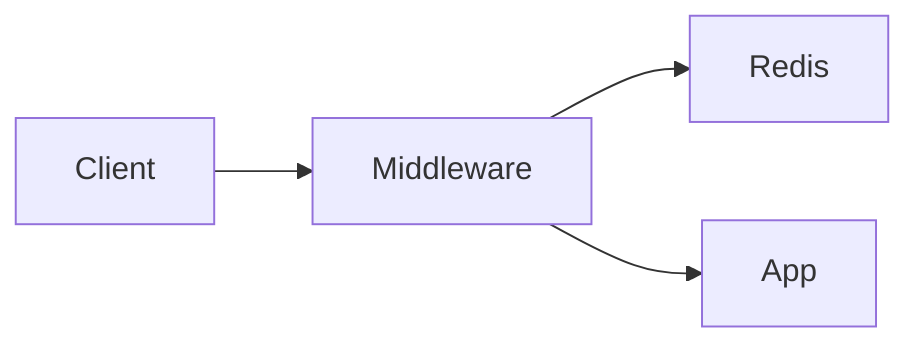

# Rate limiter for the public API

## Context

The public API has no rate limiting, so a single client can exhaust shared capacity. This plan adds a token-bucket limiter keyed per API key, backed by the Redis instance already in the stack, plus user-facing docs. It is a golden fixture: it must pass `finalize_plan.py --repair` with zero fixes and zero warnings, and it deliberately includes one code task (with a Tests block) and one docs task (without one) to lock in the code-only TDD rule.

## Decisions made

| # | Decision | Chosen | Rejected | Rationale |
|---|----------|--------|----------|-----------|
| 1 | Storage backend | Redis | in-memory, SQLite | existing dependency, safe across instances |
| 2 | Algorithm | Token bucket | leaky bucket, fixed window | smooth bursts, matches the official Redis pattern |

## Architecture



<!-- deep-plan-task-overview:begin generated: do not edit -->
## Task overview

| # | Task | Files | Deps | Summary |
|---|------|-------|------|---------|
| 1 | Add token-bucket middleware | src/api/rate_limit.py | none | Adds per-key request throttling to the public API. |
| 2 | Document the rate limiter | docs/rate-limit.md | 1 | Documents the new rate limits for API consumers. |
<!-- deep-plan-task-overview:end -->

## Tasks

### Task 1: Add token-bucket middleware

**Target files**:
- src/api/rate_limit.py (new)

**Change**:
Adds per-key request throttling to the public API. Add a `TokenBucketMiddleware` class in `src/api/rate_limit.py` that reads a per-API-key bucket from Redis. Configurable via `RATE_LIMIT_RPS` (default 10) and `RATE_LIMIT_BURST` (default 20).

**Tests (TDD)**:
- File: tests/test_rate_limit.py (new)
- Test name: `test_burst_over_limit_returns_429`
- Behavior: requests beyond the configured burst within one second are rejected.
- Level: component -- the middleware plus a real Redis, the lowest level where bucket state is observable.
- Real vs mocked: the middleware and Redis run real; only the clock is frozen.
- Setup: local to the test; the bucket key and the request loop live in the test body.
- Seams: none introduced.
- Dedup: unit tests cover bucket arithmetic only; no lower level observes throttling.
- Asserts: with RPS 10 and burst 20, the 21st request within one second returns HTTP 429 with a `Retry-After` header.
- This test MUST fail before implementation begins.

**Verification**:
```
uv run pytest tests/test_rate_limit.py::test_burst_over_limit_returns_429 -x
```

**Depends on**: none

### Task 2: Document the rate limiter

**Target files**:
- docs/rate-limit.md (new)

**Change**:
Documents the new rate limits for API consumers. Document the `RATE_LIMIT_RPS` and `RATE_LIMIT_BURST` knobs, the per-API-key scope, and the 429 plus `Retry-After` contract for API consumers.

**Verification**:
```
grep -q RATE_LIMIT_RPS docs/rate-limit.md
```

**Depends on**: 1

## References

- src/api/app.py
- https://redis.io/docs/latest/develop/use/patterns/rate-limiter/

## Open questions

- none
